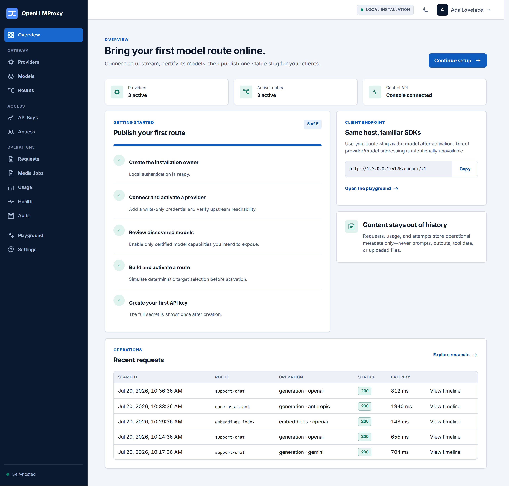
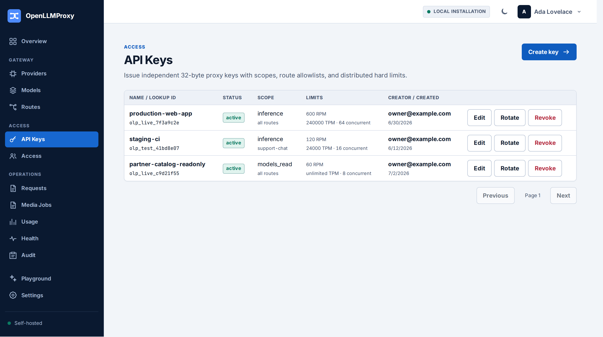
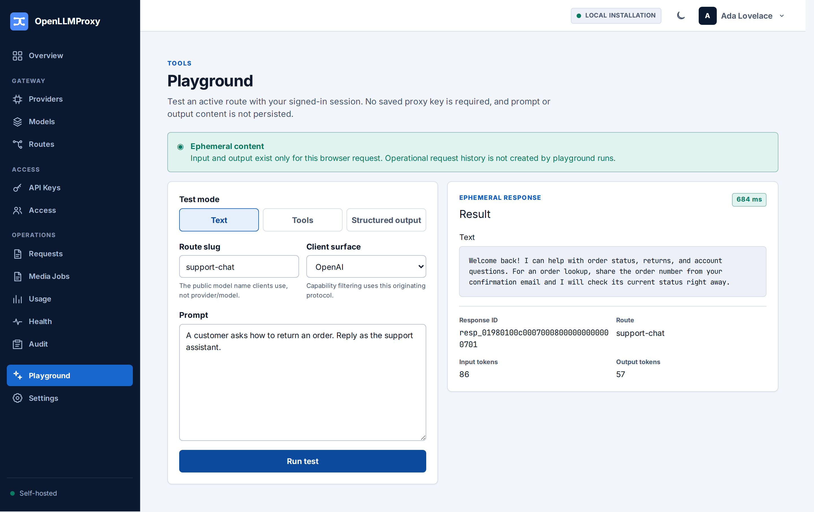

# OpenLLMProxy

[](https://github.com/tyk-swe/olp/actions/workflows/ci.yml)
[](LICENSE)
[](https://github.com/tyk-swe/olp/releases)

OpenLLMProxy is a self-hosted AI gateway and control plane. It exposes
OpenAI-, Anthropic-, and Gemini-compatible APIs and routes requests to OpenAI,
Anthropic, Gemini, Vertex AI, Azure OpenAI, AWS Bedrock, and certified
OpenAI-compatible providers — behind one stable endpoint, one key inventory,
and one audit trail.



## Features

- **Drop-in compatibility** — Point existing OpenAI, Anthropic, and Google
  GenAI SDKs at one base URL. Clients address routes by a stable public slug;
  direct provider/model addressing is intentionally unavailable.
- **Deterministic routing** — Explicit provider-model targets with priority
  groups, weighted selection, bounded failover, and pre-activation simulation.
- **Capability certification** — Models are activated only after bounded live
  probes certify each provider/model/operation tuple against the production
  connector.
- **Immutable runtime generations** — Configuration is compiled, digested, and
  published atomically; in-flight streams never cross a generation boundary.
- **Usage and cost accounting** — Requests, attempts, and usage facts store
  operational metadata only — never prompts, outputs, tool data, or uploads.
- **Scoped access control** — Installation-scoped proxy keys with route allowlists,
  expiry, and distributed hard rate limits; full audit stream of every
  administrative change.
- **Production operations** — Private health and metrics listener, Prometheus
  rules, Grafana dashboard, backup/restore and upgrade rehearsal tooling.

## Quick start

**Prerequisites:** Docker with Compose support and OpenSSL.

Create the local environment. The helper generates any missing local secrets,
including the one-time bootstrap token, without replacing existing keys:

```bash
cp .env.example .env
./scripts/prepare-compose-secrets.sh
```

Compose runs OpenLLMProxy as UID and GID `1000` by default. If either differs
from the output of `id -u` and `id -g` for your host user, update `OLP_UID` and
`OLP_GID` in `.env` so the container can read the mode-`0600` secret files.
If you change `POSTGRES_PASSWORD`, set `POSTGRES_PASSWORD_URL_ENCODED` to the
RFC 3986 percent-encoded form of the same password. PostgreSQL receives the raw
value, while `OLP_DATABASE_URL` derives from the encoded value.

Start a new installation with the bootstrap overlay and the root environment
file explicitly selected:

```bash
docker compose --env-file .env \
  -f deploy/compose.yaml -f deploy/compose.bootstrap.yaml up --build -d
```

With the default `.env`, open the console at `http://localhost:8080`. On the
first visit, paste the one-time value from `deploy/secrets/olp_bootstrap_token`
into the setup form before creating the installation owner. The application
clears its in-memory copy after successful setup. Once you have verified the
owner account, recreate the application from the base configuration and only
then retire the token:

```bash
docker compose --env-file .env -f deploy/compose.yaml up -d --force-recreate olp
./scripts/retire-compose-bootstrap-secret.sh
```

Use `deploy/compose.yaml` alone for every subsequent restart or upgrade. It has
no bootstrap-secret reference, so container recreation remains valid after the
file is removed. Compose applies database migrations before startup and stores
PostgreSQL and Valkey data in named volumes.

## Interfaces

All public interfaces share one origin — `http://localhost:8080` by default:

| Interface | Path |
|---|---|
| Console | `/` |
| Management API | `/api/v1` |
| OpenAI-compatible API | `/openai/v1` |
| Anthropic-compatible API | `/anthropic/v1` |
| Gemini-compatible APIs | `/gemini/v1` and `/gemini/v1beta` |
| Management OpenAPI | `/api/v1/openapi.json` — tracked schema: [openapi/management.json](openapi/management.json) |

Liveness, readiness, and metrics are private observability endpoints on
`OLP_OBSERVABILITY_LISTEN_ADDR` (default `127.0.0.1:9090`): `/health/live`,
`/health/ready`, and `/metrics`. The Compose stack starts this listener but
does not publish port 9090 to the host; public requests for these paths return
404.

## Console

The console is the control-plane interface for providers, routes, keys, and
operations. It is served as static assets by the same process — no separate
frontend deployment is required.

| Providers | API Keys |
|---|---|
|  |  |
| **Routes** | **Playground** |
|  |  |
| **Usage** | |
|  | |

Screenshots are generated from deterministic fixtures and can be regenerated
after UI changes with `pnpm --dir console screenshots`.

## Documentation

| Document | Contents |
|---|---|
| [Architecture](docs/architecture.md) | Component boundaries, runtime publication, capability certification, data-safety invariants |
| [Deployment](docs/deployment.md) | Helm-based production deployment, secrets, edge routing, readiness |
| [Operations](docs/operations.md) | SLOs, monitoring, backup and restore, upgrades, incident response |
| [Security policy](SECURITY.md) | Supported versions and vulnerability reporting |

## Contributing

See [CONTRIBUTING.md](CONTRIBUTING.md) for architecture boundaries,
source-of-truth ownership, and the full validation matrix. Use Rust 1.97.0,
Node.js 24 or newer, pnpm 11.10.0, and ripgrep. The Compose stack supplies
PostgreSQL 18 and Valkey 9.1. Install the locked console dependencies, then run
the standard checks:

```bash
pnpm --dir console install --frozen-lockfile
./scripts/check-boundaries.sh
cargo fmt --all --check
cargo clippy --locked --workspace --all-targets --all-features -- -D warnings
cargo test --locked --workspace --all-features
pnpm --dir console verify
```

## Security

Report suspected vulnerabilities privately to `support@mail.tyk.sh`. See
[SECURITY.md](SECURITY.md) for the supported release lines and reporting
guidelines.

## License

Licensed under the GNU Affero General Public License v3.0 only
(`AGPL-3.0-only`). See [LICENSE](LICENSE).
