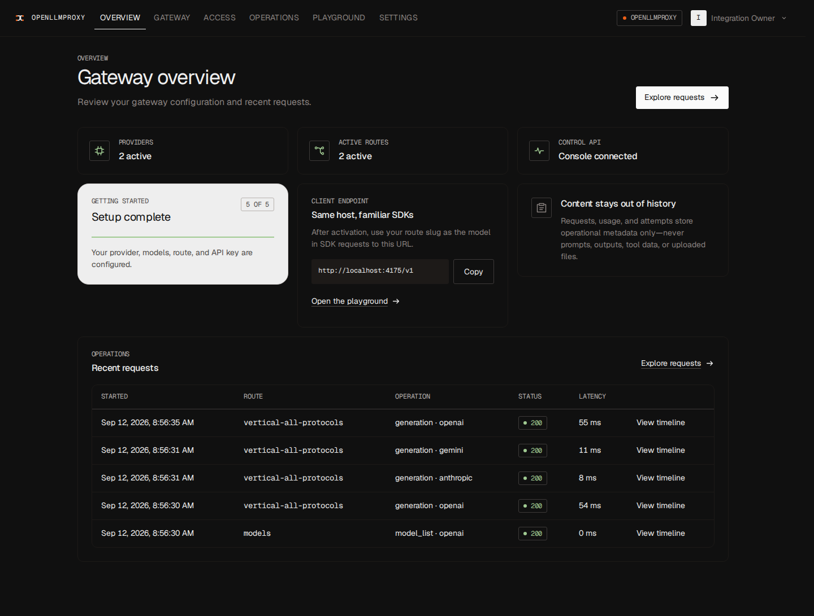

# OpenLLMProxy

[](https://github.com/tyk-swe/olp/actions/workflows/ci.yml)
[](LICENSE)
[](https://github.com/tyk-swe/olp/releases)

OpenLLMProxy is a self-hosted AI gateway and control plane. It presents
OpenAI-, Anthropic-, and Gemini-compatible APIs and routes stable public route
slugs to OpenAI, Anthropic, Gemini, Vertex AI, Azure OpenAI, Amazon Bedrock,
and certified OpenAI-compatible providers.



## Features

- Stable protocol surfaces with explicit route and provider policy; direct
  provider/model addressing is intentionally unavailable.
- Priority groups, weighted selection, bounded failover, and pre-activation
  simulation over certified provider/model/operation tuples.
- Immutable, digested runtime generations: a stream keeps one generation and
  credential revision for its entire lifetime.
- Attempt-level usage and cost accounting with operational metadata only —
  never prompts, outputs, tool data, uploads, or raw credentials.
- Installation-scoped keys, route permissions, expiry, hard distributed
  limits, and an audit stream for administrative changes.
- Private health/metrics, backup/restore, upgrade rehearsal, and HA workers.

## Quick start

Prerequisites: Docker with Compose support and OpenSSL.

```bash
cp .env.example .env
./scripts/prepare-compose-secrets.sh
docker compose --env-file .env \
  -f deploy/compose.yaml -f deploy/compose.bootstrap.yaml up --build -d
```

The helper creates only missing secrets, including the one-time bootstrap
token. Compose runs as UID/GID `1000`; set `OLP_UID` and `OLP_GID` in `.env`
when the host user differs. If `POSTGRES_PASSWORD` contains reserved URL
characters, keep its RFC 3986 encoded form in
`POSTGRES_PASSWORD_URL_ENCODED`.

Open `http://localhost:8080`, paste the value in
`deploy/secrets/olp_bootstrap_token` into the first-run setup form, and create
the installation owner. Then recreate the application without the bootstrap
overlay and retire the token:

```bash
docker compose --env-file .env -f deploy/compose.yaml up -d --force-recreate olp
./scripts/retire-compose-bootstrap-secret.sh
```

Use `deploy/compose.yaml` alone for later restarts and upgrades. See
[`deploy/secrets/README.md`](deploy/secrets/README.md) for rotation and
file-backed connector details.

## Interfaces

All public interfaces share one origin — `http://localhost:8080` by default:

| Interface | Path |
|---|---|
| Console | `/` |
| Management API | `/api/v1` |
| OpenAI-compatible API | `/v1` (SDK compatibility alias) and `/openai/v1` (explicit protocol prefix) |
| Anthropic-compatible API | `/anthropic/v1` |
| Gemini-compatible APIs | `/gemini/v1` and `/gemini/v1beta` |
| Management OpenAPI | `/api/v1/openapi.json` — [tracked schema](openapi/management.json) |

Liveness, readiness, and metrics are private endpoints on
`OLP_OBSERVABILITY_LISTEN_ADDR` (default `127.0.0.1:9090`):
`/health/live`, `/health/ready`, and `/metrics`. Compose does not publish port
9090; public requests to these paths return 404.

### OpenAI compatibility

Use either registered OpenAI base with the official OpenAI JavaScript SDK;
both also accept a trailing slash:

| Base URL | Meaning | Gateway credentials |
|---|---|---|
| `/v1` | OpenAI SDK-compatible alias | `Authorization: Bearer <OLP key>` or `x-litellm-api-key: <OLP key>` |
| `/openai/v1` | Explicit protocol-prefixed OpenAI surface | `Authorization: Bearer <OLP key>` or `x-litellm-api-key: <OLP key>` |

`x-litellm-api-key` accepts the raw key or `Bearer <OLP key>`. When it is
present, it is authoritative: an invalid value does not fall back to a valid
native credential, and two different valid OLP credentials are rejected. A
valid gateway key may coexist with a separate, non-OLP `Authorization` value.

These are explicit aliases, not wildcard forwarding. Gateway-only deployments
return 404 for bare root paths such as `/chat/completions` or `/models`; when
the management console is enabled, unmatched bare paths can instead serve the
console SPA fallback for deep links. Base paths without a registered operation
and unknown `/v1/*` or `/openai/*` paths are unsupported and return 404; they
are never passed through to a provider. The compatibility suite covers the
implemented chat-completions, Responses, streaming, and model list/retrieve
operations, but this does not imply support for other OpenAI endpoints.

## Console

The SvelteKit console is compiled to static assets and served by the same Rust
process. It has no API proxy in `pnpm dev`; use a built console with the Rust
server for API-backed pages. Visible UI changes can regenerate the fixture
screenshots with `pnpm --dir console screenshots`.

## Documentation

| Document | Purpose |
|---|---|
| [Architecture](docs/architecture.md) | Boundaries, runtime publication, endpoint/provider policy, limits, certification, and data safety |
| [Configuration](docs/configuration.md) | Binary defaults, mounted secrets, Compose values, and provider presets |
| [Deployment](docs/deployment.md) | Helm install, edge routing, workers, observability, and readiness |
| [Operations](docs/operations.md) | Monitoring, recovery, upgrades, incidents, and master-key rotation |
| [Contributing](CONTRIBUTING.md) | Toolchain, sources of truth, and validation |
| [Changelog](CHANGELOG.md) | Release notes, and the upgrade notes that go with them |
| [Security](SECURITY.md) | Supported releases and private vulnerability reporting |
| [Console development](console/README.md) | Frontend commands, boundaries, integration tests, and screenshots |
| [Compatibility and contract tests](tests/README.md) | Conformance, SDK, end-to-end, HA, and fuzz suites |
| [Compose secrets](deploy/secrets/README.md) | Bootstrap lifecycle, key rotation, and file-backed connectors |
| [Amazon Bedrock connector](crates/olp-engine/BEDROCK.md) | Authentication, transport behavior, and focused tests |

## Contributing

Use Rust 1.97.1, Node.js 24.15 or newer within the 24.x line (or Node.js 26+),
pnpm 11, and ripgrep. Install the console dependencies once, then run the
standard local gate:

```bash
make console-install
make check
```

`make help` lists the locked CI-aligned targets, including coverage,
database-backed tests, contract tests, and generated-file checks. See
[`CONTRIBUTING.md`](CONTRIBUTING.md) before changing architecture or APIs.

## Security

Report vulnerabilities privately to `support@mail.tyk.sh`; see
[`SECURITY.md`](SECURITY.md). Do not include credentials or customer data.

## License

Licensed under the GNU Affero General Public License v3.0 only
(`AGPL-3.0-only`). See [LICENSE](LICENSE).
