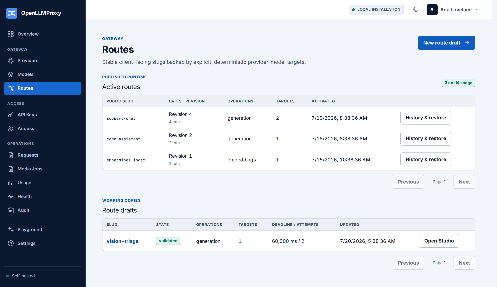
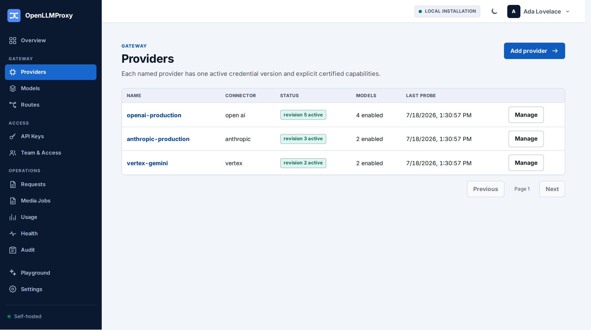

# Architecture

This document describes how OpenLLMProxy is structured: the crate boundaries
and their dependency rules, how configuration reaches running gateways, how
provider capabilities are certified before activation, and the invariants that
keep durable records free of request content.

## Contents

- [Component boundaries](#component-boundaries)
- [Enterprise control-plane contracts](#enterprise-control-plane-contracts)
- [Runtime publication](#runtime-publication)
- [Capability certification](#capability-certification)
- [Data-safety invariants](#data-safety-invariants)

## Component boundaries

Dependencies point toward `crates/domain`, which owns canonical types,
routing, and ports without infrastructure dependencies. `crates/protocols`
maps public wire formats to canonical operations. `crates/providers` owns
upstream transports, provider authentication, and outbound HTTP policy.
`crates/storage` owns PostgreSQL, the outbox, encryption, usage ingestion, and
Valkey scripts. The `apps/olp` package composes those crates into the gateway,
control, worker, migration, and administration process modes.

```text
apps/olp ─┬─> crates/protocols ──> crates/domain
          ├─> crates/providers ─┬─> crates/protocols
          │                    └─> crates/domain
          ├─> crates/storage ────> crates/domain
          └─> crates/domain
```

The console is a client-only static asset with no server routes or production
Node adapter. `tests/conformance` is a test-only workspace package and is not a
production process component. `scripts/check-boundaries.sh` enforces this
dependency graph and the infrastructure ownership rules in CI.

## Enterprise control-plane contracts

The running 2.x implementation described below is installation-global. The
accepted contracts for evolving it into an organization → project →
environment control plane live in [`docs/enterprise`](enterprise/README.md).
Those contracts freeze ownership, request/runtime authority, extension trust
boundaries, compatibility policy, and enterprise-beta qualification targets.
They intentionally do not claim that later-milestone tenant features are
already implemented.

## Runtime publication

Activation stores a byte-stable compiled release, its SHA-256 digest, and an
outbox row in one transaction. The worker publishes only a generation hint to
Valkey. Gateways consume hints and poll PostgreSQL every five seconds, verify
the digest, build indexes, and atomically replace the full snapshot. Each
request holds one `Arc` containing its configuration, key indexes, and provider
transports, so a stream cannot cross a generation or credential version.

Activating a provider creates an immutable numbered revision containing the
endpoint or cloud context, credential version, enabled models, and certified
capabilities. Edits and credential rotation affect only the draft; unrelated
key or route publications continue using the active revision. A current
ETag-bound connectivity probe and capability certification are required before
activation atomically replaces that revision. Runtime and fallback credential
lookup are validated against the release revision, preventing newer catalog
credentials from entering an older generation.



Revision diffs are bounded to 2,000 models and 32,000 capability tuples per
side. The database reads at most each limit plus one row, and the API returns an
RFC 9457 `422` problem when a revision exceeds a limit. Full revisions remain
available through the cursor-paginated model endpoint.

## Capability certification

Enabled native-provider tuples require server-owned certification for the
exact provider, model, and operation. Safe operations use bounded live probes.
Each enabled native model must have at least one tuple, and every tuple must be
certified. OpenAI media and video operations that would require user media,
billable generation, or job mutation may instead use credentialed bounded
discovery and the closed native connector matrix. Generic OpenAI-compatible
providers cannot use that fallback. Probe results are stored only when the
captured draft ETag is still current.

Browser-reviewed tuples for a generic provider are stored as `declared` and
remain ineligible. The explicit per-model certification action reuses the
production connector, SSRF controls, deadlines, encoders, streaming decoder,
and response codecs. It permits at most 16 reviewed tuples and four concurrent
requests. Safe probes cover OpenAI generation (unary and streaming),
embeddings, Responses input-token counting, and unary moderation. Media upload
or generation, asynchronous video, and cross-protocol claims fail closed.

Every attempted tuple is downgraded before results are applied; only an exact
successful probe receives `source = certified` and `certified_at`. Declared-only
tuples cannot activate, enter a runtime, validate a route, or pass route
simulation. Replacing a model's tuple set removes its previous evidence.



## Data-safety invariants

Durable request, attempt, and usage records contain only identifiers, timing,
token or media units, status, error classification, and pricing provenance.
They must not contain prompts, responses, reasoning, tool arguments or results,
uploads, raw headers, or credentials. Unknown provider fields remain in
source-scoped in-memory protocol extensions.

The gateway emits one bounded terminal metadata envelope containing the full
attempt list. PostgreSQL enforces composite foreign keys from attempts and
usage facts to the partitioned request. Missing upstream usage is incomplete
and unpriced, never zero. Stream entries are removed only after the database
transaction commits and the consumer acknowledges them; producers do not trim
unconsumed events.
