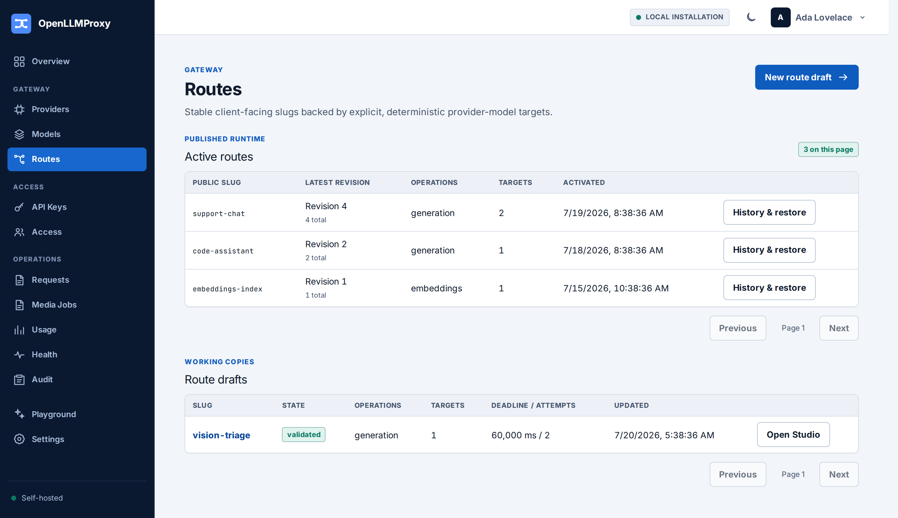
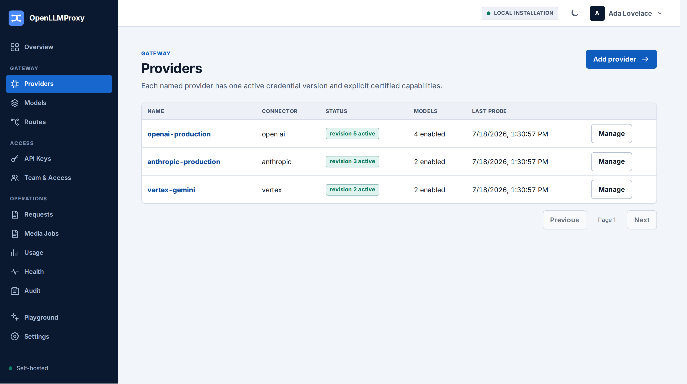

# Architecture

Crate boundaries and dependency rules, how configuration reaches running
gateways, how provider capabilities are certified before activation, and the
invariants that keep durable records free of request content.

## Component boundaries

Production dependencies point toward `olp-domain`, which owns domain types,
routing, and ports without infrastructure dependencies. `olp-protocols` maps
vendor wire formats to canonical operations. `olp-providers` implements
upstream transports, discovery, authentication, and outbound network policy.
`olp-storage` owns PostgreSQL, the outbox, encryption, request-metadata
ingestion, usage accounting, and Valkey integration. `olp-inference` owns the
transport-neutral application workflow: immutable generation pinning,
selection, circuits, failover, limit lease lifetime, canonical event
collection, terminal accounting, and shared playground execution. The `olp`
package in `apps/olp` owns only HTTP delivery, process modes, and dependency
wiring.

```text
olp-domain
├── olp-protocols ───────────────────────────────> olp-domain
├── olp-providers ───────────────> {domain, protocols}
├── olp-storage ────────────────────────────────> domain
├── olp-inference ───────> {domain, protocols, providers, storage}
└── apps/olp (olp) ─> {domain, protocols, providers, storage, inference}
```

`olp-conformance` is a test-only workspace package that exercises
`olp-domain`, `olp-protocols`, and `olp-providers` against the conformance
corpus, outside the production dependency graph. `olp-e2e` is likewise a
test-only harness. Each workspace member declares its semantic role under
`[package.metadata.olp]`; the boundary checker validates allowed role edges and
infrastructure ownership rather than freezing this concrete package list.
Multiple packages may therefore share a role while production packages remain
unable to depend on test harnesses. The console is a client-only static
application with no server routes or production Node adapter. Its top-level
feature slices are discovered by layout rather than enumerated; an ESLint rule
forbids imports from one feature slice into another while permitting neutral
`$lib` modules and route-level composition.

The delivery crate exposes six responsibility roots:

```text
apps/olp/src/
  bootstrap/      CLI, construction, mode finalization, workers, supervision
  public_http/    listener/router and shared HTTP boundary policy
  gateway/        protocol-specific inference adapters and endpoint registry
  management/     auth, access, configuration, operations, OIDC, playground
  observability/  private readiness/metrics listener
  console/        embedded static asset delivery
```

Storage similarly exposes subsystem namespaces instead of a flat `PgStore`
method/export soup. Pool lifecycle stays in `store.rs`; session, setup,
idempotency, runtime release/outbox, security, and request-metadata behavior
live under their owning `authentication`, `identity`, `idempotency`, `runtime`,
`security`, and `request_metadata` modules.

## Typed HTTP composition

Startup finalizes mode-specific dependency bundles before building routers.
Gateway, management, and observability surfaces have immutable state types
whose mandatory stores, keys, emitters, and runtime services are
non-optional; Axum `FromRef` exposes narrower capabilities to handlers, and
the private `ProcessComposition` bootstrap input is never an endpoint service
locator. It is exposed only by the explicitly gated `olp::test_support`
namespace for integration fixtures.
`GatewayState` composes gateway HTTP dependencies with `InferenceService`;
`ManagementState` contains control-plane dependencies plus only the explicit
playground inference capability; `ObservabilityState` contains only readiness
and metrics inputs. Neither control-plane state dereferences to gateway state.
A routed handler therefore cannot represent a mode missing one of its required
dependencies or silently acquire another surface's capabilities.

## Transport-neutral inference service

Both public gateway adapters and the authenticated management playground call
the same cloneable `olp_inference::InferenceService`. It pins a runtime
generation before selection, retains the matching transport and credential
registry for the request lifetime, owns cancellation-safe distributed lease
release, and finalizes exactly one terminal metadata envelope. Axum extraction,
HTTP status/problem mapping, protocol response rendering, and multipart/body
admission remain in `apps/olp`; provider construction remains in
`olp-providers`; concrete persistence remains in `olp-storage`.

## Canonical endpoint and provider policy

`apps/olp/src/gateway/endpoint_policy.rs` is the inference endpoint
registry. Each entry binds one identity to its HTTP method and path, Axum
handler, surface, typed operation, body admission, route extraction, token
estimation, and metadata behavior. Routing and classification both consume
the registry, and uniqueness tests reject duplicate identities or
method/path pairs.

`crates/domain/src/provider_configuration.rs` is the provider capability
registry, exhaustively binding each `ProviderKind` to supported/default
authentication, credential rules, supported and required fields, stable API
metadata, and complete-candidate validation. Management create and update
use the same validator; the console obtains the matrix from the management
capability endpoint and uses generated OpenAPI enums for wire values.

## Checked storage access

Static PostgreSQL statements use SQLx checked macros and the committed
`.sqlx` metadata. Large or conditionally assembled reads use `QueryBuilder`
but decode only through subsystem-owned `FromRow` records; string-key
`PgRow` decoding is forbidden in production storage, and
`scripts/check-storage-sqlx.sh` enforces the single execute-only dynamic
statement exception. CI compiles with `SQLX_OFFLINE=true` and verifies the
metadata against a freshly migrated PostgreSQL 18 database.

## Runtime publication

Activation stores a byte-stable compiled release, its SHA-256 digest, and an
outbox row in one transaction. The worker publishes only a generation hint
to Valkey; gateways consume hints, poll PostgreSQL every five seconds,
verify the digest, build indexes, and atomically replace the full snapshot.
Worker replicas serialize hint delivery with a PostgreSQL session advisory
leader. The owning session performs both ordered, bounded outbox reads and
durable completion updates; session loss releases leadership automatically
and prevents the stale connection from completing work. A crash after Valkey
accepts `PUBLISH` but before `published_at` commits can produce an additional
hint on retry, which is harmless because every hint only triggers an
authoritative PostgreSQL read. The leader connection is always closed rather
than returned locked to the pool. Each worker replica therefore uses one
dedicated PostgreSQL session, including while it waits as a standby.
Each request holds one `Arc` with its configuration, key indexes, and
provider transports, so a stream cannot cross a generation or credential
version.

Activating a provider creates an immutable numbered revision containing the
endpoint or cloud context, credential version, enabled models, and certified
capabilities. Edits and credential rotation affect only the draft; unrelated
key or route publications continue using the active revision. A current
ETag-bound connectivity probe and capability certification are required
before activation atomically replaces the revision. Runtime and fallback
credential lookup are validated against the release revision, so newer
configuration credentials cannot enter an older generation.



Revision diffs are bounded to 2,000 models and 32,000 capability tuples per
side; the database reads at most each limit plus one row, and the API
returns an RFC 9457 `422` problem beyond a limit. Full revisions remain
available through the cursor-paginated model endpoint.

## Distributed limit semantics

Valkey server time is authoritative for distributed requests-per-minute
(RPM), tokens-per-minute (TPM), and concurrency decisions. The atomic
reservation script calls `TIME` and derives the UTC minute identity,
remaining window time, rate-state expiry, expired-lease cleanup, lease
scores, and `Retry-After` from that one result; gateway process clocks are
not an input, and obtaining time adds no round trip.

RPM and TPM are fixed UTC-minute windows, not rolling windows or token
buckets. The rate hash stores only `window`, `rpm`, and `tpm`; the script
replaces the three fields once at rollover, and the hash expires at the
fixed minute boundary regardless of traffic. Fixed windows permit boundary
bursts: a key can use its full allowance just before a minute boundary and
its next full allowance immediately after.

The cluster-safe state for lookup ID `id` is:

```text
<namespace>:{id}:rate           hash(window, rpm, tpm)
<namespace>:{id}:concurrency:v2 sorted set(lease ID -> server-time expiry ms)
```

Both keys share the `{id}` Valkey Cluster hash tag, so the reservation
script declares every key it accesses and keeps RPM, TPM, and concurrency
admission atomic in one hash slot. A rejection consumes no dimension.
Malformed stored state and Valkey failures fail closed for hard-limited
keys; concurrency release is idempotent, and abandoned leases expire on
Valkey time.

The layout is a forward-only rollout: new binaries neither read, write,
migrate, nor delete the legacy `rpm:<client-window>`, `tpm:<client-window>`,
and unversioned `concurrency` keys, which expire naturally. The versioned
concurrency key also prevents a clock-skewed old process from deleting or
rescoring a new lease. During mixed-version deployment, old and new binaries
therefore enforce separate limit pools — each request stays fail-closed, but
split traffic can temporarily consume up to each pool's allowance. Complete
the gateway rollout promptly; an N-1 rollback is not a steady state.

## Capability certification

Enabled native-provider tuples require server-owned certification for the
exact provider, model, and operation. Safe operations use bounded live
probes; each enabled native model needs at least one tuple, and every tuple
must be certified. OpenAI media and video operations that would require user
media, billable generation, or job mutation may instead use credentialed
bounded discovery and the closed native connector matrix — generic
OpenAI-compatible providers cannot. Probe results are stored only while the
captured draft ETag is still current.

Browser-reviewed tuples for a generic provider are stored as `declared` and
remain ineligible. The explicit per-model certification action reuses the
production connector, SSRF controls, deadlines, encoders, streaming decoder,
and response codecs, permitting at most 16 reviewed tuples and four
concurrent requests. Safe probes cover OpenAI generation (unary and
streaming), embeddings, Responses input-token counting, and unary
moderation; media upload or generation, asynchronous video, and
cross-protocol claims fail closed.

Every attempted tuple is downgraded before results apply; only an exact
successful probe receives `source = certified` and `certified_at`.
Declared-only tuples cannot activate, enter a runtime, validate a route, or
pass route simulation. Replacing a model's tuple set removes its previous
evidence.



## Data-safety invariants

Durable request, attempt, and usage records contain only identifiers,
timing, token or media units, status, error classification, and pricing
provenance — never prompts, responses, reasoning, tool arguments or results,
uploads, raw headers, or credentials. Unknown provider fields remain in
source-scoped in-memory protocol extensions.

The gateway emits one bounded terminal metadata envelope containing the full
attempt list. PostgreSQL enforces composite foreign keys from attempts and
usage facts to the partitioned request. Missing upstream usage is incomplete
and unpriced, never zero. Stream entries are removed only after the database
transaction commits and the consumer acknowledges them; producers do not
trim unconsumed events.
