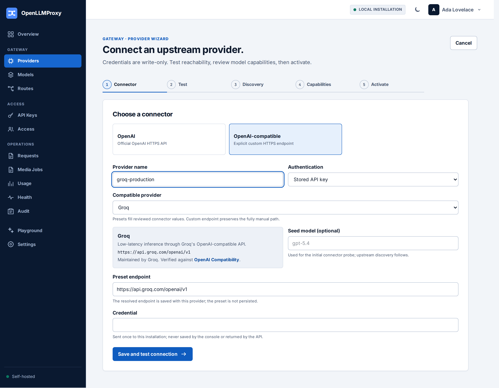

# Configuration reference

Runtime configuration is environment-driven; every variable also exists as a
CLI flag (`olp <subcommand> --help`). The definitions live in
`apps/olp/src/bootstrap/cli/config.rs` — when this document and the code disagree, the
code wins and this file needs a patch.

## Runtime variables

| Variable | Default | Purpose |
|---|---|---|
| `OLP_DATABASE_URL` | required | PostgreSQL connection URL. |
| `OLP_DATABASE_MAX_CONNECTIONS` | `20` | Connection pool size. |
| `OLP_VALKEY_URL` | optional (serve), required (`worker`, `migrate`, `doctor`) | Valkey URL for installation-scoped distributed limits, hints, and streams. Independent installations may use one logical database; the durable PostgreSQL identity supplies the namespace. |
| `OLP_LISTEN_ADDR` | `127.0.0.1:8080` | Public HTTP listener. The CLI default is loopback on purpose; containers override to `0.0.0.0:8080` (see `deploy/compose.yaml`). Both are intentional — do not "align" them. |
| `OLP_OBSERVABILITY_LISTEN_ADDR` | `127.0.0.1:9090` | Private listener for `/health/live`, `/health/ready`, `/metrics`. Keep loopback unless an internal network is deliberate. |
| `OLP_HTTP_MAX_CONNECTIONS` | `1024` | Max simultaneously admitted TCP connections per listener. |
| `OLP_HTTP_MAX_IN_FLIGHT_INFERENCE_REQUESTS` | `256` | Process-wide inference admission capacity. |
| `OLP_HTTP_MAX_IN_FLIGHT_MANAGEMENT_REQUESTS` | `32` | Reserved management admission capacity. |
| `OLP_PUBLIC_ORIGIN` | `http://127.0.0.1:8080` | Externally visible origin used for OIDC redirects and links. |
| `OLP_LOCAL_LOGIN_ENABLED` | `true` | Whether password sign-in stays available after setup. |
| `OLP_TRUSTED_PROXY_CIDRS` | empty | Comma-separated CIDRs allowed to supply `X-Forwarded-For`. Empty means forwarding headers are ignored. |
| `OLP_CONSOLE_DIR` | `console/build` | Built console assets served at `/` (`/opt/olp/console` in the image). |
| `OLP_MEDIA_SPOOL_DIR` | optional | On-disk spool for media payloads. |
| `OLP_MEDIA_SPOOL_CAPACITY_BYTES` | `1073741824` | Spool capacity (1 GiB). |
| `OLP_CONNECTOR_CONFIG_FILE` | optional | JSON mapping runtime provider IDs to credential file paths (paths only, never values). See `deploy/connectors.example.json`. |
| `RUST_LOG` | unset | Standard tracing filter, e.g. `olp=info,tower_http=info`. |

## File-based secrets

Secrets are always mounted as files; the variables carry paths, never values.
Generation and rotation are documented in `deploy/secrets/README.md`.

| Variable | Required by | Purpose |
|---|---|---|
| `OLP_MASTER_KEY_FILE` | serve (control), `doctor`, `master-key` | Envelope-encryption master key (JSON keyring for rotation). |
| `OLP_AUTH_HMAC_KEY_FILE` | serve (control), `doctor` | Session/auth HMAC key. |
| `OLP_BOOTSTRAP_TOKEN_FILE` | first run only | One-time setup token; retire it after setup (see README quick start). |

## Compose-only variables

`.env.example` additionally carries `OLP_HOST_PORT`, `POSTGRES_PASSWORD`,
`POSTGRES_PASSWORD_URL_ENCODED` (keep percent-encoded form synchronized),
`OLP_UID`, and `OLP_GID` — these configure the Compose stack itself, not the
binary.

## OpenAI-compatible provider presets

The provider wizard offers a release-owned preset catalog under the existing
`openai_compatible` connector. Selecting a preset resolves its reviewed API
base URL and `api_key` authentication mode into the same ordinary provider
fields used by **Custom endpoint**. The provider record stores those resolved
values, not a catalog reference, so a later release cannot silently change an
existing provider.

The initial catalog was reviewed against the official documentation below on
2026-08-09:

| Preset ID | Provider | Resolved HTTPS endpoint | Official documentation |
|---|---|---|---|
| `groq` | Groq | `https://api.groq.com/openai/v1` | [OpenAI Compatibility](https://console.groq.com/docs/openai) |
| `mistral_ai` | Mistral AI | `https://api.mistral.ai/v1` | [Migration from OpenAI](https://docs.mistral.ai/resources/migration-guides) |
| `together_ai` | Together AI | `https://api.together.ai/v1` | [OpenAI API Compatibility](https://docs.together.ai/docs/openai-api-compatibility) |
| `xai` | xAI | `https://api.x.ai/v1` | [API Reference](https://docs.x.ai/docs/api-reference) |
| `cerebras` | Cerebras | `https://api.cerebras.ai/v1` | [Using OpenAI with Cerebras](https://inference-docs.cerebras.ai/resources/openai) |
| `openrouter` | OpenRouter | `https://openrouter.ai/api/v1` | [API Reference Overview](https://openrouter.ai/docs/api/reference/overview) |

A preset certifies neither a provider nor any model or operation. Creation and
later edits still pass production HTTPS, public-egress, and SSRF validation;
the wizard still probes reachability; and only live server certification makes
an exact model capability eligible for activation and routing. Choose **Custom
endpoint** for another compatible service or a private deployment that needs
only the connector's supported Bearer API-key semantics. Services requiring
mandatory custom headers, authentication, or wire behavior are not supported
by this catalog.

## Test-only escape hatches — never set in production

Both require the exact value `test-only` and exist solely for test harnesses:

| Variable | Effect |
|---|---|
| `OLP_ALLOW_INSECURE_OIDC_FOR_TESTS` | Permits plain-HTTP OIDC issuers (`apps/olp/src/bootstrap/cli/startup.rs`). |
| `OLP_ALLOW_PARTIAL_MIGRATIONS_FOR_TESTS` | Permits `migrate --through-version` to stop early to build N-1 upgrade fixtures (`apps/olp/src/bootstrap/cli/commands.rs`). |

## Harness-only variable families

These configure test/ops scripts, not the server process:

- `OLP_TEST_DATABASE_ADMIN_URL`, `OLP_TEST_DATABASE_URL_PREFIX`,
  `OLP_TEST_DATABASE_OWNER`, `OLP_VALKEY_URL` (optional) —
  `scripts/run-postgres-tests.sh` (`make db-test`); see CONTRIBUTING.md for
  a copy-paste example. Timeouts come from the nextest `db` profile
  (`.config/nextest.toml`); subset selection is a pass-through nextest
  filter, e.g. `make db-test ARGS="-E 'test(upgrade_0021)'"`.
- `OLP_CONSOLE_E2E_*` — console↔Rust integration suite
  (`console/README.md`).
- `OLP_E2E_DATABASE_APP_ADMIN_URL`, `OLP_E2E_VALKEY_APP_URL`,
  `OLP_E2E_TOXIPROXY_API`, `OLP_E2E_{DATABASE,VALKEY}_PROXY_NAME` —
  two-gateway HA proof (`tests/e2e`, full CI tier only).
- `OLP_TEST_WORKER_START_MARKER`, `OLP_TEST_REQUEST_METADATA_OWNED_MARKER`,
  and `OLP_TEST_OUTBOX_OWNED_MARKER` — debug/test-util-only real-worker
  ownership barriers used by `make worker-ha`; release binaries contain no
  barrier code.
- `OLP_REHEARSAL_*`, `OLP_BACKUP_*`, `OLP_RESTORE_*`, `OLP_PG_DUMP`,
  `OLP_PG_RESTORE`, `OLP_PSQL` — backup/restore/upgrade rehearsal scripts
  (`docs/operations.md`).
- `OLP_SDK_SMOKE_*` — `tests/sdk-smoke/run.sh`.
- `OLP_LIVE_{OPENAI,ANTHROPIC,GEMINI}_API_KEY`, `OLP_VERTEX_LIVE_*`,
  `OLP_AZURE_OPENAI_LIVE_*`, `OLP_BEDROCK_LIVE_*` — opt-in live-provider
  tests in `crates/providers` (skipped when unset).
