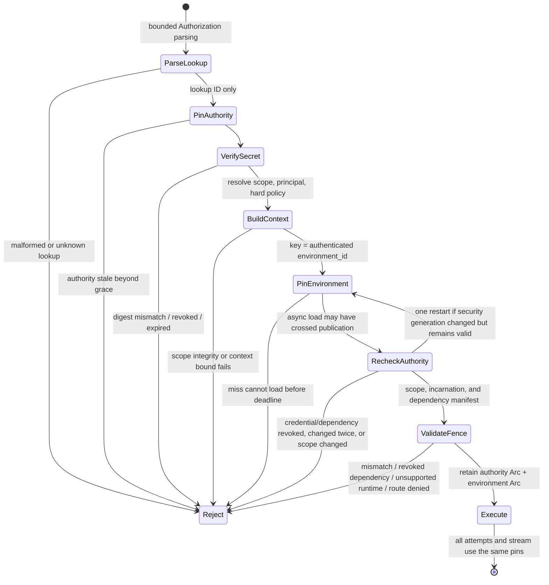
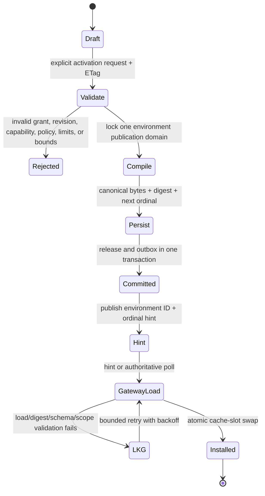
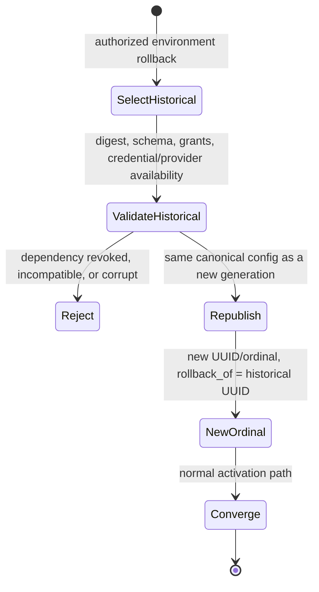

# ADR 0002: Bounded request context and split runtime authority

- Status: Accepted target (approval pending)
- Decision issue: XOD-84 / M0-02
- Depends on: ADR 0001
- Scope: public authentication, request execution, runtime publication, cache behavior, and telemetry
- Replaces: one fleet-wide `RuntimeBundle` as the long-term authority model

## Context

The current gateway atomically pins one `Arc<RuntimeBundle>` for a request. The
bundle contains a `RuntimeSnapshot` with one global generation, providers,
routes, and API keys, plus provider transports holding the matching credential
material. This correctly prevents an in-flight request from observing a future
route or provider credential. `decode_release_candidate` also replaces every
historical API-key security field with the current database view before an old
release can become last-known-good.

The same bundle is nevertheless the wrong enterprise unit. A route change in
one environment would rebuild every environment. A public-key revocation would
wait for an unrelated provider/runtime publication. Authentication cannot
derive organization, project, or environment because current
`RequestMetadata` contains only request ID, operation, surface, and transport
mode.

This ADR preserves immutable request and transport pinning while splitting the
two authorities that change for different reasons.

## Decision summary

A request observes exactly two immutable authorities, in this order:

1. **Credential authority** is selected by an opaque, installation-unique
   public lookup ID. It verifies the submitted secret, resolves one scope and
   principal, carries all current security-critical credential policy, and
   exposes the same immutable security generation's provider-credential and
   provider-grant revocation index.
2. **Environment runtime** is selected only from the authenticated credential
   authority entry. It contains one environment's granted provider revisions
   and transports, routes, immutable policy program, limit/budget references,
   pricing references, and an exact dependency manifest checked against that
   revocation index.

Authentication pins credential authority first. After validation it constructs
a bounded trusted `RequestContext`, then pins exactly one environment runtime.
Retries and streaming retain both pins. They never repin a newer transport,
credential revision, route, policy, price, or environment generation.

## RequestContext contract

`RequestContext` is an internal trusted value, not a deserialized client
object. Protocol adapters may submit candidate values to the context builder,
but only the builder can assign provenance and produce a valid context.

### Fields, bounds, and provenance

| Field | Type and bound | Authoritative provenance | Durable/telemetry rule |
|---|---|---|---|
| `request_id` | UUIDv7 | Generated by OLP at admission; a syntactically valid inbound request ID may be retained only as separate untrusted correlation metadata. | Durable operational identifier. Safe as a trace correlation field, not a metric label. |
| `received_at` | UTC timestamp | Gateway monotonic/wall-clock pair. | Durable timing metadata. |
| `installation_id` | UUID | Local installation configuration. | Audit/trace only; never a public tenant selector. |
| `organization_id` | UUID | Credential authority scope tuple. | Copied to scoped facts; raw value excluded from general metrics. |
| `project_id` | UUID | Credential authority scope tuple, integrity-checked against organization. | Copied to scoped facts. |
| `environment_id` | UUID | Credential authority scope tuple, integrity-checked against project. | Copied to scoped facts and used as the sole runtime-cache key. |
| `environment_incarnation` | UUID | Created with the environment and present in both authorities. | Internal consistency fence; not user-visible. |
| `principal` | Tagged `inference_credential`, `application`, or `service_account` with UUID; exactly one primary kind | Credential authority. Human management sessions use a separate management context and do not enter public inference through client headers. | Principal kind may be bounded telemetry; raw ID is audit/trace only. |
| `credential_id` | UUID | Credential authority entry. | Durable attribution. Never log the lookup ID or secret digest. |
| `application_id` | Optional UUID | Credential binding; must belong to the project. | Durable cost attribution when present. |
| `opaque_end_user_id` | Optional 1-256 byte UTF-8 value after control-character rejection | An explicitly enabled protocol field or header. It is always untrusted and namespaced by credential; it cannot alter authorization. | Raw value is memory-only. Durable and telemetry forms are keyed hashes; absence and invalidity are distinct. |
| `operation` | Closed canonical `OperationKind` | Protocol decoder and selected endpoint. | Durable bounded dimension. |
| `surface` | Closed `Surface` | Listener/path and protocol decoder; client content cannot override it. | Durable bounded dimension. |
| `transport_mode` | Closed `TransportMode` | Endpoint semantics plus validated request mode. | Durable bounded dimension. |
| `route` | Parsed route slug (1-63 bytes) plus resolved stable route ID | Canonical request plus environment runtime lookup. | Slug may be durable; route ID is authoritative. No unrestricted metric label. |
| `data_classification` | Closed enum: `unspecified`, `public`, `internal`, `confidential`, `restricted` | Credential/application default; a client may request only an equal or stricter allowed value. | Durable enum only; never content-derived. |
| `residency_region` | Optional approved region ID, maximum 63 lowercase ASCII slug bytes | Organization/environment policy. Client hints can only narrow an allowlist. | Bounded telemetry enum/allowlist. |
| `priority` | Closed enum: `background`, `normal`, `high`; default `normal` | Credential/application policy. Client may lower priority; elevation requires explicit policy. | Bounded telemetry dimension. |
| `deadline` | Absolute monotonic deadline, 1 ms to 900,000 ms after admission | Minimum of endpoint hard cap, route timeout, credential/policy cap, and an optional shorter validated client request. | Durable elapsed/timeout class, not the raw client value. |
| `labels` | At most 16 entries; key 1-32 lowercase ASCII slug bytes; value 0-128 UTF-8 bytes; at most 2,048 encoded bytes total | Credential/application allowlist plus validated client candidates. Reserved `olp.*` keys are server-only. | Memory-only by default. Only explicitly allowlisted keys and hashed/enum values may enter traces or facts; never general metric labels. |
| `trace_context` | One valid W3C `traceparent`; `tracestate` <=512 bytes; approved baggage <=1,024 bytes and 16 members | Validated inbound headers or server-created root. | Propagated only under provider-header policy. Baggage is memory-only and content/credentials are rejected. |
| `credential_security_revision` | Positive monotonic integer plus digest | Pinned credential authority entry. | Internal/audit evidence. |
| `security_authority_generation` | Positive monotonic generation plus digest | Pinned credential authority object containing the entry and dependency-revocation index. | Internal/audit evidence; excluded from connector projection. |
| `environment_generation` | Filled after runtime pin: generation UUID, positive environment-local ordinal, and digest | Pinned environment runtime. | Durable operational evidence. |

The fully encoded context, excluding fixed-size runtime references, is limited to
8 KiB. Parsing stops and the request fails before provider admission when an
individual or aggregate bound is exceeded. Truncation is forbidden because it
could change policy, routing, or audit meaning.

### Trust and privacy rules

- Organization, project, environment, principal, application, credential,
  policy, grant, and runtime fields never come from arbitrary headers or body
  extensions.
- Unknown vendor fields remain source-scoped protocol extensions in memory.
  They do not become labels automatically.
- Request content, responses, reasoning, tool arguments/results, uploads, raw
  headers, bearer values, credential digests, and raw end-user IDs are absent
  from context debug output and durable records.
- `Debug` implementations redact every unbounded or secret-bearing field.
- Context passed to connectors is a typed projection. A connector receives only
  fields its versioned contract permits; it never receives management identity,
  secret digests, arbitrary baggage, or the complete label map.
- Policy phases use typed, size-bounded projections. Content access is explicit
  per phase and cannot make durable content capture implicit.

### Cardinality rules

Metrics use only closed enums and fixed health/result classes. Organization,
project, environment, application, user, credential, route slug, provider,
model, label values, and end-user identifiers are not general Prometheus label
dimensions. Scoped dashboards obtain authorized aggregates from storage or use
bounded configured aliases. Traces and structured logs may contain opaque or
keyed-hash identifiers under sampling and access control; audit records retain
typed raw UUIDs because they are authorized evidence.

## Current-field migration map

This map is exhaustive for the current domain and application runtime structs.
Field removal is not permitted until its destination is implemented and
compatibility fixtures prove equivalent behavior.

### `RequestMetadata`

| Current field | Destination |
|---|---|
| `request_id` | `RequestContext.request_id`, unchanged semantics and stable through every attempt. |
| `operation` | `RequestContext.operation`, still derived from the canonical decoded operation. |
| `surface` | `RequestContext.surface`, now additionally checked against the endpoint and credential policy. |
| `mode` | `RequestContext.transport_mode`, now additionally checked against endpoint, capability, and credential policy. |

`ProviderRequest.metadata` becomes a bounded connector projection derived from
the pinned `RequestContext`; providers do not gain tenant policy authority.

### `RuntimeSnapshot`

| Current field | Destination |
|---|---|
| `generation.id` | `EnvironmentRuntime.generation.id`. Existing releases migrate to the default environment without changing the UUID. |
| `generation.ordinal` | `EnvironmentRuntime.generation.ordinal`, monotonic per environment. Existing sequence values are retained for the default environment. |
| `generation.activated_at` | `EnvironmentRuntime.generation.activated_at`. |
| `providers` | Environment runtime `granted_providers`, keyed by provider connection ID and pinned provider revision/grant ID. Mutable organization catalog fields stay in the control plane. |
| `routes` | Environment runtime `routes`, with stable route/routing IDs and environment-scoped slugs. |
| `api_keys` | Removed from environment releases. Every `ApiKeyLookupId -> ApiKey` entry becomes a credential-authority entry pointing to one environment. |

Current `ApiKey` fields map as follows: `id`, `lookup_id`, digest, status,
expiry, scopes, allowed routes, and hard limits all move to credential authority.
The lookup ID remains installation-unique, allowed routes become stable
environment route IDs (with compatibility slugs during migration), and limits
remain security-critical even when general quota policy later exists.

Current `Provider` fields map as follows: `id` remains the organization provider
connection ID; `name` stays control-plane metadata; `kind` becomes a versioned
provider type reference in the connector milestone; `enabled` is the combined
connection/revision/grant eligibility result; `active_credential` is captured
inside the immutable provider revision/transport; and `capabilities` remain the
certified tuples compiled into the environment runtime. The selected provider
credential revision and grant revision also enter the runtime dependency
manifest; their current allow/revoke state enters credential authority.

### `RuntimeBundle`

| Current field | Destination |
|---|---|
| `snapshot` | Split between credential authority and one `EnvironmentRuntime` as described above. |
| `transports` | `EnvironmentRuntime.provider_transports`, keyed by the granted provider revision. Transport objects and their provider credential revision remain inside the same pinned environment `Arc`. |

`RuntimeManager.bundle: ArcSwap<RuntimeBundle>` becomes an independently
published credential-authority store plus an environment cache whose installed
values are immutable `Arc<EnvironmentRuntime>` objects. The semantic `pin()`
guarantee remains, but callers must pin in the prescribed order.

## Authority envelopes and publication fences

Every published authority object has a bounded envelope:

- contract name and semantic schema version;
- installation ID;
- complete organization/project/environment tuple and environment incarnation
  for environment objects;
- monotonic sequence in its own authority domain;
- object/release UUID;
- creation/activation timestamp;
- SHA-256 digest of byte-stable canonical payload bytes;
- previous digest or explicit genesis marker;
- minimum reader contract version; and
- bounded payload length and collection counts.

Publication stores the canonical object, digest, sequence, and outbox event in
one PostgreSQL transaction under the appropriate advisory/row lock. A gateway
verifies envelope, payload length, digest, schema support, monotonicity, scope
tuple, and all internal references before atomic installation. Invalid or
unknown candidates never replace last-known-good state. Outbox/Valkey messages
are hints; periodic authoritative polling closes missed-hint gaps.

Public-credential changes and provider dependency invalidations use the
credential-authority sequence and do not need to wait for an environment
generation. Environment activation uses an environment-local sequence and does
not rebuild credential authority. An ownership/incarnation change is not an
ordinary update: credentials are revoked/reissued and the environment is
recreated or restored with explicit evidence.

## Request authentication and pinning

The post-load recheck prevents a request authenticated immediately before a
revocation from starting new provider work after a slow cold load. It may
restart authentication once; continuous churn fails closed. After the first
provider attempt begins, the pins are stable for the request lifetime. A later
revocation blocks new requests but does not silently switch or kill an already
committed stream. Incident policy may explicitly terminate connections outside
this request contract.

## Environment activation

An activation changes only its environment cache slot. Requests that already
pinned the prior generation complete on it. The control API reports committed
publication separately from measured gateway convergence.

## Credential update and revocation

```mermaid
stateDiagram-v2
    [*] --> Active
    Active --> CommitChange: revoke, expire, rotate secret, or tighten policy
    CommitChange --> PublishAuthority: durable revision + outbox atomically
    PublishAuthority --> GatewayValidate: hint or authoritative poll
    GatewayValidate --> KeepPrevious: invalid candidate; readiness degraded
    GatewayValidate --> InstallRevision: atomic authority entry/shard swap
    InstallRevision --> DenyNew: revoked/expired entry
    InstallRevision --> AllowNew: valid replacement entry
    Active --> InFlightPinned: request already began execution
    InFlightPinned --> Complete: old immutable security revision remains attributable
```

Revocation never waits for route/provider activation. Propagation latency and
the maximum accepted authority staleness are measured release gates. A gateway
that cannot prove authority freshness beyond the signed grace denies new public
authentication even if an environment runtime remains cached.

### Provider credential and grant invalidation

Provider credentials and provider grants are security dependencies, not merely
configuration inputs. Every environment runtime carries an exact bounded
manifest of the provider credential revision and grant revision used by each
transport. The credential-authority object carries a monotonic allow/revoke
record for those dependency IDs in the same immutable security generation as
the public credential entry.

Activating, tightening, disabling, or revoking a provider credential or grant
commits the durable dependency state, next credential-authority generation, and
outbox event in one PostgreSQL transaction. A project-wide grant change uses
the same indexed dependency ID; it does not rely on best-effort fan-out before
becoming effective. Environment compilation subsequently publishes forward-fix
generations that omit or replace the dependency, but denial of new work does
not wait for that compilation.

After pinning an environment runtime, the gateway compares every dependency
manifest entry with the pinned authority generation. A missing record, revoked
record, revision mismatch, or security generation below the dependency's
minimum makes the complete cached runtime ineligible for a new request. The
gateway does not dynamically remove a target, substitute a credential, or
combine transports from another generation. The post-cold-load authority
recheck covers both the public credential and this dependency manifest and may
restart once under the same bounded rule.

A request that began its first provider attempt before the invalidation commit
retains its two immutable pins and may complete under the accepted in-flight
risk. Every request admitted after the invalidation reaches a gateway within
the authority propagation bound either uses a newly valid environment
generation or fails closed. Restore and rollback apply the same check, so an
otherwise valid historical runtime cannot revive a revoked provider secret or
grant.

The capacity envelope's `provider_dependency_invalidation` target measures
this path from security transaction commit: healthy hints are 2,000 ms p99 and
a missed hint must converge through authoritative polling within 6,000 ms.
Environment republication is explicitly outside that denial critical path.

## Rollback

Rollback never decrements or reuses an ordinal and never reinstates a revoked
credential or grant. If a historical release names an unavailable dependency,
operators must create a forward-fix revision. Database rollback is a separate
restore decision governed by the compatibility ADR.

## Cold load, eviction, and stale behavior

Environment runtimes are loaded lazily because fleet-wide eager loading is
unbounded. Cache limits are part of the signed capacity envelope and include
entry count, canonical bytes, compiled bytes, concurrent loads, waiters per
load, load deadline, and eviction work per interval.

```mermaid
stateDiagram-v2
    [*] --> Lookup
    Lookup --> Hit: immutable Arc present and usable
    Lookup --> SingleFlight: absent or invalidated
    SingleFlight --> Wait: one bounded loader; bounded coalesced waiters
    Wait --> Install: latest authoritative release validates
    Wait --> UseLKG: refresh failed but cached generation is valid and control freshness is within grace
    Wait --> Deny: no LKG, deadline, unsupported schema, or stale control watermark
    Install --> Hit
    Hit --> Pinned: request clones Arc
    Pinned --> Hit: request drops Arc
    Hit --> Evictable: idle, unpinned by cache policy, over capacity
    Evictable --> Evicted: remove cache ownership only
    Evicted --> Lookup
    UseLKG --> SingleFlight: bounded backoff/poll
```

- The signed stale grace is exactly 6,000 ms, frozen at
  `propagation_targets.admission_authority_freshness.maximum_age_ms` in the
  capacity envelope. Age is measured independently for credential/dependency
  security authority and the environment release head from completion of the
  last successful authoritative PostgreSQL read and validation of the current
  head. Reading or receiving a candidate that cannot be installed does not
  reset the watermark, and neither does a hint. Once either age exceeds 6,000
  ms, the gateway denies new public
  authentication before runtime selection and cannot remain ready. Being
  inside the grace permits cached admission only when every other security,
  dependency, hard-control, and runtime fence passes.
- A cache miss during PostgreSQL unavailability fails closed; another
  environment's runtime is never a fallback.
- Valkey/outbox-hint loss alone does not block service while authoritative
  polling remains fresh.
- Cached last-known-good state may serve only while the gateway's control-plane
  freshness watermark is inside the signed stale grace. Beyond it, new requests
  are denied because revocation and hard-policy freshness cannot be proven.
- Existing pinned requests and streams may complete after the freshness window;
  they remain attributable to their pinned revisions.
- Eviction removes only the cache's `Arc`. An active request retains its object
  and provider transports. Eviction cannot cancel a request or mutate a runtime.
- The credential authority is capacity-qualified separately. It may be
  immutable sharded internally by lookup ID, but lookup observes one complete
  entry revision and shard swaps are atomic.
- Load failures, LKG use, staleness, churn restarts, eviction, convergence, and
  per-environment cache pressure produce bounded metrics without tenant IDs as
  unrestricted labels.

## Mixed-generation deny-safe rules

A request is executable only when all of the following hold:

1. credential authority is fresh and the public entry is active;
2. organization/project/environment ancestry and environment incarnation match
   between context and runtime;
3. both contract versions are supported by the process;
4. credential hard policy permits operation, surface, mode, and stable route;
5. the environment runtime contains that route and a certified eligible target;
6. every provider credential and grant manifest entry exactly matches an
   allowed record in the pinned credential-authority generation;
7. hard limit/budget dependencies required by policy are available; and
8. the post-cold-load credential revision recheck succeeds.

A missing field, unknown enum, digest mismatch, newer unsupported contract,
scope mismatch, stale cursor/context, or unavailable hard-control dependency is
a denial. Compatibility defaults may exist only in a versioned decoder with a
documented conservative meaning. Unknown usage or price stays incomplete or
unpriced and cannot become zero.

## Attempt and streaming invariants

The request execution object owns both pinned `Arc`s. An `AttemptPlan` contains
stable IDs and receives its transport from the pinned environment runtime. No
retry path performs a fresh runtime or provider-registry lookup. Retry remains
bounded by route attempts and the request deadline. Once a response is externally
committed, failover is forbidden. Non-idempotent media/job mutations are not
hedged, and ambiguous outcomes remain explicit.

## Dependency-outage behavior

| Failure | New requests | In-flight requests | Recovery |
|---|---|---|---|
| Valkey hint unavailable, PostgreSQL polling fresh | Continue on validated authority/runtime; mark hint path degraded. | Continue pinned. | Poll catches up; verify convergence. |
| PostgreSQL unavailable within signed stale grace | Cached environments may serve only with fresh-enough credential authority and available hard controls; cache misses deny. | Continue pinned. | Reload latest sequences before clearing degraded state. |
| Control freshness exceeds grace | Deny new public authentication. | Continue pinned; do not repin. | Authoritative poll and digest verification must succeed. |
| Credential-authority candidate corrupt/incompatible | Keep previous entry/shard only within freshness grace; degrade readiness. | Continue pinned. | Repair/forward-fix publication. |
| Environment candidate corrupt/incompatible | Keep its LKG only within freshness grace; other environments are unaffected. | Continue pinned generation. | Repair/rollback as a new ordinal. |
| Hard limiter, quota, or budget dependency unavailable | Fail closed for credentials/policies requiring it. Explicit versioned soft modes may only reduce privilege or mark economics incomplete. | Existing reservations reconcile under their pinned policy. | Restore dependency and reconcile before readiness clears. |
| Provider unavailable | Apply existing bounded route failover on the pinned runtime only. | Same. | Circuit/probe recovery; no runtime repin. |

## Consequences

Credential revocation and environment activation now have independent
publication, convergence, and failure domains. Cache memory becomes bounded by
active environments rather than total fleet configuration, and activation or
rollback cannot replace another environment's runtime.

The cost is a two-stage admission path, a lazy cache, two convergence metrics,
explicit stale-grace behavior, and more compatibility envelopes. Those are
intentional: the system gains a precise place to enforce tenant scope and can
deny mixed or stale security observations without weakening immutable
generation and transport pinning.

This ADR does not implement the M2 runtime, choose a connector RPC protocol,
define general policy language semantics, or add end-user enterprise features.
It freezes the authority and request contracts those milestones must satisfy.
