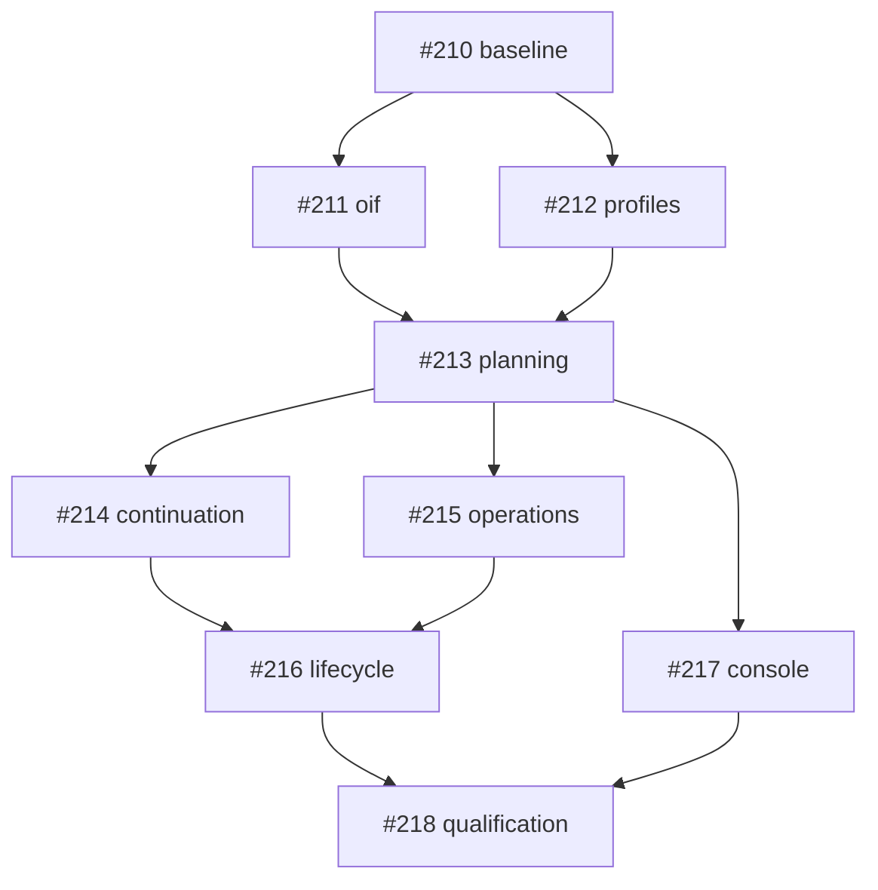

# OIF implementation tracking

The authoritative specification is [OLP-implementation-spec.md](../../OLP-implementation-spec.md), tracked by [#209](https://github.com/tyk-swe/olp/issues/209). Baseline: `8580b39905dc4da9278de8e53ceac7d2412ad6a5`.

## Dependency graph

## Delivery status

Tickets become ready for implementation when their blockers are integrated into this branch. They remain open until the complete PR merges. A commit or a passing unit test alone does not establish the full specification gates.

| Ticket | Scope | Status | Evidence |
| --- | --- | --- | --- |
| [#210](https://github.com/tyk-swe/olp/issues/210) Freeze independent fidelity fixtures and performance baseline | D23; T01, T07, T08, T09 | Fixtures integrated; performance baseline pending | Fixture commit `a541fd31`; [baseline validation](../qualification/fidelity/baseline-validation.md) |
| [#211](https://github.com/tyk-swe/olp/issues/211) Introduce source-preserving OIF and registered identity plans | D01-D07, D14, D19-D20; T01, T07, T10 | Pending | — |
| [#212](https://github.com/tyk-swe/olp/issues/212) Implement typed provider profiles and secure connection configuration | D06-D07, D16-D17; T05 | Pending | — |
| [#213](https://github.com/tyk-swe/olp/issues/213) Admit complete strict interaction plans and expose safe inspection | D02,D08-D10,D13,D18,D21,D23; T01,T03,T05 | Pending | — |
| [#214](https://github.com/tyk-swe/olp/issues/214) Preserve streaming reasoning and recoverable tool continuation | D04,D08,D10-D14,D19; T02-T03,T07 | Pending | — |
| [#215](https://github.com/tyk-swe/olp/issues/215) Implement independent non-generation operation fidelity | D03-D05,D14-D15; T04,T07,T10 | Pending | — |
| [#216](https://github.com/tyk-swe/olp/issues/216) Integrate media durable resources and duplex interaction contracts | D11-D15,D19,D23; T03-T05,T10 | Pending | — |
| [#217](https://github.com/tyk-swe/olp/issues/217) Expose schema-driven configuration fidelity evidence and operation playgrounds | D16,D21-D22; T05-T06 | Pending | — |
| [#218](https://github.com/tyk-swe/olp/issues/218) Complete extensibility migration and release qualification | D07,D19-D23; T01-T10; G1-G7 | Pending | — |

## Qualification rules

- Preserve the frozen reference inventory; add versioned independent evidence.
- Retain the denominator and report admitted, incompatible, incomplete, ambiguous and unknown outcomes separately.
- Empirical quality remains unknown without authorized live evidence; deterministic fixtures do not establish intelligence parity.
- Capture baseline performance and predeclare budgets before changing the measured hot path.
- Keep existing published routes explicitly legacy until reviewed migration.
- Complete G1–G7, repository checks, service/recovery/SDK/browser qualification, and the two-axis code review before marking the PR ready.
