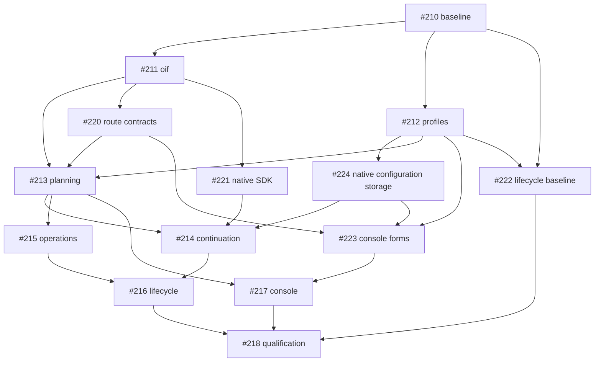

# OIF implementation tracking

The authoritative specification is [OLP-implementation-spec.md](../../OLP-implementation-spec.md), tracked by [#209](https://github.com/tyk-swe/olp/issues/209). Baseline: `8580b39905dc4da9278de8e53ceac7d2412ad6a5`.

## Dependency graph

## Delivery status

Tickets become ready for implementation when their blockers are integrated into this branch. They remain open until the complete PR merges. A commit or a passing unit test alone does not establish the full specification gates.

| Ticket | Scope | Status | Evidence |
| --- | --- | --- | --- |
| [#210](https://github.com/tyk-swe/olp/issues/210) Freeze independent fidelity fixtures and performance baseline | D23; T01, T07, T08, T09 | Integrated; replacement qualification pending | Fixture commit `a541fd31`; [fixture validation](../qualification/fidelity/baseline-validation.md); [legacy performance baseline and frozen budgets](../evidence/fidelity-performance/README.md), measured at `8e52f775` and captured in `cff8c753` |
| [#211](https://github.com/tyk-swe/olp/issues/211) Introduce source-preserving OIF and registered identity plans | D01-D07, D14, D19-D20; T01, T07, T10 | Source layer integrated; full G6 qualification pending in #218 | Source branch `f687cdc5`; [source contracts and validation](../qualification/fidelity/oif-source.md); [both performance captures and unresolved relay-control limit](../evidence/fidelity-performance/oif-source-v1/README.md) |
| [#212](https://github.com/tyk-swe/olp/issues/212) Implement typed provider profiles and secure connection configuration | D06-D07, D16-D17; T05 | Integrated; bounded strict generation admission integrated in #213 | Profile branch `7d2230f8`, merge `fe49524d`; attempt-budget fix `1f68975b`, merge `2b9a7867`; [profile and connection contracts](../provider-profiles.md) |
| [#220](https://github.com/tyk-swe/olp/issues/220) Persist route fidelity contracts and policy invariants | D02, D18, D21, D23 | Foundation integrated; bounded strict generation execution integrated in #213 | Route branch `1a9a9248`, merge `b618961b`; [configuration and migration qualification](../qualification/fidelity/route-contracts.md) |
| [#213](https://github.com/tyk-swe/olp/issues/213) Admit complete strict interaction plans and expose safe inspection | D02,D08-D10,D13,D18,D21,D23; T01,T03,T05 | Integrated; continuation, other operations, lifecycle and playground guards remain #214–#217 | Planner branch `b09c0012`, merge `873b3ce1`; [strict planning scope and validation](../qualification/fidelity/strict-planning.md); [safe inspector qualification](../qualification/fidelity/plan-inspector.md) |
| [#221](https://github.com/tyk-swe/olp/issues/221) Qualify native reasoning/tool SDK continuation | T02 native seam | Native SDK slice integrated; strict/translated/recovery qualification remains #214 | SDK branch `d62b0eb1`, merge `04396de3`; [native SDK qualification](../qualification/fidelity/native-sdk.md) |
| [#214](https://github.com/tyk-swe/olp/issues/214) Preserve streaming reasoning and recoverable tool continuation | D04,D08,D10-D14,D19; T02-T03,T07 | Ready; #213, #221 and #224 integrated | Forward migration 0025 reserved; continuation/resource guards remain pending implementation and qualification |
| [#215](https://github.com/tyk-swe/olp/issues/215) Implement independent non-generation operation fidelity | D03-D05,D14-D15; T04,T07,T10 | Active; #213 integrated | Operation/profile exploration started from `06523391`; no #215 implementation integrated yet |
| [#216](https://github.com/tyk-swe/olp/issues/216) Integrate media durable resources and duplex interaction contracts | D11-D15,D19,D23; T03-T05,T10 | Pending | — |
| [#224](https://github.com/tyk-swe/olp/issues/224) Preserve native JSON configuration and release storage | D03-D04, D16 | Integrated; backend blockers for #223 and #214 resolved | Storage branch `3e5d5358`, merge `3b35c1fb`; forward migration 0024; [native configuration conservation and migration qualification](../qualification/fidelity/native-configuration-storage.md) |
| [#223](https://github.com/tyk-swe/olp/issues/223) Implement lossless schema-driven configuration editors | D16, D21; T05-T06 | Active; #212, #220 and #224 integrated | Independent configuration-editor slice; backend storage blocker resolved; inspector, evidence and operation playgrounds remain #217 |
| [#217](https://github.com/tyk-swe/olp/issues/217) Expose schema-driven configuration fidelity evidence and operation playgrounds | D16,D21-D22; T05-T06 | Pending | — |
| [#222](https://github.com/tyk-swe/olp/issues/222) Freeze native durable publication and duplex baselines | T09 prerequisite | Baseline integrated; replacement qualification pending | Harness `373c5846`, capture `033c611f`, merge `b11a55e4`; [48 measured repetitions and frozen criteria](../evidence/fidelity-performance/lifecycle-v1/README.md) |
| [#218](https://github.com/tyk-swe/olp/issues/218) Complete extensibility migration and release qualification | D07,D19-D23; T01-T10; G1-G7 | Pending | — |

## Qualification rules

The #210 merge passed `go test -mod=readonly ./tests/fidelity`, the gateway benchmark
oracle corruption test, and the seven benchmark runner tests. The baseline artifact
matches the recorded harness and runner hashes, and its self-comparison preserves
all 22 workloads within the frozen budgets. This validates baseline integrity;
replacement performance, empirical quality, and G1–G7 remain unqualified.

The #211 source branch passed `make check`, focused source/protocol/SSE/gateway/
fidelity race tests, source fuzzing, the official JavaScript and Python SDK smoke
suites, and management-provisioned conservation and response-lifecycle tests.
These runs apply to the recorded source runtime in its [validation
receipt](../qualification/fidelity/oif-source.md). The optimized performance
capture passed every gateway workload and sample floor, but the unchanged
slow-relay control exceeded its frozen p99 inter-event-gap limit (3,943 µs versus
3,544 µs). Neither full comparison passed. Both captures are retained; integrated
G6 qualification remains open in #218 with the original harness and budgets.

Integrating source revision `f687cdc5` with connection revision `f1360852` on
2026-09-22 required no conflict resolution. The combined tree passed uncached
OIF, operation, protocol/SSE, gateway, egress, provider and independent fidelity
tests; focused Go vet and formatting checks; all seven release-inventory script
tests; and disposable-service public conservation and `TestResponseLifecycle`
checks. Regenerating the current release inventory preserved the frozen
reference, native fidelity fixtures and v1 performance artifacts unchanged.

The combined profile, route-contract and native SDK tree at `04396de3` passed
`make check` (including 617 console tests and 14 script tests), both official
SDK smoke suites, and disposable-service race tests for all new profile/cloud/
network and route-fidelity behaviors, migration recovery/history, public source
conservation and response lifecycle. The SDK clients each retained all 19 native
events and completed both tool results in two verified provider dispatches.
Migration qualification retained both the 0022 network-credential and 0023
route-fidelity additions; no historical production migration changed. The
follow-up `1f68975b` checks current network-credential revocation before attempt
admission, preserving the budget for eligible siblings with both API-key and
credential-free provider authentication. The combined gateway revocation tests
passed with race detection after its merge. These checks do not provide strict
admission (#213), complete G2, or G6.

The #222 merge passed the lifecycle artifact self-comparison, all five runner
tests and the short public-service conservation/corruption suite. Recorded
source, harness and runner identities match the frozen capture; current
inventory regeneration retained the original v1 evidence and all independent
fixtures. This qualifies baseline integrity and integration, not replacement
timings, encrypted translated-tool recovery or full G6.

The #213 planner at `b09c0012` merged without conflicts in `873b3ce1`. The combined
tree, including the pricing timestamp fixture correction `4f1f47f0` merged in
`338f4d0f`, passed uncached gateway, interaction, runtime, routes and configuration
race tests. The combined disposable-service suite passed with race detection in
83.430 s, covering strict admission and inspection, effective defaults, native
cloud profiles, network credentials, route fidelity, Responses lifecycle, source
conservation, lifecycle performance correctness/corruption controls and populated
forward migration. All five lifecycle runner tests and the frozen lifecycle
baseline self-comparison passed. Regenerated Go/TypeScript contracts and current release
inventory introduced no changes; historical migrations, independent fixtures,
and both original and supplemental performance harnesses and artifacts remained
unchanged. These runs supplement the planner's recorded `make check`, SDK,
strict-public, cloud and inspector qualification; they are not timed G6 evidence.

The separate production correction `f39064c6`, merged in `da9ebeea`, gives proxy
negotiation deadlines one context owner so timeout classification cannot race a
second socket deadline. The combined egress race suite, gateway cancellation and
network-revocation regressions, and public network-profile/inspector race checks
passed after this merge. Existing timeout, cancellation and bounded-header tests
remain unchanged; this is distinct from the test-only pricing fixture correction.

Strict continuation/resource authority (#214), independent non-generation
contracts (#215), media/durable/duplex contracts (#216), and the console playground
projection (#217) remain guarded until their own qualification. Full G2 and G6
remain unqualified. #224 now supplies forward migration 0024 and native
configuration/release storage conservation. #214 can build its persistence work
on reserved forward migration 0025; the active #223 and #215 branches remain
outside this integration.

The #224 storage branch `3e5d5358` merged without conflicts in `3b35c1fb`, retaining
the already integrated pricing-test and proxy corrections unchanged. Combined
access/configuration/media/provider/runtime/routes/interaction race suites and
focused Go vet passed. The public suite passed with race detection in 75.849 s,
using a freshly built CLI for migration/rotation checks, and covered native JSON
configuration/replay/promotion/reload, migration history and rollback, strict
admission/inspection, route fidelity, network profiles and Responses lifecycle.
Focused media lifecycle/quota/revocation and claim-reconciliation service races
also passed. Current inventory regeneration introduced no further changes;
0024 is the only new migration, with no historical migration or frozen evidence
changes. These results supplement the storage branch's recorded `make check`.

- Preserve the frozen reference inventory; add versioned independent evidence.
- Retain the denominator and report admitted, incompatible, incomplete, ambiguous and unknown outcomes separately.
- Empirical quality remains unknown without authorized live evidence; deterministic fixtures do not establish intelligence parity.
- Capture baseline performance and predeclare budgets before changing the measured hot path.
- Keep existing published routes explicitly legacy until reviewed migration.
- Complete G1–G7, repository checks, service/recovery/SDK/browser qualification, and the two-axis code review before marking the PR ready.
