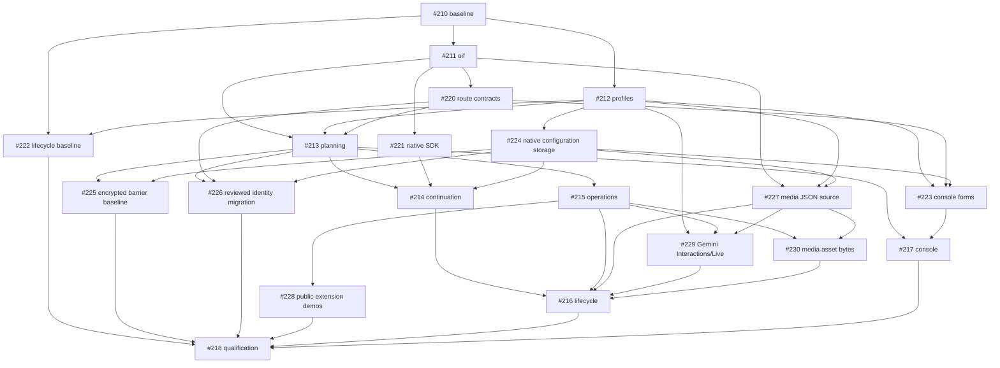

# OIF implementation tracking

The authoritative specification is [OLP-implementation-spec.md](../../OLP-implementation-spec.md), tracked by [#209](https://github.com/tyk-swe/olp/issues/209). Baseline: `8580b39905dc4da9278de8e53ceac7d2412ad6a5`.

The September 24, 2026 [release-criteria amendment](../qualification/fidelity/release-validation.md)
retains all 66 stories and product decisions. Bounded performance smoke and
resource/overflow correctness are required; long statistical studies are
optional. Earlier G6 descriptions below are historical checkpoints under the
original criteria, not a requirement to repeat those studies. Failed/invalid
captures and unknown live quality remain visible. All functional, security,
recovery, SDK, browser, inventory and code-quality gates still apply.

## Dependency graph

## Delivery status

Tickets become ready for implementation when their blockers are integrated into this branch. They remain open until the complete PR merges. A commit or a passing unit test alone does not establish the full specification gates.

| Ticket | Scope | Status | Evidence |
| --- | --- | --- | --- |
| [#210](https://github.com/tyk-swe/olp/issues/210) Freeze independent fidelity fixtures and performance baseline | D23; T01, T07, T08, T09 | Baseline integrated; current release validation remains #218 | Fixture commit `a541fd31`; [fixture validation](../qualification/fidelity/baseline-validation.md); [legacy performance baseline and frozen budgets](../evidence/fidelity-performance/README.md), measured at `8e52f775` and captured in `cff8c753` |
| [#211](https://github.com/tyk-swe/olp/issues/211) Introduce source-preserving OIF and registered identity plans | D01-D07, D14, D19-D20; T01, T07, T10 | Source layer integrated; current release validation remains #218 | Source branch `f687cdc5`; [source contracts and validation](../qualification/fidelity/oif-source.md); [both performance captures and unresolved relay-control limit](../evidence/fidelity-performance/oif-source-v1/README.md) |
| [#212](https://github.com/tyk-swe/olp/issues/212) Implement typed provider profiles and secure connection configuration | D06-D07, D16-D17; T05 | Integrated; bounded strict generation admission integrated in #213 | Profile branch `7d2230f8`, merge `fe49524d`; attempt-budget fix `1f68975b`, merge `2b9a7867`; [profile and connection contracts](../provider-profiles.md) |
| [#220](https://github.com/tyk-swe/olp/issues/220) Persist route fidelity contracts and policy invariants | D02, D18, D21, D23 | Foundation integrated; bounded strict generation execution integrated in #213 | Route branch `1a9a9248`, merge `b618961b`; [configuration and migration qualification](../qualification/fidelity/route-contracts.md) |
| [#213](https://github.com/tyk-swe/olp/issues/213) Admit complete strict interaction plans and expose safe inspection | D02,D08-D10,D13,D18,D21,D23; T01,T03,T05 | Integrated with dependent #214–#217 slices; final release audit remains #218 | Planner branch `b09c0012`, merge `873b3ce1`; [strict planning scope and validation](../qualification/fidelity/strict-planning.md); [safe inspector qualification](../qualification/fidelity/plan-inspector.md) |
| [#221](https://github.com/tyk-swe/olp/issues/221) Qualify native reasoning/tool SDK continuation | T02 native seam | Native SDK slice integrated; translated continuation is integrated in #214; final audit remains #218 | SDK branch `d62b0eb1`, merge `04396de3`; [native SDK qualification](../qualification/fidelity/native-sdk.md) |
| [#214](https://github.com/tyk-swe/olp/issues/214) Preserve streaming reasoning and recoverable tool continuation | D04,D08,D10-D14,D19; T02-T03,T07 | Functional implementation integrated; historical paired barrier v2 pass and frozen v1 failure retained; final interaction/recovery audit remains #218 | Continuation branch `d9c3d729`, merge `5e1731b6`; [encrypted continuation, replay, recovery, SDK and refusal qualification](../qualification/fidelity/continuation.md); forward schema 0025; [final paired barrier v2 pass](../evidence/fidelity-performance/paired-barrier-v2-attempt2/README.md) |
| [#215](https://github.com/tyk-swe/olp/issues/215) Implement independent non-generation operation fidelity | D03-D05,D14-D15; T04,T07,T10 | Integrated; public extensibility and final G3/G7 qualification remain #218 | Operation branch `ebfd6d88`; [registered unary operation contracts and public qualification](../qualification/fidelity/unary-operations.md); forward schema 0026 |
| [#227](https://github.com/tyk-swe/olp/issues/227) Bind native media JSON inputs to OIF source parser | D03-D04,D15; T04,T07 | Source foundation and dependent strict media plans integrated; final audit remains #218 | Media source branch `ad5558e5`, merge `22738e0d`; [native image/speech source parser and public ambiguity qualification](../qualification/fidelity/media-source-foundation.md) |
| [#229](https://github.com/tyk-swe/olp/issues/229) Implement distinct Gemini Interactions and Live native lifecycle profiles | D06,D11-D15; T03-T05 | Native foundation and dependent #216 lifecycle integrated; final audit remains #218 | Feature commit `6d361ba8`, integrated as `508cfb4a`; [Gemini Interactions/Live scripted public and pinned SDK qualification](../qualification/fidelity/gemini-lifecycle-v1beta.md); forward schema 0028 |
| [#230](https://github.com/tyk-swe/olp/issues/230) Retain media OIF source and staged asset byte identities | D03-D04,D15,D19; T04,T07 | Integrated with dependent #216 strict media behavior; final audit remains #218 | Media source/digest branch `58afbe36`, merge `211fc8fa`; [source and streamed asset identity qualification](../qualification/fidelity/media-asset-identity.md) |
| [#216](https://github.com/tyk-swe/olp/issues/216) Integrate media durable resources and duplex interaction contracts | D11-D15,D19,D23; T03-T05,T10 | Scoped functional implementation integrated; historical lifecycle/stress evidence retained; final breadth and resource-correctness audit remains #218 | Strict media/video and encrypted file/batch/background merged in `4be7abc7` and `a5edce21`; direct OpenAI/Azure realtime merged in `d923fee` with terminal correction `250defcb`; forward schemas 0029/0030. [Media](../qualification/fidelity/media-strict.md), [durable resources](../qualification/fidelity/durable-lifecycle.md), [Gemini background recovery](../qualification/fidelity/gemini-background-stream.md) and [strict realtime](../qualification/fidelity/strict-realtime.md) record exact public scope and exclusions; [final strict lifecycle and stress v2 captures](../evidence/fidelity-performance/final-bc325-v2/README.md) passed their scoped criteria. |
| [#224](https://github.com/tyk-swe/olp/issues/224) Preserve native JSON configuration and release storage | D03-D04, D16 | Integrated; backend blockers for #223 and #214 resolved | Storage branch `3e5d5358`, merge `3b35c1fb`; forward migration 0024; [native configuration conservation and migration qualification](../qualification/fidelity/native-configuration-storage.md) |
| [#223](https://github.com/tyk-swe/olp/issues/223) Implement lossless schema-driven configuration editors | D16, D21; T05-T06 | Integrated; #217 inspector and playground also integrated | Console branch `a406b4b5`, merge `7c322cf6`; [native configuration browser qualification and reviewed screenshots](../qualification/fidelity/console-configuration.md) |
| [#217](https://github.com/tyk-swe/olp/issues/217) Expose schema-driven configuration fidelity evidence and operation playgrounds | D16,D21-D22; T05-T06 | Integrated; final exact-head browser/SDK audit remains #218 | Console branch `5963e192`, merge `760bc795`; [inspector, evidence, operation and strict playground qualification](../qualification/fidelity/console-interaction.md) with six reviewed screenshots |
| [#222](https://github.com/tyk-swe/olp/issues/222) Freeze native durable publication and duplex baselines | T09 prerequisite | Baseline integrated; historical strict lifecycle v2 pass retained; final release validation remains #218 | Harness `373c5846`, capture `033c611f`, merge `b11a55e4`; [48 measured repetitions and frozen criteria](../evidence/fidelity-performance/lifecycle-v1/README.md); [final strict lifecycle v2 pass](../evidence/fidelity-performance/lifecycle-v2/README.md) |
| [#225](https://github.com/tyk-swe/olp/issues/225) Freeze encrypted continuation barrier reference and budgets | T09 prerequisite | Reference baseline integrated; paired barrier v2 passes at locked source, frozen v1 failure remains | Source `29e18268`, capture `a99d0217`, merge `533ac161`; [36 repetitions, encrypted barrier reference and frozen criteria](../evidence/fidelity-performance/barrier-v1/README.md); [final paired barrier v2 pass](../evidence/fidelity-performance/paired-barrier-v2-attempt2/README.md); full G6 remains #218 |
| [#226](https://github.com/tyk-swe/olp/issues/226) Enforce reviewed route identity migration across mixed versions | D23; T10 | Integrated; final mixed-version and release audit remain #218 | Migration branch `39bf2792`; [strict route migration, rollback and mixed-version qualification](../qualification/fidelity/strict-route-migration.md); forward schema 0027, reviewed console draft and screenshot |
| [#228](https://github.com/tyk-swe/olp/issues/228) Prove provider, dialect and operation extensions through public behavior | D07,D15,D23; T10 | Integrated; final G7 audit remains #218 | Extension branch `1ed196c2`, merge `f3204af1`; [three public registration/dispatch/result/accounting demonstrations](../qualification/fidelity/extension-demos.md) run in their own integration process |
| [#218](https://github.com/tyk-swe/olp/issues/218) Complete extensibility migration and release qualification | D07,D19-D23; T01-T10; G1-G7 | All feature and functional/review gates remain required; bounded strict performance smoke and resource correctness replace long statistical studies | [47 frozen and 45 additive rows at `bc325da5`](../qualification/fidelity/compatibility-matrix-v1.md) report 31 native, 19 qualified mappings, two zero-dispatch incompatibilities and 40 unqualified rows, with [31 selected ancestor-run public/SDK race checks](../qualification/fidelity/row-evidence-v1.md). [Final-source timed evidence](../evidence/fidelity-performance/final-bc325-v2/README.md) and [gate status](../qualification/fidelity/qualification-status-v1.md) record scoped v2 passes, invalid source r6, unchanged frozen v1 failures and unknown empirical quality. Current-candidate repository/integration/SDK/recovery/browser checks, inventory reconciliation, final G1–G7 audit and mandatory review must be recorded separately under the [amended release criteria](../qualification/fidelity/release-validation.md). Historical source-cost failures/invalidity and unknown live quality do not become passes. |

## Qualification rules

The #210 merge passed `go test -mod=readonly ./tests/fidelity`, the gateway benchmark
oracle corruption test, and the seven benchmark runner tests. The baseline artifact
matches the recorded harness and runner hashes, and its self-comparison preserves
all 22 workloads within the frozen budgets. This validates baseline integrity;
replacement performance, empirical quality, and G1–G7 remain unqualified.

The #211 source branch passed `make check`, focused source/protocol/SSE/gateway/
fidelity race tests, source fuzzing, the official JavaScript and Python SDK smoke
suites, and management-provisioned conservation and response-lifecycle tests.
These runs apply to the recorded source runtime in its [validation
receipt](../qualification/fidelity/oif-source.md). The optimized performance
capture passed every gateway workload and sample floor, but the unchanged
slow-relay control exceeded its frozen p99 inter-event-gap limit (3,943 µs versus
3,544 µs). Neither full comparison passed. Both captures are retained; integrated
G6 qualification remains open in #218 with the original harness and budgets.

Integrating source revision `f687cdc5` with connection revision `f1360852` on
2026-09-22 required no conflict resolution. The combined tree passed uncached
OIF, operation, protocol/SSE, gateway, egress, provider and independent fidelity
tests; focused Go vet and formatting checks; all seven release-inventory script
tests; and disposable-service public conservation and `TestResponseLifecycle`
checks. Regenerating the current release inventory preserved the frozen
reference, native fidelity fixtures and v1 performance artifacts unchanged.

The combined profile, route-contract and native SDK tree at `04396de3` passed
`make check` (including 617 console tests and 14 script tests), both official
SDK smoke suites, and disposable-service race tests for all new profile/cloud/
network and route-fidelity behaviors, migration recovery/history, public source
conservation and response lifecycle. The SDK clients each retained all 19 native
events and completed both tool results in two verified provider dispatches.
Migration qualification retained both the 0022 network-credential and 0023
route-fidelity additions; no historical production migration changed. The
follow-up `1f68975b` checks current network-credential revocation before attempt
admission, preserving the budget for eligible siblings with both API-key and
credential-free provider authentication. The combined gateway revocation tests
passed with race detection after its merge. These checks do not provide strict
admission (#213), complete G2, or G6.

The #222 merge passed the lifecycle artifact self-comparison, all five runner
tests and the short public-service conservation/corruption suite. Recorded
source, harness and runner identities match the frozen capture; current
inventory regeneration retained the original v1 evidence and all independent
fixtures. This qualifies baseline integrity and integration, not replacement
timings, encrypted translated-tool recovery or full G6.

The #213 planner at `b09c0012` merged without conflicts in `873b3ce1`. The combined
tree, including the pricing timestamp fixture correction `4f1f47f0` merged in
`338f4d0f`, passed uncached gateway, interaction, runtime, routes and configuration
race tests. The combined disposable-service suite passed with race detection in
83.430 s, covering strict admission and inspection, effective defaults, native
cloud profiles, network credentials, route fidelity, Responses lifecycle, source
conservation, lifecycle performance correctness/corruption controls and populated
forward migration. All five lifecycle runner tests and the frozen lifecycle
baseline self-comparison passed. Regenerated Go/TypeScript contracts and current release
inventory introduced no changes; historical migrations, independent fixtures,
and both original and supplemental performance harnesses and artifacts remained
unchanged. These runs supplement the planner's recorded `make check`, SDK,
strict-public, cloud and inspector qualification; they are not timed G6 evidence.

The separate production correction `f39064c6`, merged in `da9ebeea`, gives proxy
negotiation deadlines one context owner so timeout classification cannot race a
second socket deadline. The combined egress race suite, gateway cancellation and
network-revocation regressions, and public network-profile/inspector race checks
passed after this merge. Existing timeout, cancellation and bounded-header tests
remain unchanged; this is distinct from the test-only pricing fixture correction.

At that checkpoint, strict continuation/resource authority (#214), media/durable/
duplex contracts (#216), and the console playground projection (#217) remained
guarded until their own qualification. The current status is in the delivery
table above; G6 still needs its unchanged frozen comparisons. #224 supplies forward
migration 0024 and native configuration/release storage conservation. Forward
migration 0025 provides the shared encrypted continuation schema; #214 still
owns production continuation and resource behavior. #223 supplies the
configuration editors; #217 owns inspector, evidence presentation and operation
playground work. #215 now provides registered unary operation admission and
public tests, while #218 retains the full extension demonstrations and G3/G7
audit.

The #224 storage branch `3e5d5358` merged without conflicts in `3b35c1fb`, retaining
the already integrated pricing-test and proxy corrections unchanged. Combined
access/configuration/media/provider/runtime/routes/interaction race suites and
focused Go vet passed. The public suite passed with race detection in 75.849 s,
using a freshly built CLI for migration/rotation checks, and covered native JSON
configuration/replay/promotion/reload, migration history and rollback, strict
admission/inspection, route fidelity, network profiles and Responses lifecycle.
Focused media lifecycle/quota/revocation and claim-reconciliation service races
also passed. Current inventory regeneration introduced no further changes;
0024 is the only new migration, with no historical migration or frozen evidence
changes. These results supplement the storage branch's recorded `make check`.

The #223 console branch `a406b4b5` merged without conflicts in `7c322cf6`. The
combined console passed Svelte/TypeScript and ESLint checks with zero Svelte
errors/warnings, plus 124 tests across seven focused native JSON, generated-client,
provider/route editor, dirty-draft and configuration-promotion files. API and
current inventory regeneration introduced no changes. Console source and all
three reviewed screenshots match the completed branch; browser qualification
remains the recorded four packaged/Vite native-configuration cases and legacy
onboarding with unary/streaming inference. Historical migrations, independent
fixtures and both performance evidence sets remain unchanged. #217's inspector,
evidence presentation and operation playgrounds remain a separate ready task.

The #225 encrypted continuation reference merged without conflicts in
`533ac161`; the native JSON accounting fixture correction merged in `ad9810c9`.
The recorded source `29e18268`, harness, runner and six helper/oracle hashes
match the integrated files. All ten pre-existing performance evidence files,
the new captured baseline/budgets, and schema 0025 remain byte-identical;
schema 0025 also matches the continuation owner's `495ade9f`. The five runner
mutation tests and baseline self-comparison passed. The recorded-vendor pricing
regression and barrier in-memory/storage corruption checks passed together with
race detection in 3.991 s. Current inventory regeneration introduced no changes.
These checks establish reference integrity only: no candidate was timed, no
budgets were reset, and translated continuation performance and full G6 remain
pending in #214/#218.

The #226 migration branch `39bf2792` merged in `1b8c1a0a`, preserving the
existing 0025 schema byte for byte and adding the operation-label 0026 and
strict-identity 0027 migrations in order. The #215 operation branch `ebfd6d88`
merged in `d97035fd`; its 0025 and 0026 schemas match the already integrated
files. The combined OpenAPI contract contains both route migration drafts and
registered operation dialects, with regenerated Go/TypeScript types and current
release inventory. The combined tree passed `make check`, including Go vet,
local Go tests, 632 console tests and 24 script tests. Selected disposable-service
race tests passed in 97.860 s, covering populated forward migration, actual
old/new gateway route separation, rollback and writer fences, public unary
operations and pinned SDK storage, and original cloud profile controls. These
results do not complete the full #218 migration, extensibility or G3/G7 audit.

The #227 media source branch `ad5558e5` merged in `22738e0d`. Its native
image/speech source parser checks passed the media unit race suite in 4.247 s,
and public native image/source tests passed with race detection in 6.125 s.
Integration-tagged Go vet and current release inventory regeneration also
passed. Strict media request/result/event plans and lifecycle recovery remain
#216 scope; no frozen fixture or performance artifact changed.

The #217 console (`760bc795`), #228 public extension (`f3204af1`) and #230
media asset identity (`211fc8fa`) branches are integrated, alongside CI
prerequisite and video quota test fixes. The combined tree passed `make check`
with 647 console tests and 24 script tests. The separate public extension
suite, shared video quota settlement suite and public native image/media source/
management cases passed with race detection against disposable service data.
The merged management schema has one bounded `client_contract` field in each
simulation input and regenerated Go/TypeScript types; the integration script
retains both old-binary migration coverage and the isolated extension suite.
At that checkpoint these checks established the integrated prerequisites;
continuation, lifecycle, final qualification and G1–G7 remained open.

The #214 continuation branch `d9c3d729` merged in `5e1731b6`; the distinct
#229 Gemini Interactions/Live feature commit `6d361ba8` followed in `508cfb4a`
without replaying its earlier resource prerequisite. This preserves historical
provider pinning alongside operation-owned attempt evidence, both browser
client-contract and continuation headers, and one bounded simulation
`client_contract` field. The #214 candidate's two earlier failed timed captures
remain in the versioned evidence directory. At that checkpoint, a clean
low-load candidate capture against the unchanged frozen budget and final
integrated validation remained #218 work; the current performance disposition
is in the [gate crosswalk](../qualification/fidelity/qualification-status-v1.md).
The #229 foundation did not claim retained Live resume or complete
durable/media lifecycle; the latter belonged to the later #216 slice. The
plan-only migration shadow
review added in `3a83b2b8` compares the same native request and seed through
separate legacy and strict simulations; the two calls are not one atomic API.
The combined tree passed `make check` with 647 console tests and 30 script
tests, tagged integration vet, and a selected public service race run covering
continuation recovery, JS SDK retry, Gemini Interactions/Live and both pinned
Gemini SDKs, forward and mixed-version migration, strict shadow review and
operation storage. The separately tagged official Python continuation SDK test
passed with race detection. The Gemini slow-reader test initially reproduced a
five-second abnormal-close handshake delay three times; immediate abnormal
transport teardown made it pass three times in isolation and in the combined
service rerun. The captured failing log remains outside the tracked evidence;
the frozen performance artifacts and budgets were not edited.

The current #216 composition includes strict compatible media/video,
encrypted Azure file/batch and unary background resources, direct Gemini
Interactions/Live, and direct OpenAI/Azure v1 realtime. Forward-only migrations
0029/0030 preserve strict resource and encrypted video source authority. The
realtime terminal correction in `250defcb` distinguishes early graceful client
cancellation, premature provider close, and a clean close after `response.done`
in public Attempt evidence. #218's [scoped matrix](../qualification/fidelity/compatibility-matrix-v1.md)
uses 47 unchanged frozen rows plus 45 additive tuples; its
[execution receipt](../qualification/fidelity/row-evidence-v1.md) records 31
selected ancestor-run public/official SDK symbols, including Python tool
continuation, video and batch journeys. The generated release inventory
includes the new suites. At locked product `bc325da5`, the separately
versioned [strict lifecycle, registered-profile stress and paired-barrier
captures](../evidence/fidelity-performance/final-bc325-v2/README.md) passed
their scoped predeclared comparisons. The source paired r6 capture is invalid
with zero completed blocks; original frozen v1 failures remain visible. None
of these scripted fixtures establishes empirical model quality or completes
G6. Exact-head integration/browser/CI and the final two-axis review remain
#218 work, as shown in the [G1–G7 crosswalk](../qualification/fidelity/qualification-status-v1.md).

- Preserve the frozen reference inventory; add versioned independent evidence.
- Retain the denominator and report admitted, incompatible, incomplete, ambiguous and unknown outcomes separately.
- Empirical quality remains unknown without authorized live evidence; deterministic fixtures do not establish intelligence parity.
- Require bounded strict performance smoke and resource/overflow correctness. Optional statistical studies retain their predeclared budgets and historical outcomes.
- Keep existing published routes explicitly legacy until reviewed migration.
- Complete G1–G7, repository checks, service/recovery/SDK/browser qualification, and the two-axis code review before marking the PR ready.
