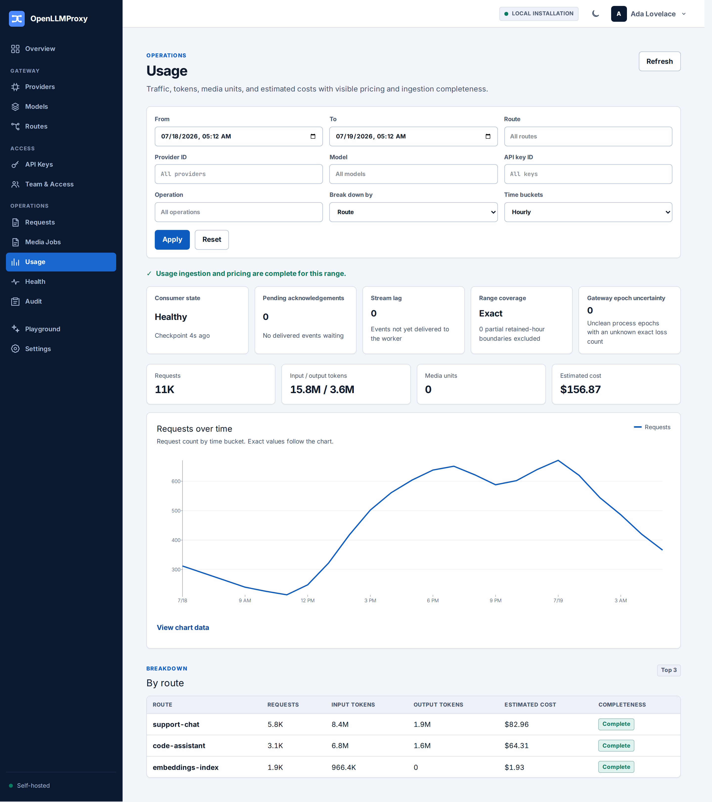

# Operations runbook

This runbook defines how to operate OpenLLMProxy in production: availability
objectives and alerting, routine checks, backup and restore, upgrades, incident
response, and master-key rotation.

## Contents

- [Objectives and monitoring](#objectives-and-monitoring)
- [Routine checks](#routine-checks)
- [Backup and restore](#backup-and-restore)
- [Upgrade](#upgrade)
- [Incident response](#incident-response)
- [Master-key rotation](#master-key-rotation)

## Objectives and monitoring

Measure the gateway at the client-facing listener. The target-load SLO is
99.9% successful availability excluding upstream-provider failures, with no
more than 15 ms p95 and 30 ms p99 added latency. The OLP on-call owns service
availability and metadata completeness; provider owners own upstream
credentials, quotas, and model availability.

Scrape each in-cluster gateway and control `*-observability` Service on port
9090 every 15 seconds. Probe `/health/live` and `/health/ready` there
separately; public listener requests for those paths intentionally return 404.
Readiness snapshots refresh every five seconds and expensive metrics rollups
every fifteen seconds, so page on stale snapshot freshness telemetry as well as
an absent readiness signal. Page when readiness is absent for five minutes,
usage events are dropped or abandoned, usage persistence is unavailable, or the
distributed limiter is unavailable while hard limits are configured. Warn when
a usage backlog remains nonzero for ten minutes. The supplied Prometheus rules
implement these defaults, one ServiceMonitor per HTTP component prevents a
healthy gateway from hiding control failure, and the Grafana dashboard is a
starting point. See [deployment.md](deployment.md) for edge routing and private
observability exposure.

## Routine checks

1. Confirm pod readiness and the same nonzero runtime generation across
   gateways.
2. Check PostgreSQL replication, WAL archiving, disk headroom, and backup age.
3. Check Valkey latency and memory. Valkey is runtime state, not the backup
   authority.
4. Review usage completeness and pricing coverage before exporting costs.
5. Review provider health, authentication failures, owner or role changes,
   credential rotations, and route activations in the audit stream.
6. When offboarding a user, review the API-key inventory for keys attributed
   to them and explicitly rotate or revoke the appropriate team-scoped keys.
   Deactivating a user deliberately does not revoke those keys automatically.
7. Keep media-spool usage below `OLP_MEDIA_SPOOL_CAPACITY_BYTES`. The chart
   provides a 1-GiB process budget in a 2-GiB volume; do not use the 64-MiB
   general `/tmp` mount.



Never place prompts, outputs, raw headers, provider credentials, sessions,
proxy-key secrets, or master keys in tickets or diagnostic bundles.

### Compatible-provider capability certification

After discovery, review at most 16 exact tuples per compatible model and run
**Certify reviewed capabilities**. Certification sends only
`OLP capability probe`, requests at most one generated token, uses production
codecs, and persists neither prompt nor response. Only `succeeded` tuples are
eligible; `partial` and `failed` remain declared. Remove unsupported media,
asynchronous, or cross-surface claims, or use a separately qualified native
connector. Re-certify after endpoint, model, or credential changes. Do not
activate until every enabled tuple has a certification timestamp.

`anthropic_compatible` endpoints require HTTPS, an API key sent in
`x-api-key`, and the fixed `anthropic-version: 2023-06-01` header. They use
the Messages and token-count contracts and can certify only generation (unary
or streaming) and unary token-counting across the OpenAI, Anthropic, and
Gemini client surfaces. If `/models` is unavailable, declare one or more model
identifiers manually and rerun the connection test; it issues a bounded
one-token Messages request against a declared model.

## Backup and restore

For a production recovery point:

1. Stop admission of new inference requests, leave the worker running, and
   wait for zero pending acknowledgements and zero Stream lag.
2. On an encrypted volume with a PostgreSQL 18 client, run
   `scripts/backup.sh` with `OLP_BACKUP_TRAFFIC_QUIESCED=true`.

The script independently requires a zero and no-more-than-30-second-old durable
worker checkpoint. Without the quiescence assertion, the manifest records
`usage_stream_drained: false` and the dump is not a production recovery point.
The output is a mode-`0600` custom-format dump, checksum, and manifest.

Treat the dump as sensitive: it contains password hashes, session and proxy-key
digests, and encrypted provider/OIDC credentials. Mounted master-key and
key-hash files are excluded; back them up separately in the secret manager.
Losing any historical master key makes records encrypted with that version
unrecoverable.

At least weekly, use `scripts/restore-rehearsal.sh` to restore the newest dump
to an isolated database. The script requires its checksum and manifest, refuses
the production URL, and requires `--replace` for a nonempty destination. Record
duration, migration and runtime-generation counts, and the checksum. Start
control and gateway processes with a fresh Valkey, then verify setup, session
login, runtime loading, and a mock-provider request. Do not reuse production
OIDC redirects or provider credentials.

## Upgrade

1. Verify the immutable OCI digest and any signature, provenance, SBOM, and
   vulnerability information required by the deployment process.
2. Run `scripts/upgrade-rehearsal.sh` with a recent backup and candidate binary
   against an isolated database. It restores and migrates twice, derives the
   target versions from tracked migration files, and rejects an incomplete or
   non-idempotent result. For a manual N-1 or release rehearsal, set
   `OLP_REHEARSAL_EXPECTED_NEW_MIGRATIONS` to the exact expected count. CI
   builds its N-1 fixture from
   `release-metadata.env`; after a release completes, release operators update
   its `OLP_PREVIOUS_RELEASED_SCHEMA_MIGRATION` marker in a follow-up commit to
   the highest migration shipped by that release. Do not advance the marker
   while qualifying that release. For an N-1 fixture, restore the matching keys
   and enable the candidate `doctor` smoke.
3. Enter a maintenance window. Stop inference admission at the edge and freeze
   every control mutation, including OIDC login/link initiation. Gracefully
   drain and scale every old inference-serving workload to zero first; verify
   there are no active requests and no media-reconciliation process left that
   can write PostgreSQL. Then leave the old worker running only until both
   Stream pending and lag are durably zero, scale that worker workload to zero,
   and confirm both values remain zero. Pre-upgrade persisted login flows may
   complete only through their existing ten-minute expiry; authenticated link
   flows keep their normal expiry. Users whose login flow expires must restart
   it after the candidate is ready.
4. With admission and the worker still stopped, create the final PostgreSQL
   rollback backup using `OLP_BACKUP_TRAFFIC_QUIESCED=true` and snapshot mounted
   key files in the secret manager. This is the recovery point; a backup taken
   before quiescence is not a substitute.
5. Run the Helm upgrade with a timeout of at least 20 minutes. Its pre-upgrade
   migration hook completes before Helm rolls the candidate control, worker,
   and gateway Deployments; those Deployments may roll concurrently. Keep
   management and admission frozen until the migration succeeded and every
   workload is on the candidate. The database independently rejects N-1
   runtime publications, non-additive usage rollups, and OIDC completions.
   A three-way merge can preserve a manual live scale-to-zero when chart replica
   values did not change: explicitly scale each candidate Deployment back to
   its production replica count, wait for `kubectl rollout status`, and verify
   every running image digest. Preserve `maxUnavailable: 0`, the 10-second
   pre-stop delay, and five-minute termination grace period.
6. Resume admission and OIDC initiation. For 30 minutes, verify readiness,
   zero usage backlog, generation convergence, usage completeness, provider
   probes, error rate, and added latency.

The supported usage-delivery and exact-replay window is seven days. Durable
event receipts are removed after that bound plus the five-minute clock-skew
grace. Page on backlog long before the window expires; an entry first delivered
outside it is rejected and recorded as uncertain completeness evidence rather
than risk double-counting an hourly aggregate. Maintenance runs bounded receipt
cleanup every minute. Capacity PostgreSQL for up to
`sustained_requests_per_second * 604800` receipt rows plus the event/request
unique indexes, and alert on table growth or cleanup lag. During a usage
incident, restore or reconcile the Stream within seven days and do not extend
the window by suspending database maintenance.

Migrations are forward-only. Once migrations 0022-0024 apply, an N-1 binary
rollback is unsupported: its runtime, usage-maintenance, and OIDC writes fail
closed. Restore the final pre-upgrade database and mounted keys to a
replacement cluster with fresh Valkey. Verify migration state, workloads,
readiness, and runtime generation before redirecting traffic.

## Incident response

### Dependency failure

- **PostgreSQL or control:** Freeze management changes and keep healthy
  gateways on their last-known-good generation. Restore PostgreSQL instead of
  restarting the gateways.
- **Valkey:** Hard-limited keys fail closed; keys without distributed limits
  may continue. Restore Valkey and verify lease cleanup. During the partial
  outage `/health/ready` remains successful but reports `status: degraded` and
  `limits: unavailable`, allowing Kubernetes to route unlimited keys; alert on
  dependency fields and metrics.
- **Usage persistence:** Continue inference only with explicit business
  acceptance of incomplete cost data. Preserve logs and Stream state, suspend
  retention, record the affected interval, and reconcile request, attempt,
  usage, and gap counts. Never report an outage gap as zero cost.

### Unclean gateway epochs

An unclean process epoch is uncertain, not proof that every event was lost.
Readiness and `olp_usage_gateway_unresolved_epochs` remain degraded until an
owner or operator compares its bounds with the durable worker checkpoint,
Stream state, and request/attempt records. After recording the decision, list
and acknowledge the epoch:

```text
GET  /api/v1/usage/gateway-epochs?state=unresolved
POST /api/v1/usage/gateway-epochs/{process_epoch}/acknowledge
```

Acknowledgement is idempotent, session- and CSRF/Origin-protected, requires
settings-management permission, and emits an audit event. It clears the
unresolved readiness condition but not raw or hourly gap evidence;
`usage_historical_uncertain_gaps` and affected usage windows remain incomplete.
Retention never removes unacknowledged epochs and removes acknowledged or
gracefully closed leases only after rollup.

### Unrecoverable Valkey Stream

If the AOF and replicas are unrecoverable, stop admission and the worker. Do
not attach an empty Valkey until the missing interval is explicit. Derive its
event count and timestamps from the durable consumer checkpoint, Valkey/AOF
inventory, and monitoring, then record it idempotently:

```console
export OLP_CONFIRM_FRESH_VALKEY_LOSS=record-explicit-gap
scripts/checkpoint-lost-usage-stream.sh incident-123 42 exact \
  2026-07-13T01:00:00Z 2026-07-13T01:02:00Z
```

Use `lower-bound` only when an exact count is impossible, and retain that
limitation in the incident record; cost exports remain incomplete. The helper
removes the stale consumer-health checkpoint, writes a content-free audit
event, and prevents double counting by incident ID. Start the replacement
Valkey and worker only after recording the gap, then require a new checkpoint.

### Secret exposure

Revoke the proxy key or rotate the provider credential first, then activate a
new runtime generation. Rotate master keys only through the versioned procedure
below, retaining the old key until all records are rewritten and verified.
Record containment in the audit and incident records.

## Master-key rotation

`olp master-key` is a standalone database-administration mode: it serves no
HTTP, applies no migrations, prints no plaintext or envelope bytes, and reports
only versions, table names, row counts, and verification status. It inventories
provider credentials, OIDC secrets and flow payloads, and encrypted idempotency
replays. Back up the database and key file first.

Use a three-stage keyring rollout:

1. Add the new key but keep the old version active. Restart every `all`,
   `gateway`, `control`, and `worker` replica and confirm readiness.
2. Set `active_version` to the new version. Restart and verify every replica
   uses it for writes.
3. Re-encrypt and verify before removing the old key.

Obtain key values from the secret manager; never put them in shell history or
operational records:

```json
{
  "active_version": 2,
  "keys": [
    { "version": 1, "key": "<base64-old-32-byte-key>" },
    { "version": 2, "key": "<base64-new-32-byte-key>" }
  ]
}
```

With `OLP_DATABASE_URL` and `OLP_MASTER_KEY_FILE` pointing to production and
the two-version keyring, run:

```console
olp master-key status --batch-size 100
olp master-key reencrypt --dry-run --batch-size 100
olp master-key reencrypt --batch-size 100
olp master-key status --batch-size 100
olp master-key verify-retirement --version 1 --batch-size 100
```

`status` and `--dry-run` authenticate every envelope and fail when a referenced
version is absent. Re-encryption authenticates before updating and commits
bounded batches; the stored key version is the progress marker, so rerunning
after interruption resumes safely. Rehearse interruption after a logged batch,
confirm both versions with `status`, then complete the run and retain only its
metadata logs.

`verify-retirement` rejects the active version, an unmounted version, or any
version still referenced. Only after zero references and successful envelope
authentication may the old key be removed. Restart all replicas with the
reduced keyring and run `status` again. On any failure, retain both keys and
investigate the reported table and row identifier without copying ciphertext,
nonces, credentials, OIDC state, or replay bodies into logs or tickets.
