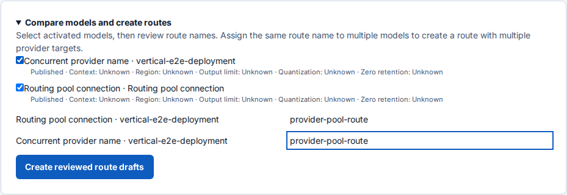
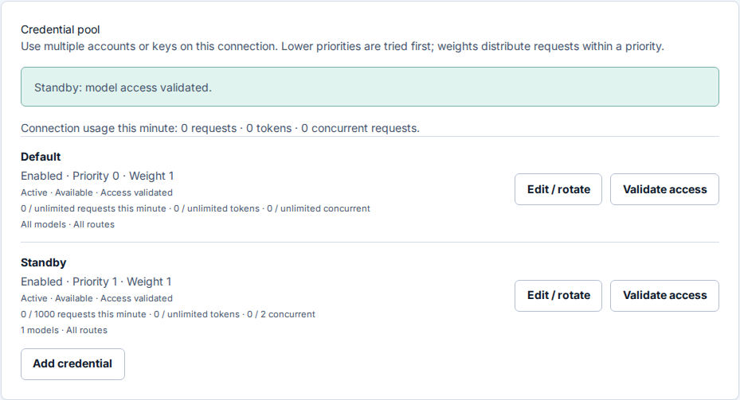
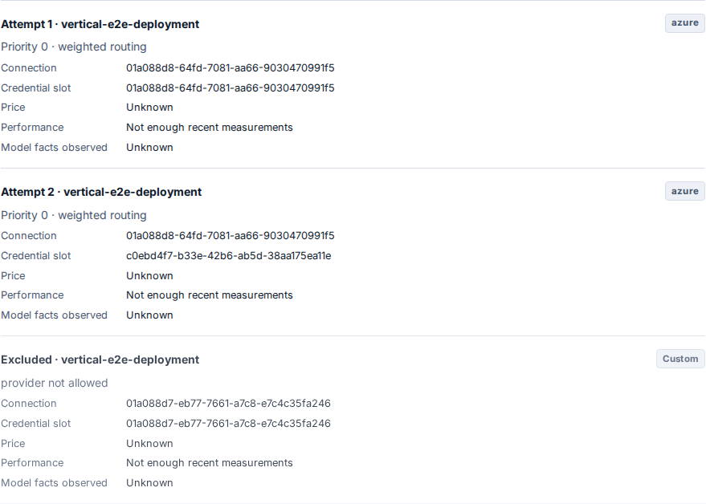

# Provider connections and routing

OLP keeps published route names as the public model API. A vendor identifies
an upstream organization; a connection (the existing provider ID) identifies
an endpoint, account, region, or deployment. Several connections can use the
same vendor and different credentials. A connector identifies the wire
protocol and authentication mechanism.

## Connect and qualify models

1. Choose a vendor in **Providers → Add provider**. Review the connector,
   endpoint, authentication, and optional seed model. Vendor identity remains
   in `configuration.options.vendor_id` when an endpoint is customized.
2. Test the connection, discover models or enter exact upstream identifiers,
   and select the models to enable. Perplexity, Cohere, and Voyage use an
   explicit model for their connection probe.
3. Use **Validate models in bulk**. Keep configured capabilities or choose a
   generation, embedding, or token-count contract. The console reports
   failures per model, can stop after the current model, and can retry only
   failures. Each model's server certification uses at most eight concurrent
   bounded probes.
   The completed-draft probe also checks every enabled model assigned to the
   default credential, including after rotation.
4. Review the completed draft, test it, and activate. Discovery and model
   changes remain drafts until activation. Operator model facts are stored
   separately from discovered identifiers and survive discovery refreshes.
5. In **Models → Compare models and create routes**, select models and review
   route slugs. An explicitly assigned canonical model identity can group
   connections automatically. Other models start with distinct connection
   suffixes; assigning the same slug explicitly creates multiple targets.
   Review the generated drafts before publishing them individually or in bulk.



The vendor catalog is `GET /api/v3/provider-vendors`. The additional profiles
are DeepSeek, Fireworks, DeepInfra, Hugging Face, Perplexity, Cohere, and
Voyage. The first six cover generation and streaming; Cohere and Voyage cover
embeddings. These are bounded connector contracts, not a claim that every
model or credential supports every operation.

The generation profiles use Chat Completions upstream, including lossless
translation of supported Responses requests. Hugging Face's compatible API
is [chat-only](https://huggingface.co/docs/inference-providers/en/index).
Voyage maps dimensions to `output_dimension`, converts float encoding to its
native default, disables implicit truncation, and normalizes usage.
See the [Voyage contract](https://docs.voyageai.com/reference/embeddings-api).
Cohere's documented unsupported parameters are rejected before selection;
its compatible embeddings endpoint does not support dimensions.
See [Cohere compatibility](https://docs.cohere.com/docs/compatibility-api).
Paid-provider qualification remains an operator activity scoped to the actual
account, model, region, and credential.

## Private endpoints, headers, defaults, and model facts

OpenAI, OpenAI-compatible, Anthropic, and Gemini connectors accept custom
endpoints. Set `auth_mode` to `none` for an explicitly unauthenticated endpoint
or to `headers` for encrypted custom authentication. Custom authentication
requires an explicit endpoint. Private addresses and HTTP additionally need
the existing [egress allowlists](configuration.md#provider-egress-policy).
DNS pinning, redirect refusal, and response limits still apply.

For header authentication, put only lowercase header names in
`options.credential_headers`, for example `["authorization","x-account-id"]`.
The write-only `credential` is a JSON **string** containing exactly those
names and their values. Include the complete Authorization value when needed.
Reserved transport and OLP headers cannot be configured. Header values never
appear in management reads or error responses.

`options.parameter_defaults` contains provider-wire JSON defaults. Explicit
request values take precedence, including nested generation configuration.
Response-format defaults apply only to matching chat, image, or speech
endpoints; an explicit response format replaces the complete format default.
Routing, model, messages, input, stream, and other envelope fields cannot be
overridden through defaults. Native HTTP connectors support these defaults;
Vertex and Bedrock retain their native cloud configuration.

`options.models` maps upstream model identifiers to model facts:

```json
{
  "models": {
    "account/model": {
      "canonical_model": "organization/model",
      "context_length": 131072,
      "max_output_tokens": 8192,
      "supported_parameters": ["temperature", "max_output_tokens", "tools"],
      "input_modalities": ["text"],
      "output_modalities": ["text"],
      "region": "eu-west",
      "quantization": "bf16",
      "data_collection": false,
      "zero_data_retention": true,
      "source": "Operator-reviewed account agreement",
      "observed_at": "2026-09-09T00:00:00Z"
    }
  }
}
```

Unspecified facts are unknown. Privacy declarations require a source and an
observation time. `deployment` overrides the wire model for native HTTP
connectors; Azure overrides select an exact deployment path. Changing relevant
connection options invalidates previous certification evidence. A custom
endpoint never inherits official OpenAI media certification merely from its
connector selection.

## Credential pools and limits

Each connection has a default slot preserving its original credential-version
IDs and encryption context. The existing `/credentials` endpoints remain
available. Add, edit, rotate, and validate additional slots under
`/api/v3/providers/{provider_id}/credential-slots` and in the provider detail
page. Writes use ETags and idempotency keys; secrets remain encrypted and
write-only. A connection supports up to 64 named slots.

Default-slot restrictions and quotas also apply to connections using no stored
secret (`none`, ADC, or the AWS default chain).

A slot has enabled state, priority, weight, and optional `allowed_models`,
`allowed_routes`, and `allowed_api_keys` restrictions. Empty restriction lists
mean unrestricted within the published connection. Slots are ordered by lower
priority first and weighted rendezvous within a priority. Every enabled slot
must prove access to its allowed enabled model capabilities before activation.
New model contracts invalidate this access evidence.

Set `requests_per_minute`, `tokens_per_minute`, and `max_concurrency` on a slot
or in `configuration.options.limits` for the whole connection. Both scopes
apply to every attempt. Valkey supplies the UTC minute and distributed
concurrency leases. Rotation preserves the logical slot's quota identity.
Tokens are reserved conservatively and reconciled when complete usage is
available; cancellation releases concurrency. Configured provider quotas fail
closed when the distributed limiter is unavailable.
New requests use current published connection and slot quotas, including when
a gateway retains an older runtime release.

Activation snapshots options, model contracts, and selected secret versions.
An attempt pins its exact slot, credential version, and pricing revision.
Authentication failures cool down that version; HTTP 429 honors Retry-After
for the logical slot, so rotation does not reset an account cooldown. Successful
credential validation can clear the cooldown. Connection/transport and server
failures affect endpoint health; a credential failure does not disable other
slots. Media jobs retain their original connection and secret through rotation,
restart, polling, and deletion. Their credentials cannot be explicitly revoked
until the jobs have durable deletion records.



## Policies and caller preferences

Policies live at installation, route revision, and gateway-key scopes.
Use **Settings**, the route draft editor, and the API-key editor, or
`GET/PUT /api/v3/routing-policies/{scope}/{id}`. Scopes are `installation`,
`route-draft`, and `api-key`; the installation ID is the nil UUID. Installation
and key changes publish immediately. Route policy changes are staged and
published with the route. Policy writes require the corresponding management
permission and current ETag.

Hard constraints intersect across all scopes and the request. They include
`only`, `ignore`, `regions`, `quantizations`, `deny_data_collection`,
`require_zero_data_retention`, `require_parameters`, and `max_price`.
Selectors are `vendor:<catalog-id>` or `provider:<connection-uuid>`.
Unknown facts cannot satisfy a required constraint. Constraints placed inside
policy defaults also narrow eligibility. They do not grant additional access.

Ordering and strategy preferences use request → key → route → installation
precedence. A policy can restrict `allowed_strategies`. `order` precedes the
strategy inside an operator priority tier. With `allow_fallbacks: false`, an
explicit order restricts attempts to that list; without an order, only the
first eligible attempt is selected. Requests cannot add published targets,
raise deadlines or attempt limits, or broaden policy constraints.

All native inference surfaces accept one optional `X-OLP-Routing` header:

```http
X-OLP-Routing: {"only":["vendor:deepseek"],"strategy":"price","max_price":{"input_per_million":"0.50","output_per_million":"2.00"}}
```

Malformed JSON, unknown controls, and invalid selectors are rejected before
dispatch. The header is never forwarded upstream. Existing header-size limits
apply. Strict parameter filtering additionally requires affirmative model
support for supplied canonical parameters and semantic extensions. Semantic
loss checks always apply, even when strict parameter filtering is off.
Media controls include `n`, `size`, `mask`, `voice`, `response_format`,
`language`, `prompt`, and `input_reference`; internal cleanup markers are excluded.

| Strategy | Ordering within a priority and preferred-order tier |
|---|---|
| `weighted` | Deterministic weighted rendezvous; the default |
| `price` | Exact decimal rates; generation compares input plus output per million, embeddings use input, other units use their unit rate |
| `latency` | Median time to first meaningful output for streams, total attempt latency for unary operations |
| `throughput` | Median generated output tokens per second after first meaningful output; reasoning tokens are excluded |

Prices resolve connection scope before vendor scope before connector-kind
scope, then the latest effective revision. Future rates become eligible at
their effective time. Missing required price components fail a price ceiling;
unknown prices rank after known prices. Routing and accounting preserve the
selected revision, including an explicit unpriced decision.

Performance aggregates use five minutes of persisted successful attempts,
partitioned by connection, model, operation, and mode. At least 20 samples are
required; snapshots refresh every ten seconds and expire after 60 seconds.
Unknown measurements rank after known measurements and use weighted order
when all are unknown. `preferred_max_latency_ms` and
`preferred_min_throughput` favor matching observations; they are preferences,
not response guarantees.

Eligibility filtering precedes ordering and `max_attempts`. Each actual
credential attempt consumes the route's budget, which can exceed target
count. Fallback never restarts a committed stream or an ambiguously created
media job.

## Explain and observe



The route editor's dry run and playground use the execution selection engine.
`POST /api/v3/routing/simulate` accepts a canonical operation, surface, mode,
preferences, optional API-key ID, and seed. It returns exclusions even when
nothing is eligible, attempt order, slot IDs, prices, and measurement freshness.
The playground accepts the same preferences in its `routing` field and shows
the resulting decision. Runtime health and available capacity can change
between a preview and a dispatch.

Request history records connection, slot/version, provider revision, policy
digest, selected price revision, fallback failure classes, and meaningful
output timing. Prompts, outputs, secret header values, and raw preference
payloads are absent from persisted routing telemetry.

## Coordinated 3.x upgrade

1. Back up PostgreSQL and the existing encryption/HMAC keys, then drain all
   gateways and pause other old process roles.
2. Run migrations with the new binary. Migrations after `0001_initial.sql`
   backfill default slots without changing secret IDs or AAD, add policies and
   media pins, and wrap historical releases in the `olp-routing-v1` envelope.
   The envelope preserves snapshot identities and facts while preventing an
   older binary from decoding a release and silently ignoring its constraints.
3. Upgrade every gateway, control, and worker process before resuming traffic
   or activating new policies. Verify readiness, credential validation, route
   previews, and one request per required client surface.

This is a coordinated upgrade, not a rolling mixed-version deployment. Old
processes must be drained, including those holding snapshots in memory.
Rollback requires restoring the pre-upgrade database backup and matching
binaries and keys; migrations are forward-only.
