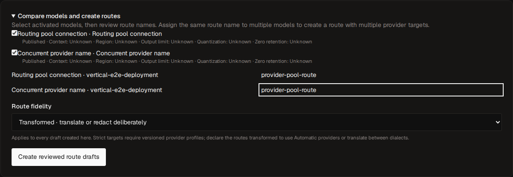
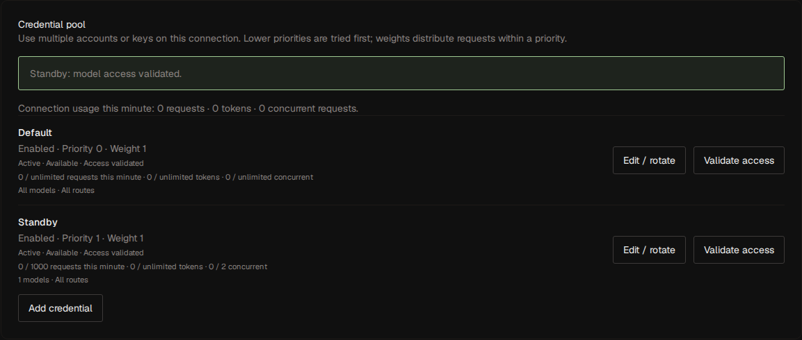
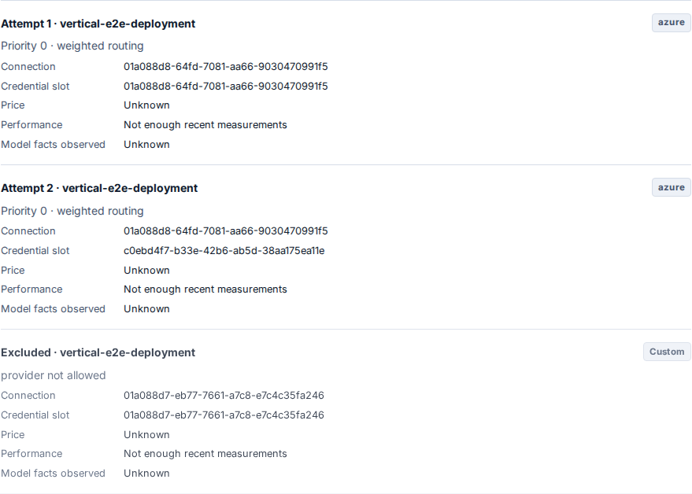

# Provider connections and routing

OLP keeps published route names as the public model API. A vendor identifies an
upstream organization; a connection (the existing provider ID) identifies an
endpoint, account, region, or deployment. Several connections can use the same
vendor and different credentials. A connector identifies the wire protocol and
authentication mechanism.

## Connect and qualify models

1. Choose a vendor in **Providers → Add provider**. Review the connector,
   endpoint, authentication, and optional seed model. Vendor identity remains
   in `configuration.options.vendor_id` when an endpoint is customized.
2. Test the connection, discover models or enter exact upstream identifiers,
   and select the models to enable. A vendor that publishes no OpenAI-shaped
   model list, such as Cohere, Voyage, Together or an account-scoped platform,
   uses an explicit model for its connection probe.
3. Use **Validate models in bulk**. Keep configured capabilities or choose a
   generation, embedding, or token-count contract. The console reports
   failures per model, can stop after the current model, and can retry only
   failures. Each model's server certification uses at most eight concurrent
   bounded probes.
   The completed-draft probe also checks every enabled model assigned to the
   default credential, including after rotation.
4. Review the completed draft, test it, and activate. Discovery and model
   changes remain drafts until activation. Operator model facts are stored
   separately from discovered identifiers and survive discovery refreshes.
5. In **Models → Compare models and create routes**, select models and review
   route slugs. An explicitly assigned canonical model identity can group
   connections automatically. Other models start with distinct connection
   suffixes; assigning the same slug explicitly creates multiple targets.
   Choose the route fidelity for the generated drafts. Strict is preselected;
   choose transformed when the targets need translation or are Automatic
   providers (providers without a provider profile). Review the generated
   drafts before publishing them individually or in bulk.



### Reviewed vendor contracts

`GET /api/v1/provider-vendors` lists the vendor catalog. Each vendor is a
reviewed contract in [`internal/vendors`](../internal/vendors/catalog.go): the
operations its documentation lists, the generation dialects it speaks, and the
request fields it refuses or spells differently. A vendor is admitted only the
operations its contract lists, so a preset never claims media, moderation or
token counting its documentation does not describe. Each model and credential
still needs certification for the requested operation.

A vendor that documents only Chat Completions is sent Chat Completions,
including lossless translation of supported Responses requests, and a profile
in another generation dialect is refused for it. Fields a vendor documents as
unsupported or ignored are refused before selection rather than silently lost:
Cohere's compatibility API, for example, refuses `n`, `dimensions` and its
other documented exceptions. Renamed fields are rewritten: vendors that
document only `max_tokens` receive the OpenAI `max_completion_tokens` under
that name, Snowflake Cortex receives the reverse, Mistral receives `seed` as
`random_seed`, and Voyage maps dimensions to `output_dimension` and float
encoding to its native default. A request that sets both names of a renamed
field is refused. See the [Voyage contract](https://docs.voyageai.com/reference/embeddings-api)
and [Cohere compatibility](https://docs.cohere.com/docs/compatibility-api).

Paid-provider qualification remains an operator activity scoped to the actual
account, model, region, and credential.

## Provider lifecycle

An unused draft can be deleted with `DELETE /api/v1/providers/{provider_id}`,
using its observed ETag and an idempotency key. Published revisions, route
draft references, scoped price history, notification evidence and retained
resource dependencies return `409 provider_in_use`. Deletion cleans the draft's
owned sealed material and advances authority. Use disable for published
providers, preserving their immutable revisions and accounting history.

A provider is created as a draft with its configuration and a credential unless
the authentication mode is `none`, `adc`, `default_chain`, `azure_default`, or a
plugin's `grant`, whose credential versions come from
[grant enrollment](plugins.md#grant-enrollment). The console wizard then:

1. **Probes** the connection (`POST /providers/{id}/probe`), which lists
   upstream models or proves a configured deployment/model when that vendor
   has no model-list API, with bounded time, concurrency, and body size. Probe results
   store only a status, a timestamp, and a sanitized detail; upstream bodies
   never enter persistent diagnostics.
2. **Discovers** models (`POST /providers/{id}/discovery`), either from the
   upstream list or from up to 2000 declared identifiers. Discovered models
   start disabled with no capabilities.
3. **Reviews** capabilities (`PATCH /providers/{id}/models/{model_id}`),
   which records *declared* tuples of operation, surface, and mode.
4. **Certifies** each model (`POST /providers/{id}/models/{model_id}/certify`),
   which proves each operation/surface/mode tuple and marks successful tuples
   as *certified*. An OpenAI-surface generation capability proves both Chat
   and Responses unless the vendor profile explicitly translates Responses
   through Chat. Review at most 64 tuples per model. Each probe has a 15-second
   budget, with at most eight concurrent probes and a one-minute
   model-certification deadline. Only certified tuples of enabled
   models are published to the runtime and are eligible for routes.
5. **Activates** the draft (`POST /providers/{id}/activate`), which validates
   the configuration, requires current validation for each selectable
   credential slot and at least one enabled, fully certified model, writes
   an immutable revision, and publishes a new runtime generation.

Draft edits never change serving traffic: they mark the provider as having a
pending activation, and the runtime keeps using the active revision. Changing
transport or semantic details (kind, authentication mode, endpoint, cloud
addressing, credential headers, parameter defaults, model facts, vendor)
invalidates certification evidence and slot validation, so tuples must be
certified again before activation. Re-reviewing capabilities preserves unchanged
tuples, removes evidence for deleted tuples, and starts new tuples as declared.
Renaming and credential rotation preserve model certification; rotation still
requires fresh slot validation. Revisions can be listed, read, compared, and
restored as a new draft; restoring copies the recorded models and evidence but
never a historical credential.

Disabling a provider (`POST /providers/{id}/disable`) publishes a generation in
which the provider is not selectable; streams that already started keep the
snapshot they were admitted with.

## Private endpoints, headers, defaults, and model facts

OpenAI, OpenAI-compatible, Anthropic, and Gemini connectors accept custom
endpoints. Set `auth_mode` to `none` for an explicitly unauthenticated endpoint
or to `headers` for encrypted custom authentication. Custom authentication
requires an explicit endpoint. Private addresses and HTTP additionally need the
existing [egress allowlists](configuration.md#provider-egress-policy). DNS
pinning, redirect refusal, and response limits still apply.

For header authentication, put only lowercase header names in
`options.credential_headers`, for example `["authorization","x-account-id"]`.
The write-only `credential` is a JSON **string** containing exactly those names
and their values. Include the complete Authorization value when needed. Reserved
transport and OLP headers cannot be configured. Header values never appear in
management reads or error responses.

`options.parameter_defaults` contains provider-wire JSON defaults. Explicit
request values take precedence, including nested generation configuration.
Response-format defaults apply only to matching chat, image, or speech
endpoints; an explicit response format replaces the complete format default.
Routing, model, messages, input, stream, and other envelope fields cannot be
overridden through defaults. Native HTTP connectors support these defaults;
Vertex and Bedrock retain their native cloud configuration.

`options.models` maps upstream model identifiers to model facts:

```json
{
  "models": {
    "account/model": {
      "canonical_model": "organization/model",
      "context_length": 131072,
      "max_output_tokens": 8192,
      "supported_parameters": ["temperature", "max_output_tokens", "tools"],
      "input_modalities": ["text"],
      "output_modalities": ["text"],
      "region": "eu-west",
      "quantization": "bf16",
      "data_collection": false,
      "zero_data_retention": true,
      "source": "Operator-reviewed account agreement",
      "observed_at": "2026-09-09T00:00:00Z"
    }
  }
}
```

Unspecified facts are unknown. Privacy declarations require a source and an
observation time. `deployment` overrides the wire model for native HTTP
connectors; Azure overrides select an exact deployment path. Changing relevant
connection options invalidates previous certification evidence. A custom
endpoint never inherits official OpenAI media certification merely from its
connector selection.

## Credential pools and limits

Each connection has a default slot, whose credential versions the
`/api/v1/providers/{provider_id}/credentials` endpoints list and rotate. Add,
edit, rotate, and validate additional slots under
`/api/v1/providers/{provider_id}/credential-slots` and in the provider detail
page. Writes use ETags and idempotency keys; secrets remain encrypted and
write-only. A connection supports up to 64 slots including the default.

Individual `GET /credential-slots/{slot_id}` reads return a slot ETag.
Individual PUT and DELETE accept it, so sibling edits preserve each other's
preconditions. Pool edits retain the collection ETag. DELETE removes a
nondefault draft slot and its pending enrollment state, retaining immutable
credential versions and published revision slots. The default slot is required;
activate the changed provider draft to publish the resulting pool.

Default-slot restrictions and quotas also apply to connections using no stored
secret (`none`, ADC, or the AWS default chain).

A slot has enabled state, priority, weight, and optional `allowed_models`,
`allowed_routes`, and `allowed_api_keys` restrictions. Empty restriction lists
mean unrestricted within the published connection. Slots are ordered by lower
priority first and weighted rendezvous within a priority. Every enabled slot
must prove access to its allowed enabled model capabilities before activation.
New model contracts invalidate this access evidence. Validation has a one-minute
bound and a 15-second deadline per upstream probe. Evidence binds the credential
version, transport configuration, and allowed enabled capabilities; edits during
a probe invalidate its result. Model-list access alone does not prove generation
access. Disabled slots and slots with no allowed enabled models are not selected
and do not block activation.

Rotation validates the new credential against model discovery and the default
slot's allowed enabled capabilities before selecting it for the draft. The
active revision keeps its original credential until reactivation. Certification
prefers an enabled usable default slot, then another enabled usable slot;
certifying all applicable models validates that selected slot. Additional or
rotated pool slots need their own validation. Disabling the default does not
prevent an independently validated named slot from serving.

Set `requests_per_minute`, `tokens_per_minute`, and `max_concurrency` on a slot
or in `configuration.options.limits` for the whole connection. Both scopes apply
to every attempt. Valkey supplies the UTC minute and distributed concurrency
leases. Rotation preserves the logical slot's quota identity. Tokens are
reserved conservatively and reconciled when complete usage is available;
cancellation releases concurrency. Configured provider quotas fail closed when
the distributed limiter is unavailable. New requests use current published
connection and slot quotas, including when a gateway retains an older runtime
release.

A quota may also divide itself among the admission priorities a request
carries (see [priority admission](gateway.md#priority-admission)). Declare
`priority_shares` with a percent for each of `critical`, `high`, `normal` and
`low`, summing to 100, together with a `saturation_percent` from 1 to 100:

```json
{"max_concurrency": 40, "priority_shares": {"critical": 50, "high": 25, "normal": 20, "low": 5}, "saturation_percent": 60}
```

Until the quota's use reaches the saturation percent, any class may use idle
capacity. Beyond it, each class holds at most its share of each window, so
critical work keeps headroom that background traffic cannot take. The Valkey
scripts enforce the shares atomically with the request, token and concurrency
windows, so they hold across every gateway sharing the limiter. A refused
attempt is a quota rejection that fails over like any other.

Connections and slots also take supply-side spend caps, `daily_cost_limit` and
`monthly_cost_limit`, in the installation currency. They use the same
exact-decimal accounting, PostgreSQL authority and Valkey snapshots as key
budgets ([spend reconciliation](operations.md#spend-budget-reconciliation)) and
count spend from the moment they are declared. An exhausted cap removes the
connection or slot from selection with the plan reason
`connection_budget_exhausted` or `slot_budget_exhausted`; before reconciliation
has installed a new cap's windows, about a minute after publication, or while
Valkey cannot read them, the target is skipped as `connection_budget_unavailable`
or `slot_budget_unavailable`, as unreadable provider quotas are. Each attempt
reserves its cost bound against every cap it is subject to and settles the
actual cost once it is accounted.

Set `configuration.options.health_probe` to `{"interval_seconds": 300}` (60 to
86,400) to have the `health_probes` worker task send each of the connection's
routed models a bounded synthetic request, no more than once per interval across
the fleet: the certification probe's minimal chat, embeddings or rerank body,
with a 30-second deadline, through the route and its quotas. A probe whose
upstream fails with a server, transport, timeout or protocol error marks the
connection unhealthy for the fleet until a later probe or request succeeds.
Probes cost money, so they are off unless a connection enables them; their usage
is accounted to the installation under the `system` actor with origin `probe`,
and appears in usage reports. `GET /api/v1/provider-health` reports each
connection's latest probe and shared circuit.

Activation snapshots options, model contracts, and selected secret versions. An
attempt pins its exact slot, credential version, and pricing revision.
Authentication failures cool down that version; HTTP 429 honors Retry-After for
the logical slot, so rotation does not reset an account cooldown. Successful
credential validation can clear the cooldown. Connection/transport and server
failures affect endpoint health; a credential failure does not disable other
slots. While an endpoint is recovering, a credential-only outcome (401, 429, a
local slot quota) completes the half-open probe without penalizing the endpoint,
so a sibling slot can probe immediately. Explicit credential-version revocation
is authority, not routing: it reaches every retained release on the next
authority poll, including a gateway that cannot install a newer release, and
selection refuses a revoked version even when a request pins it. Media jobs
retain their original connection and secret through rotation, restart, polling,
and deletion. Their credentials cannot be explicitly revoked until the jobs have
durable deletion records. Autonomous media reconciliation claims only as many
jobs as it runs at once, revalidates its claim and bounds its lease to the route
deadline immediately before each upstream poll or delete, and hands off silently
when another replica has reclaimed the job.



## Scoped routing policies

`GET /api/v1/routing-policies/{scope}/{id}` reports `configured` alongside
its policy and observed ETag. Installation policy uses the nil UUID and requires
installation settings authority; API-key policies require key authority, and
route-draft policies require configuration authority and project access.

`DELETE` removes an explicit override under the same permissions, observed
`If-Match`, and `Idempotency-Key` requirements as `PUT`. The next read reports
inherited defaults with a fresh ETag. An observation from before a create/delete
cycle remains stale. Non-draft removal publishes the runtime change; draft removal
becomes effective when that draft is activated. Scoped writes return their exact
parent ETag transition, and replay returns the original transition and outcome.
Successful removals are audited.

## Routes

Automation can create a published route with `POST /api/v1/routes` and replace
its configuration with `PUT /api/v1/routes/{route_id}`. Both validate and publish
an immutable revision in one transaction using the same checks as console draft
activation. Creation refuses an existing slug; replacement requires the observed
published ETag and retains its slug, project, and routing policy. Each successful
write retains a revision source draft and leaves independent console drafts
untouched. Failed validation rolls back the draft, revision and runtime release;
replaying the same Idempotency-Key returns the original result. Published route
reads return their own ETag. Retirement preserves revision and accounting history.

Route drafts carry a slug, allowed operations (default `generation`), an overall
deadline, an attempt budget, and 1–64 targets with priority, weight, and
timeout. Supported operations also include `token_count`, `embeddings`,
`rerank`, `moderation`, `image_generation`, `image_edit`, `image_variation`,
`speech`, `transcription`, `translation`, the `video_*` operations, `batch`,
`realtime`, and `bedrock_invoke`; see the
[compatibility matrix](compatibility.md).

The overall deadline is 1–3,600,000 milliseconds; target timeouts cannot exceed
it. The attempt budget is 1–32,767 and counts credential attempts, so it can
exceed the target count. Every target must reference a published model with
certified support for each allowed operation; validation and activation reject
unknown, inactive, unpublished, or uncertified targets. Drafts are versioned
with ETags, so stale edits return `412` and the console offers a reload.

Activating a draft writes an immutable route revision, makes it the latest
revision of the route named by the slug, and publishes a runtime generation.
Revisions can be compared and restored as new drafts. The simulation endpoints
(`POST /route-drafts/{id}/simulate` and `POST /routing/simulate`) explain the
deterministic attempt order for a given seed or key without contacting any
provider.

A route revision may also declare fallbacks, selectors, a retry policy, session
affinity and a spend cap, and its targets may carry `tags` and a `shadow`
sample rate. The draft and revision endpoints, revision diffs, restore, and
[configuration promotion](configuration.md#configuration-promotion-artifacts)
carry them all:

```json
{
  "slug": "assistant",
  "targets": [
    {"provider_model_id": "…", "tags": ["small"]},
    {"provider_model_id": "…", "tags": ["large"]},
    {"provider_model_id": "…", "shadow": {"sample_rate": 0.05}}
  ],
  "fallbacks": [
    {"route": "assistant-long-context", "on": ["context_window"]},
    {"route": "assistant-backup", "on": ["exhausted", "content_filter"]}
  ],
  "selectors": [
    {"id": "short", "when": {"max_input_tokens": 2000, "tools": false}, "tags": ["small"]},
    {"id": "reasoning", "when": {"reasoning_effort": ["high"]}, "route": "assistant-reasoning"}
  ],
  "retry": {"upstream_server": {"max_retries": 2, "base_backoff_ms": 200, "max_backoff_ms": 2000, "respect_retry_after": true}},
  "affinity": {"source": "cache_key"},
  "budget": {"daily_cost_limit": "250"}
}
```

### Fallbacks

`fallbacks` lists up to four other routes, in order, each with the conditions
that start it:

| Condition | The route's attempts ended… |
| --- | --- |
| `exhausted` | without success, every attempt having failed with a retryable class |
| `context_window` | on a context-window refusal, or planning found no target whose window holds the request |
| `content_filter` | on an upstream content-filter refusal |
| `rate_limit` | on an upstream rate limit or a local quota |
| `budget` | on a supply-side spend cap, at planning or before dispatch |

A content-filter refusal is a typed upstream error, such as `content_filter` or
`content_policy_violation`. It is terminal within the route, never counts
against provider health, and reaches the caller as a `400` with code
`content_filter` unless a fallback serves the request.

A fallback route runs with its own targets, policy, content policy and fidelity,
and the caller still sees the route it named in the response's `model`. The key
must be allowed to use the fallback route; otherwise the plan records
`fallback_route_forbidden` and moves to the next fallback. A route that is no
longer active is skipped as `fallback_route_unavailable`, and one the request
already visited as `fallback_route_repeated`. The named route's overall deadline
and attempt budget bound the whole request, fallbacks included, and every
attempt records the route leg it ran on. A request never falls back once a
stream has committed, after an ambiguous resource creation, or when it is bound
to its route by a pinned resource, a continuation or provider state.

Publication refuses a route graph, counting fallbacks and selector delegation,
that has a cycle (`route_graph_cycle`), crosses a project boundary
(`route_graph_project_mismatch`), is more than three routes deep
(`route_graph_too_deep`), or lets a strict route serve through a transformed one
(`route_graph_fidelity_mismatch`). Validation and activation refuse a reference
to a route that is not active (`route_reference_unknown`).

### Request selectors

`selectors` are up to 16 rules, evaluated in order; the first whose predicate
matches wins. Its action either narrows the route to the targets carrying any
of its `tags`, or delegates the request to another `route` the key may use.
Plan decisions record the selector, and targets it excluded carry the reason
`selector_excluded`. A predicate is the conjunction of what it declares, over
features the gateway computes during admission:

| Predicate | Matches |
| --- | --- |
| `operations` | the planned operation |
| `min_input_tokens`, `max_input_tokens` | the estimated input tokens |
| `min_output_tokens`, `max_output_tokens` | the requested output tokens |
| `streaming`, `tools`, `structured_output` | a streaming request, one that offers tools, one that asks for a JSON schema or object |
| `modalities` | any of `text`, `image`, `audio`, `video` and `file` among the input parts |
| `reasoning_effort` | the request's reasoning effort, such as `high` |
| `classifier` | the label another route returns for the request |
| `plugin` | the verdict of an approved confined plugin |

Attribution labels never take part, so labels stay free of routing effect.

A `classifier` predicate, such as
`{"route": "triage", "labels": ["complex"], "min_score": 0.7, "timeout_ms": 500}`,
sends the text of the request's last user turn, up to 32 KiB, to another OLP
route. A route serving `classification`, such as a TEI classifier, answers with
its top label and score; a generation route answers with its reply text as the
label. The call is an accounted request of the caller's key, with origin
`classifier` and the caller's request as its parent, under its own deadline. A
classifier that fails, times out or that the key may not use falls through to
the next selector, recorded as `classifier_failed` or `classifier_forbidden`.

A `plugin` predicate names a confined plugin by its digest,
`{"digest": "<sha-256>"}`, and asks it to judge the same features through the
`route_predicate` method ([route predicates](plugin-authoring.md#route-predicates)).
The plugin must be approved when the route is validated
(`route_plugin_unavailable` otherwise); a call that fails or exceeds 250
milliseconds falls through as `plugin_failed`. A plugin predicate can only
narrow the candidate set.

`GET /api/v1/usage/selector-savings` compares each selector's attempts with
what their own usage would have cost on the most expensive eligible target the
selector avoided, priced when each attempt was accounted. Attempts without both
prices are counted but not compared, so the report never invents usage.

### Retry policy

`retry` declares, per retryable class (`connect`, `timeout`, `rate_limit` and
`upstream_server`), how many times an attempt repeats on the same slot before
the route fails over: `max_retries` up to 10, a `base_backoff_ms` and
`max_backoff_ms` up to 60 seconds with full jitter, and whether to honor the
upstream's `Retry-After` instead. Retries consume the attempt budget and the
overall deadline, are recorded as attempts with their retry number, never apply
after commitment or to an ambiguous creation, and stop once the provider's
circuit opens. The slot cools down only after its retries are exhausted.

### Session affinity

`affinity` keeps requests of one session on the same target and slot while it
stays eligible, which raises provider prompt-cache hit rates without any gateway
state. The session key is the value of an attribution label,
`{"source": "label", "label": "session"}`, or the dialect's own cache key,
`{"source": "cache_key"}`, which is OpenAI's `prompt_cache_key`. OLP hashes it
into the rendezvous seed in place of the key's identity; a request without one
keeps the key's seed.

### Shadow targets

A target declared `{"shadow": {"sample_rate": 0.05}}` never serves callers. It
is planned with the request under every hard constraint the request is subject
to, including region, data collection, zero data retention and the route's
content policy, and a sample of eligible requests, chosen deterministically from
the request's identifier, is mirrored to it after the caller's response
completes. Shadow attempts run in their own admission pool
(`OLP_HTTP_MAX_IN_FLIGHT_SHADOW_REQUESTS`) under the route's deadline and are
dropped rather than queued when it is full, so they never change what the
caller sees. Only stateless generation, embeddings and rerank are mirrored, never
requests with provider state, continuations, pinned resources, files, batches,
realtime or media. Shadow requests are recorded with origin `shadow` and the
caller's request as their parent, and accounted to the route, never to the
caller's key, budget group or end-user budgets. Aggregate installation and project
caps also apply. `GET /api/v1/usage/shadow-experiments` compares
each shadow target with the primary path of the requests it mirrored by status,
latency, time to first byte, token usage and cost, from metadata only. A route
needs at least one serving target.

### Route spend caps

`budget` declares a route's own `daily_cost_limit` and `monthly_cost_limit`,
shared by every target. An exhausted cap removes the whole route from selection
with the reason `route_budget_exhausted` and can start a `budget` fallback; an
attempt refused by any cap at dispatch answers `503 supply_budget_exhausted`
when no fallback serves the request.

### Route templates

A route template turns certified models into ordinary routes. It names a
provider selector (`vendor:<id>` or `provider:<uuid>`), a case-insensitive model
filter where `*` matches any run of characters and `?` one, a slug pattern built
from `{model}`, the model's canonical identity, and optionally `{vendor}`, an
overall deadline, an attempt budget, a fidelity, a routing policy, and whether
to publish automatically:

```json
{"name": "claude", "provider_selector": "vendor:anthropic", "model_filter": "claude-*", "slug_pattern": "{vendor}-{model}", "overall_timeout_ms": 120000, "max_attempts": 2, "auto_publish": true}
```

Manage templates under `/api/v1/route-templates`. When a provider activation
certifies a model that matches, the template creates a route draft, or a
published revision when `auto_publish` is set, in the activation's transaction;
`POST /api/v1/route-templates/{template_id}/apply` places every matching model
now. A second connection serving the same identity joins the same generated
route as another target. A template places each model once, records why it
skipped one (`slug_taken`, `operations_not_certified`, `targets_full` or an
activation refusal), and never creates a route for an uncertified model, so
nothing reaches a caller without certification. Every generated route is a
normal route, with its own revisions, simulation and access control.

### Route fidelity

A route's `fidelity` is `{"mode":"strict"}` or `{"mode":"transformed"}`. An
omitted or `null` fidelity, and `{}`, mean strict in the management API,
configuration plan and apply, and the console. Nothing is inherited from an
earlier draft or revision: a draft body or configuration entry states the whole
contract, and every stored revision and export carries an explicit mode. Any
other mode is refused with `422 validation_failed` on the `fidelity` field
(`routes.N.fidelity` in a configuration document).

A strict route preserves execution, observation, permitted continuation and
effects relative to the selected target's native invocation. Draft validation
and activation compile an interaction contract for every target. A target on an
Automatic provider (a provider without a provider profile), on a profile whose
catalogue entry is not `strict`, or one that needs translation fails with
`422 target_capability`, and the detail tells you to declare the route
transformed. A [plugin profile](plugins.md#providers-from-plugin-profiles) that
changes only authorization, address and declared headers is strict, including
one whose signing hook adds headers; one whose envelope or rewrites change the
dialect's bodies, that forces upstream streaming, or whose unconfined plugin
[carries its traffic](plugins.md#carrying-traffic), is not. Strict routes also
refuse `redact` content-policy rules.

Declare a route transformed to translate between dialects, redact content, use
Automatic providers, use the console playground, or serve Bedrock InvokeModel.
Stored responses, files and batches on a transformed route keep only a metadata
mapping to the provider-owned object.

A published slug moves between strict and transformed through an ordinary new
revision, so clients keep their model name. Restoring an earlier revision
activates it with that revision's own fidelity, and revision history shows the
fidelity of each revision.

A stored response, file, batch, continuation or video job is served only under
the fidelity it was created with:

- While its route is transformed, a strict resource cannot be retrieved,
  downloaded or recovered, and cannot start new work such as a
  `previous_response_id` continuation or a batch. These requests fail with
  `409 provider_resource_unavailable` before reaching the provider.
- While its route is strict, a resource created under the transformed route
  cannot start new work (`409 provider_resource_unavailable`). It can still be
  retrieved as before.
- `GET /v1/files`, `/v1/batches` and `/v1/videos` always list the owner's
  resources. A resource the route no longer serves shows its stored state; the
  list does not poll the provider for it.
- The owner can always delete or cancel a stored resource, so provider-held
  data can be removed and running upstream work stopped after a switch.

## Policies and caller preferences

Policies live at installation, route revision, and gateway-key scopes. Use
**Settings**, the route draft editor, and the API-key editor, or
`GET/PUT /api/v1/routing-policies/{scope}/{id}`. Scopes are `installation`,
`route-draft`, and `api-key`; the installation ID is the nil UUID. Installation
and key changes publish immediately. Route policy changes are staged and
published with the route. Policy writes require the corresponding management
permission and current ETag.

Hard constraints intersect across all scopes and the request. They include
`only`, `ignore`, `regions`, `quantizations`, `deny_data_collection`,
`require_zero_data_retention`, `require_parameters`, and `max_price`. Selectors
are `vendor:<catalog-id>` or `provider:<connection-uuid>`. Unknown facts cannot
satisfy a required constraint. Constraints placed inside policy defaults also
narrow eligibility. They do not grant additional access.

Ordering and strategy preferences use request → key → route → installation
precedence. A policy can restrict `allowed_strategies`. `order` precedes the
strategy inside an operator priority tier. With `allow_fallbacks: false`, an
explicit order restricts attempts to that list; without an order, only the first
eligible attempt is selected. Requests cannot add published targets, raise
deadlines or attempt limits, or broaden policy constraints.

All native inference surfaces accept one optional `X-OLP-Routing` header:

```http
X-OLP-Routing: {"only":["vendor:deepseek"],"strategy":"price","max_price":{"input_per_million":"0.50","output_per_million":"2.00"}}
```

The header also chooses the request's admission `priority`, such as
`{"priority":"high"}`, up to the ceiling its key's policy allows; a higher value
is refused as `priority_increase_forbidden`. Priority decides admission and
capacity shares, never target selection, and is not a routing-policy control.

Malformed JSON, unknown controls, and invalid selectors are rejected before
dispatch. The header is never forwarded upstream. Existing header-size limits
apply. Strict parameter filtering additionally requires affirmative model
support for supplied canonical parameters and semantic extensions. Semantic loss
checks always apply, even when strict parameter filtering is off. Media controls
include `n`, `size`, `mask`, `voice`, `response_format`, `language`, `prompt`,
and `input_reference`; internal cleanup markers are excluded.

| Strategy | Ordering within a priority and preferred-order tier |
| --- | --- |
| `weighted` | Deterministic weighted rendezvous; the default |
| `price` | Exact decimal rates; generation compares input plus output per million, embeddings use input, other units use their unit rate |
| `latency` | Median time to first meaningful output for streams, total attempt latency for unary operations |
| `throughput` | Median generated output tokens per second after first meaningful output; reasoning tokens are excluded |
| `capacity` | Remaining headroom of each credential slot, the smallest of its connection's and its own remaining request, token and concurrency fractions, read in one pipelined Valkey round trip; slots without quotas rank after slots with known headroom |

Prices resolve connection scope before vendor scope before connector-kind scope,
then the latest effective revision. Future rates become eligible at their
effective time. Missing required price components fail a price ceiling; unknown
prices rank after known prices. Routing and accounting preserve the selected
revision, including an explicit unpriced decision.

Performance aggregates use five minutes of persisted successful attempts,
partitioned by connection, model, operation, and mode. At least 20 samples are
required; snapshots refresh every ten seconds and expire after 60 seconds.
Unknown measurements rank after known measurements and use weighted order when
all are unknown. `preferred_max_latency_ms` and `preferred_min_throughput` favor
matching observations; they are preferences, not response guarantees.

Targets the fleet marks unhealthy, by a shared circuit or an active probe, move
to the end of the attempt order rather than disappearing, so a fleet-wide false
positive degrades latency instead of availability.

Eligibility filtering precedes ordering and `max_attempts`. Each actual
credential attempt consumes the route's budget, which can exceed target count.
Fallback never restarts a committed stream or an ambiguously created media job,
nor a request an unconfined plugin carried whose outcome is unknown; see
[carrying traffic](plugins.md#carrying-traffic).

## Explain and observe



The route editor's dry run and playground use the execution selection engine.
`POST /api/v1/routing/simulate` accepts a canonical operation, surface, mode,
preferences, optional API-key ID, and seed. It returns exclusions even when
nothing is eligible, attempt order, slot IDs, prices, and measurement freshness.
When the simulation carries a native request, each decision also reports the
input tokens that request has on the target's model, how they were counted
(`estimate_provenance`: `tokenizer`, `calibrated` or `heuristic`), and the model
family (`model_family`). That is the input estimate [planning](gateway.md#how-the-prompt-is-estimated)
uses for the target, and each target's context window is checked against it.
Where a target is sent a request of its own, as a strict contract prepares it,
the count is of that request; admission's reservation also adds the reply bound
and takes the larger of the caller's request and the provider's, which a
simulation does not. An `estimated_input_tokens` the caller supplies stands for
every target instead, with no provenance, and a `max_output_tokens` replaces the
reply bound the request names.

Native source indexing is limited to 65,536 JSON values, including containers,
in addition to byte and nesting limits. Strict simulations share an 8 MiB
input-policy inspection budget across targets and route legs, including unary
and media operations. Each rule charges the bytes it actually inspects,
including recursively decoded tool arguments and schema keys, with a minimum
of one byte per match attempt for empty strings. Targets report
`inspection_limit` before any match that would exceed the shared budget;
reduce the request, rules or inspected targets before retrying.

Route draft simulation also explains the adaptive behaviors for the request:
the trace of each selector it evaluated (with `classifier_labels` standing in
for classifier answers, keyed by selector), the route legs a selector delegation
or a plan-time fallback leads to, every declared fallback with whether it would
run (`planned`), stays on `standby` for an execution failure, or would be
skipped and why, and the session affinity the request carries (from its
`attribution` labels or cache key). Decisions add the capacity `headroom` the
`capacity` strategy reads, shadow targets, and targets the fleet marks
`unhealthy`.
The playground accepts the same preferences in its `routing` field and shows the
resulting decision. Runtime health and available capacity can change between a
preview and a dispatch.

Request history records connection, slot/version, provider revision, policy
digest, selected price revision, fallback failure classes, the route leg, the
selector, the retry number and the spend caps of each attempt, the request's
origin (`caller`, `shadow`, `classifier` or `probe`) and parent request, and
meaningful output timing. Prompts, outputs, secret header values, and raw preference payloads are
absent from persisted routing telemetry.
