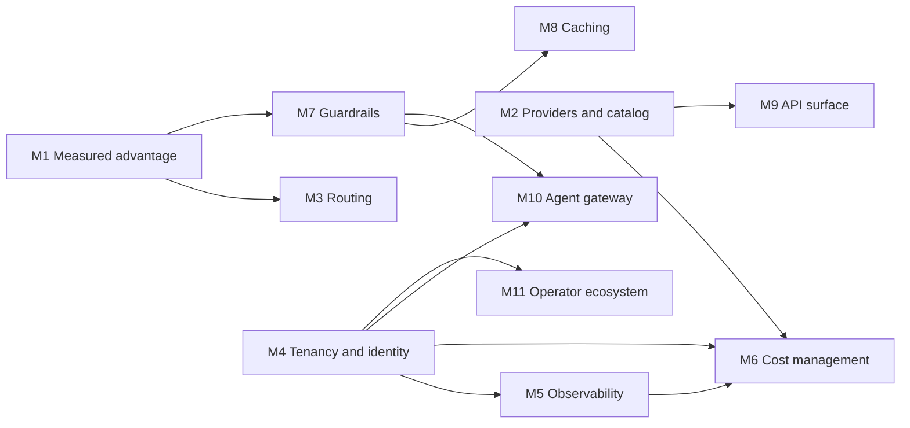

# Roadmap: LiteLLM parity and beyond

This roadmap takes OpenLLMProxy (OLP) from its 0.1 baseline to full feature
parity with the [LiteLLM AI Gateway](https://docs.litellm.ai/docs/simple_proxy)
and then past it. It is milestone-driven: each milestone has a fixed scope,
design constraints, decisions to settle and exit criteria, but no date. A
milestone closes when its exit criteria pass.

| Document | Purpose |
| --- | --- |
| [Parity matrix](parity.md) | Every LiteLLM gateway capability, OLP's state today, and the milestone that closes each gap |
| [M1](m01-measured-advantage.md) through [M11](m11-operator-ecosystem.md) | One specification per milestone, listed [below](#milestones) |

## Reference baseline

The LiteLLM reference is its gateway documentation at
[docs.litellm.ai](https://docs.litellm.ai/docs/) as reviewed on 2026-10-01,
including features marked beta or Enterprise. Unreleased LiteLLM work is not
part of the reference. The LiteLLM Python SDK is an embeddable library rather
than a gateway; OLP's client libraries are the official OpenAI, Anthropic,
Google Gen AI and AWS SDKs, which already speak OLP's surfaces.

The OLP baseline is this repository at 0.1.0. [Concepts](../concepts.md),
[compatibility](../compatibility.md), [provider routing](../provider-routing.md)
and [gateway execution](../gateway.md) describe it.

### Where OLP leads today

- **Four native client protocols on one gateway.** OpenAI, Anthropic and
  Gemini clients use their official SDKs with only a base URL change, and AWS
  SDK clients reach the Bedrock surface with an OLP key header; see
  [compatibility](../compatibility.md).
- **Certified capabilities.** A model serves an operation only after the server
  certifies the exact provider, model, operation, surface and mode, by a
  bounded live probe or by authenticated discovery; see
  [provider lifecycle](../provider-routing.md#provider-lifecycle).
- **Fidelity contracts.** Strict routes preserve native execution and refuse
  translation; transformed routes declare that they translate or redact, and
  refuse what they cannot represent; see
  [route fidelity](../provider-routing.md#route-fidelity).
- **Immutable, atomic publication.** Provider and route activations produce
  revisions and digest-verified runtime generations that every request pins; see
  [runtime publication](../gateway.md#runtime-publication-and-authority).
- **Policy-driven selection.** Credential pools, priority tiers, price, latency
  and throughput strategies, and hard constraints on region, quantization, data
  collection and zero data retention, all explainable through simulation; see
  [policies](../provider-routing.md#policies-and-caller-preferences).
- **Exact, attempt-level accounting.** Decimal pricing pinned per attempt,
  fail-closed cost budgets, and completeness evidence instead of invented usage;
  see [accounting delivery](../operations.md#accounting-delivery-and-shutdown).
- **Confined extensibility.** Provider plugins run as WebAssembly under
  approved origins; an unconfined tier is experimental and off by default; see
  [provider plugins](../plugins.md).
- **Content-free records.** Request records, diagnostics, traces and audit
  records never contain prompts, outputs or credentials. The only content OLP
  stores is sealed, time-bounded provider state for files, batches and
  continuations; see [concepts](../concepts.md#what-is-stored--and-what-never-is).

### Where it falls short

The [parity matrix](parity.md) is exhaustive. The largest gaps are provider and
media breadth, a model catalog, response caching, a guardrail ecosystem,
observability integrations, an MCP and agent gateway, end-user budgets,
enterprise identity (SAML, SCIM, workload JWTs), cost management for
chargeback, and published performance evidence.

## How OLP wins

Parity alone is not the goal. Every milestone delivers its features under these
commitments, and its exit criteria include the evidence named here.

| Commitment | Meaning | Evidence every milestone produces |
| --- | --- | --- |
| Correct by construction | New operations are certified per exact tuple before they serve traffic. Translation refuses what it cannot represent. | Conformance fixtures and certification probes for each new operation and provider. |
| Fast by default | The Go data plane adds less latency and uses less CPU per request than LiteLLM in every comparative benchmark scenario. A feature that is not configured costs nothing on the hot path. | [M1 benchmark](m01-measured-advantage.md#m11-gateway-benchmark) results with no regression beyond budget, from the day M1.1 ships. |
| Private by default | Request records and telemetry stay content-free. Content-bearing features (caching, payload capture, external guardrails) are opt-in, scoped, bounded and visible in `GET /api/v1/auth/capabilities`. | The milestone's "Data and secrets" table: what it persists, where, for how long, and under which seal or digest purpose. |
| Secure by default | Every new outbound destination passes the [egress policy](../security.md#egress) for its class: provider egress rules for providers, webhooks, sinks and tools, and identity egress for identity providers and token issuers. Every new management operation is declared in the contract and covered by the authorization and isolation sweeps. Every new secret has a declared seal purpose. | The authorization golden diff, sweep results and the generated purpose table in [security](../security.md). |
| Accountable | Every billable or quota-relevant event (provider attempt, cache hit, tool call, guardrail call, shadow attempt) produces attempt-level facts with pricing provenance. | Accounting and completeness tests for each new event type. |
| Complete without a paywall | Every capability here ships in the single AGPL-3.0-only product. LiteLLM reserves SSO beyond five users, SCIM, JWT authentication, organizations, key rotation, secret managers, key- and team-scoped guardrails and logging, audit logs and multi-region deployment for its [Enterprise license](https://docs.litellm.ai/docs/enterprise). | No license check, edition flag or entitlement gate in the repository; every operation in the management contract is available to every installation. |
| Operable | One binary with explicit process modes, forward-only migrations and digest-addressed configuration promotion. | New desired state round-trips through configuration export, plan and apply. |

## Milestones

Milestones are numbered in recommended order. Two relations connect them:

- **Depends on** is a hard dependency: the milestone builds on the other's
  shipped work and cannot start without it. The graph below shows only these,
  and milestones without a path between them may proceed in parallel.
- **Integrates with** is a touchpoint between two milestones that neither waits
  for. The part that needs both lands with whichever ships second, and each
  specification says what happens until then. The
  [integration table](#integration-points) lists every one.

| ID | Milestone | Outcome | Depends on | Status |
| --- | --- | --- | --- | --- |
| M1 | [Measured advantage](m01-measured-advantage.md) | Published, regression-gated overhead and client compatibility; accurate admission token estimates; standard response metadata. | None | Planned |
| M2 | [Provider and catalog breadth](m02-provider-catalog.md) | LiteLLM's production provider families reachable through certified tiers; media providers; a signed reference catalog of model facts and prices. | None | Planned |
| M3 | [Adaptive routing and resilience](m03-routing-resilience.md) | Cross-route fallbacks, capacity-aware selection, priority admission, supply-side budgets, active and fleet-shared health, shadow traffic, explainable request selectors. | M1 | Planned |
| M4 | [Tenancy, identity and budgets](m04-tenancy-identity.md) | End users, a budget hierarchy with flexible windows, limit templates, access groups, workload JWTs, SAML, SCIM, MFA, organizations and caller-supplied credentials. | None | Planned |
| M5 | [Observability, export and alerting](m05-observability.md) | Durable export sinks, opt-in payload capture, OpenTelemetry GenAI conventions, business metrics, alert channels and events. | M4 | Planned |
| M6 | [Cost management and chargeback](m06-cost-management.md) | Complete pricing dimensions, rate cards, cost estimation, FOCUS and billing exports, invoice reconciliation. | M2, M4, M5 | Planned |
| M7 | [Guardrails platform](m07-guardrails.md) | One guardrail engine with built-in detectors, vendor adapters, webhook and WebAssembly guardrails, streaming inspection and tool governance. | M1 | Planned |
| M8 | [Response caching](m08-caching.md) | Sealed exact and semantic response caches, cache controls and provider prompt-cache automation. | M7 | Planned |
| M9 | [API surface completion](m09-api-surface.md) | Legacy completions, cross-provider files and batches, fine-tuning, vector stores, Conversations and compaction, realtime expansion, OCR, search, provider-retained resources and governed pass-through. | M2 | Planned |
| M10 | [Agent gateway](m10-agent-gateway.md) | An MCP gateway with pinned tools, gateway-executed tools with tool search, an A2A agent gateway and a prompt registry. | M4, M7 | Planned |
| M11 | [Operator ecosystem](m11-operator-ecosystem.md) | A management CLI, a Terraform provider, KMS and external secret stores, scheduled key rotation, a developer catalog, multi-region gateways and a management MCP server. | M4 | Planned |

The graph yields three waves. A milestone may start as soon as its own
dependencies have shipped; it does not wait for the rest of the earlier wave.

| Wave | Milestones | Why they can start |
| --- | --- | --- |
| 1 | M1, M2, M4 | No dependencies |
| 2 | M3, M5, M7, M9, M11 | Each depends on one wave-1 milestone |
| 3 | M6, M8, M10 | Each depends on a wave-2 milestone |

### Integration points

| Touchpoint | Between | Until both ship |
| --- | --- | --- |
| Token calibration factors | M1.2, M2.4 | The factor is 1 |
| Cost estimates from exact token counts | M1.2, M6.3 | Estimates use the heuristic and say so |
| Client environments in the CLI | M1.3, M11.1 | `olp client-env` lists only qualified clients |
| `model.retirement` event | M2.4, M5.4 | Console warnings only |
| Budget fallbacks on per-route key limits | M3.1, M4.2 | `budget` fires on supply-side caps only |
| Sessions | M3.2, M5.5, M8.3 | Each uses the M3.2 definition; the first to ship introduces it |
| Circuit events | M3.5, M5.4 | Shared circuits without notifications |
| Guardrails on shadow traffic | M3.6, M7.1 | Shadow targets honor content policy |
| Budget and key events | M4.2, M4.3, M5.4 | The new levels and intervals raise no events |
| Access groups for toolsets and agents | M4.3, M10.1 | Groups hold routes only |
| Scheduled key rotation | M4.3, M11.3 | Rotation is an explicit call, with a reminder event |
| Organization-scoped guardrail policies | M4.5, M7.1 | Policies attach to the other four scopes |
| Capture redaction and decision export | M5.1, M5.2, M7.1 | Unredacted capture for owners only; the stream carries content-policy decisions |
| Batch pricing | M6.1, M9.2 | `batch_multiplier` ships with the first of the two |
| Batch file inspection | M7.1, M9.2 | Guardrails cover the batch surfaces that exist |
| Server-side web search tool | M9.7, M10.2 | Gateway-executed tools without built-in search |
| Terraform resources and catalog listings | M11.2, M11.4 with M2, M5, M7, M10 | Each resource and listing follows its milestone |

### Cross-milestone decisions

One decision spans several milestones and is settled before the first of them
starts.

**Where gateway-defined client endpoints live.** `/v1` is the OpenAI surface,
and today's only gateway-defined client endpoints, the continuation endpoints,
sit under it. M7.7 (`/v1/guardrails/apply`), M9.7 (`/v1/ocr`, `/v1/search`) and
M10.1 (`/v1/mcp/tools`) would add more shapes that no official OpenAI SDK
defines, where a future OpenAI endpoint could collide with them. The options
are to keep them under `/v1` for LiteLLM client compatibility, or to reserve a
gateway prefix for them (recommended: a reserved prefix, with `/v1` aliases
only for the two shapes LiteLLM clients already call, OCR and search).

## Parity gate and scorecard

Parity is reached when every row of the [parity matrix](parity.md) is
`Parity`, `Ahead` or `Excluded`. Progress is reported with these measures,
recomputed whenever a milestone closes:

| Measure | Definition |
| --- | --- |
| Parity coverage | Rows marked `Parity` or `Ahead`, divided by all rows not marked `Excluded`. |
| Added latency | Gateway minus direct-to-mock latency at p50, p95 and p99 for each [M1 scenario](m01-measured-advantage.md#scenarios), for OLP and the pinned LiteLLM release. |
| Efficiency | Sustained requests per second per vCPU, and resident memory per 1,000 open streams. |
| Compatibility | Pass rate of the SDK and client qualification suites across their pinned versions. |
| Accounting completeness | Share of admitted requests with complete usage, and share of attempts that are unpriced. |
| Authorization coverage | Management operations exercised by the authorization and isolation sweeps (must stay 100%). |

At the 0.1.0 baseline the matrix has 174 rows: 15 `Ahead`, 36 `Parity`, 30
`Partial`, 84 `Gap` and 9 `Excluded`, a parity coverage of 51 of 165 (31%).

## Definition of done

Every milestone, and every workstream inside it, ships with:

1. **Contract.** Management operations in
   [`openapi/management.json`](../../openapi/management.json) with their
   security requirements, regenerated types (`make api`), and updated
   `internal/access/testdata/authorization.golden.json`. The authorization and
   isolation sweeps pass.
2. **Desired state.** Configuration that operators promote between
   installations joins
   [configuration export, plan and apply](../configuration.md#configuration-promotion-artifacts)
   without secrets. The artifact covers projects, providers, routes and pricing
   today, so each milestone's exit criteria name the resource classes it adds.
   Configuration the data plane reads also joins runtime publication.
3. **Data plane discipline.** Inference reads configuration from the pinned
   runtime snapshot, key authority, Valkey and the polled routing inputs
   (prices and performance measurements); only retained-resource operations
   look up their PostgreSQL mappings, as they do today. Once M1.1 has shipped,
   benchmarks show no regression beyond the
   [performance budget](m01-measured-advantage.md#performance-budget).
4. **Privacy and security review.** The milestone's "Data and secrets" table
   kept current, egress policy coverage for every outbound call, declared seal
   and digest purposes, and credential redaction for every upstream error path.
5. **Accounting.** Attempt-level facts for every billable or quota-relevant
   event, metadata-only, with completeness evidence.
6. **Tests at the right boundary.** Unit and fixture tests beside the feature,
   `integration`-tagged service tests for PostgreSQL and Valkey behavior, SDK
   suites for client-visible protocol, and Chromium journeys for console
   workflows; see [behavioral validation](../../tests/README.md).
7. **Console.** A feature folder under `console/src/lib/features/` that follows
   the design system in [`AGENTS.md`](../../AGENTS.md#console-design-system)
   and passes the axe checks.
8. **Operations.** Forward-only migrations; Helm values, schema and templates
   updated together; metrics, readiness and runbook entries in
   [operations](../operations.md).
9. **Documentation.** User-facing guides updated in the same change, and the
   [parity matrix](parity.md) rows the work closes moved to `Parity` or `Ahead`.

## Out of scope by design

These LiteLLM capabilities conflict with OLP's guarantees or have been retired
upstream. The parity matrix marks a capability `Excluded` when OLP will not
offer it. Where OLP meets the same need by other means, the matrix row stays
open and names the workstream that delivers it.

| Capability | Reason | Matrix status |
| --- | --- | --- |
| An embeddable Python SDK and agent harness | OLP is a gateway. Official vendor SDKs are its clients, which keeps client compatibility the product rather than a translation layer. | `Excluded` |
| OpenAI Assistants API | OpenAI scheduled its shutdown for 2026-08-26, as the [LiteLLM page](https://docs.litellm.ai/docs/assistants) notes. Responses and Conversations replace it ([M9](m09-api-surface.md)). | `Excluded` |
| Caller-chosen upstream base URLs | Destinations stay operator-declared and egress-validated. | `Excluded`; caller-supplied credentials for an operator-declared connection are delivered by [M4.6](m04-tenancy-identity.md#m46-caller-supplied-provider-credentials) |
| `/memory` key-value storage | Application state that no provider API defines. Applications should keep it in their own stores. | `Excluded` |
| RAG ingest and query pipelines | A LiteLLM-defined shape with no official SDK. Applications compose vector stores ([M9.4](m09-api-surface.md#m94-vector-stores-and-retrieval)) and generation. | `Excluded` |
| Prompt compression | Rewriting caller content lossily conflicts with fidelity contracts. | `Excluded` |
| A code-execution sandbox | OLP governs calls to tools; it does not host runtimes. A sandbox is reached as an MCP server ([M10.1](m10-agent-gateway.md#m101-mcp-gateway)). | `Excluded` |
| Console extension plugins | Embedding third-party applications in the console widens its trust boundary. | `Excluded` |
| In-process custom code hooks | Custom code never runs inside the gateway process. | `Excluded` for call hooks, custom authentication and post-call rules; custom guardrails and routing logic are delivered as confined plugins or signed webhooks by [M7.3](m07-guardrails.md#m73-webhook-guardrails), [M7.5](m07-guardrails.md#m75-plugin-guardrails) and [M3.7](m03-routing-resilience.md#m37-request-selectors) |
| Uncertified wildcard model passthrough | Routes publish only certified capabilities. | Open; route templates create ordinary routes for newly certified models ([M3.8](m03-routing-resilience.md#m38-route-templates)) |
| Prompt and response storage in request history | Request records stay content-free. | Open; opt-in payload capture streams to an operator-owned sink instead ([M5.2](m05-observability.md#m52-payload-capture)) |

## Maintaining this roadmap

- **Status.** Each milestone file carries `Planned`, `In progress` or
  `Shipped`. A change that moves a status also updates the table above and the
  affected parity rows.
- **Template.** Every milestone file has the same sections in the same order:
  Outcome, Baseline, Scope, Non-goals, Data and secrets, Change map, Decisions
  to settle and Exit criteria, with Qualification tiers or Invariants before
  Scope where a milestone needs them. Every exit criterion names the
  workstreams it proves, and every workstream has at least one.
- **Decisions.** Each milestone lists the decisions to settle before
  implementation. Record the outcome in the milestone file, with its rationale,
  before the first implementation change lands.
- **Re-baselining.** When a milestone closes, compare LiteLLM's documentation
  sitemap and [release notes](https://docs.litellm.ai/release_notes) with the
  pages the matrix links. New capabilities become `Gap` rows assigned to a
  workstream, or `Excluded` rows with a reason, and the scorecard numbers above
  are recomputed.
- **Scope changes.** Edit the milestone specification in the change that
  proposes the new scope, so the roadmap never trails the code.
