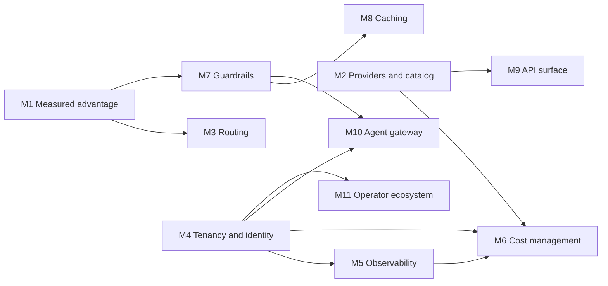

# Roadmap: LiteLLM parity and beyond

This roadmap takes OpenLLMProxy (OLP) from its 0.1 baseline to full feature
parity with the [LiteLLM AI Gateway](https://docs.litellm.ai/docs/simple_proxy)
and then past it. It is milestone-driven: each milestone has a fixed scope,
design constraints, decisions to settle and exit criteria, but no date. A
milestone closes when its exit criteria pass.

| Document                                                                 | Purpose                                                                                     |
| ------------------------------------------------------------------------ | ------------------------------------------------------------------------------------------- |
| [Parity matrix](parity.md)                                               | Every LiteLLM gateway capability, OLP's state today, and the milestone that closes each gap |
| [M1](m01-measured-advantage.md) through [M11](m11-operator-ecosystem.md) | One specification per milestone, listed [below](#milestones)                                |

## Reference baseline

The LiteLLM reference is its gateway documentation at
[docs.litellm.ai](https://docs.litellm.ai/docs/) as reviewed on 2026-10-01,
including features marked beta or Enterprise. Unreleased LiteLLM work is not
part of the reference. The LiteLLM Python SDK is an embeddable library rather
than a gateway; OLP's client libraries are the official OpenAI, Anthropic,
Google Gen AI and AWS SDKs, which already speak OLP's surfaces.

The OLP baseline is this repository at 0.1.0. [Concepts](../concepts.md),
[compatibility](../compatibility.md), [provider routing](../provider-routing.md)
and [gateway execution](../gateway.md) describe it.

### Where OLP leads today

- **Four native client protocols on one gateway.** OpenAI, Anthropic and
  Gemini clients use their official SDKs with only a base URL change, and AWS
  SDK clients reach the Bedrock surface with an OLP key header; see
  [compatibility](../compatibility.md).
- **Certified capabilities.** A model serves an operation only after a bounded
  live probe proves the exact provider, model, operation, surface and mode; see
  [provider lifecycle](../provider-routing.md#provider-lifecycle).
- **Fidelity contracts.** Strict routes preserve native execution and refuse
  lossy translation; transformed routes declare that they translate or redact;
  see [route fidelity](../provider-routing.md#route-fidelity).
- **Immutable, atomic publication.** Provider and route activations produce
  revisions and digest-verified runtime generations that every request pins; see
  [runtime publication](../gateway.md#runtime-publication-and-authority).
- **Policy-driven selection.** Credential pools, priority tiers, price, latency
  and throughput strategies, and hard constraints on region, quantization, data
  collection and zero data retention, all explainable through simulation; see
  [policies](../provider-routing.md#policies-and-caller-preferences).
- **Exact, attempt-level accounting.** Decimal pricing pinned per attempt,
  fail-closed cost budgets, and completeness evidence instead of invented usage;
  see [accounting delivery](../operations.md#accounting-delivery-and-shutdown).
- **Confined extensibility.** Provider plugins run as WebAssembly under
  approved origins; see [provider plugins](../plugins.md).
- **Content-free records.** Durable diagnostics, traces and audit records never
  contain prompts, outputs or credentials; see [concepts](../concepts.md#what-is-stored--and-what-never-is).

### Where it falls short

The [parity matrix](parity.md) is exhaustive. The largest gaps are provider and
media breadth, a model catalog, response caching, a guardrail ecosystem,
observability integrations, an MCP and agent gateway, cost management for
chargeback, and published performance evidence: the [M1](m01-measured-advantage.md)
benchmark harness and regression gate exist, but no full-rate results are
published yet.

## How OLP wins

Parity alone is not the goal. Every milestone delivers its features under these
commitments, and its exit criteria include the evidence named here.

| Commitment                 | Meaning                                                                                                                                                                                                                                                                                                                                     | Evidence every milestone produces                                                                           |
| -------------------------- | ------------------------------------------------------------------------------------------------------------------------------------------------------------------------------------------------------------------------------------------------------------------------------------------------------------------------------------------- | ----------------------------------------------------------------------------------------------------------- |
| Correct by construction    | New operations are certified per exact tuple before they serve traffic. Translation refuses what it cannot represent.                                                                                                                                                                                                                       | Conformance fixtures and certification probes for each new operation and provider.                          |
| Fast by default            | The Go data plane adds less latency and uses less CPU per request than LiteLLM in every comparative benchmark scenario. A feature that is not configured costs nothing on the hot path.                                                                                                                                                     | [M1 benchmark](m01-measured-advantage.md#m11-gateway-benchmark) results with no regression beyond budget.   |
| Private by default         | Durable records and telemetry stay content-free. Content-bearing features (caching, payload capture, external guardrails) are opt-in, scoped, bounded and visible in `GET /api/v1/auth/capabilities`.                                                                                                                                       | An inventory of what the milestone persists, where, for how long, and under which seal purpose.             |
| Secure by default          | Every new outbound destination passes the provider egress policy. Every new management operation is declared in the contract and covered by the authorization and isolation sweeps. Every new secret has a declared seal purpose.                                                                                                           | The authorization golden diff, sweep results and the generated purpose table in [security](../security.md). |
| Accountable                | Every billable or quota-relevant event (provider attempt, cache hit, tool call, guardrail call, shadow attempt) produces attempt-level facts with pricing provenance.                                                                                                                                                                       | Accounting and completeness tests for each new event type.                                                  |
| Complete without a paywall | Every capability here ships in the single AGPL-3.0-only product. LiteLLM reserves SSO beyond five users, SCIM, JWT authentication, organizations, key rotation, secret managers, key- and team-scoped guardrails and logging, audit logs and multi-region deployment for its [Enterprise license](https://docs.litellm.ai/docs/enterprise). | Not applicable.                                                                                             |
| Operable                   | One binary with explicit process modes, forward-only migrations and digest-addressed configuration promotion.                                                                                                                                                                                                                               | New desired state round-trips through configuration export, plan and apply.                                 |

## Milestones

M1–M4 implementation is complete. Long-running qualification is handed to the
human PR reviewer at the owner's request; each milestone retains the original
acceptance criteria and identifies evidence that has not been collected. The
[implementation review](m01-m04-implementation-review.md) maps delivered changes
to their tests and records the remaining qualification work. The reviewer owns
qualification and merge; implementation status is not a claim that unrun
reference-hardware, live-provider or external conformance checks passed.

Milestones are numbered in recommended order. The dependency graph is the
binding constraint: milestones without a path between them may proceed in
parallel.

| ID  | Milestone                                                    | Outcome                                                                                                                                                                                         | Depends on | Status      |
| --- | ------------------------------------------------------------ | ----------------------------------------------------------------------------------------------------------------------------------------------------------------------------------------------- | ---------- | ----------- |
| M1  | [Measured advantage](m01-measured-advantage.md)              | Published, regression-gated overhead and client compatibility; accurate admission token estimates; standard response metadata.                                                                  | None       | Implemented |
| M2  | [Provider and catalog breadth](m02-provider-catalog.md)      | LiteLLM's production provider families reachable through certified tiers; media providers; a signed reference catalog of model facts and prices.                                                | None       | Implemented |
| M3  | [Adaptive routing and resilience](m03-routing-resilience.md) | Cross-route fallbacks, capacity-aware selection, priority admission, supply-side budgets, active and fleet-shared health, shadow traffic, explainable request selectors.                        | M1         | Implemented |
| M4  | [Tenancy, identity and budgets](m04-tenancy-identity.md)     | End users, a budget hierarchy with flexible windows, limit templates, route groups, workload JWTs, SAML, SCIM, MFA, organizations and caller-supplied credentials.                              | None       | Implemented |
| M5  | [Observability, export and alerting](m05-observability.md)   | Durable export sinks, opt-in payload capture, OpenTelemetry GenAI conventions, business metrics, alert channels and events.                                                                     | M4         | Implemented |
| M6  | [Cost management and chargeback](m06-cost-management.md)     | Complete pricing dimensions, rate cards, cost estimation, FOCUS and billing exports, invoice reconciliation.                                                                                    | M2, M4, M5 | Planned     |
| M7  | [Guardrails platform](m07-guardrails.md)                     | One guardrail engine with built-in detectors, vendor adapters, webhook and WebAssembly guardrails, streaming inspection and tool governance.                                                    | M1         | Planned     |
| M8  | [Response caching](m08-caching.md)                           | Sealed exact and semantic response caches, cache controls and provider prompt-cache automation.                                                                                                 | M7         | Planned     |
| M9  | [API surface completion](m09-api-surface.md)                 | Legacy completions, cross-provider files and batches, fine-tuning, vector stores, Responses completion, realtime expansion, OCR, search, provider-retained resources and governed pass-through. | M2         | Planned     |
| M10 | [Agent gateway](m10-agent-gateway.md)                        | An MCP gateway with pinned tools, gateway-executed tools, an A2A agent gateway and a prompt registry.                                                                                           | M4, M7     | Planned     |
| M11 | [Operator ecosystem](m11-operator-ecosystem.md)              | A management CLI, a Terraform provider, KMS and external secret stores, a developer catalog, multi-region gateways and a management MCP server.                                                 | M4         | Planned     |

## Parity gate and scorecard

Parity is reached when every row of the [parity matrix](parity.md) is
`Parity`, `Ahead` or `Excluded`. Progress is reported with these measures,
recomputed whenever a milestone closes:

| Measure                 | Definition                                                                                                                                                    |
| ----------------------- | ------------------------------------------------------------------------------------------------------------------------------------------------------------- |
| Parity coverage         | Rows marked `Parity` or `Ahead`, divided by all rows not marked `Excluded`.                                                                                   |
| Added latency           | Gateway minus direct-to-mock latency at p50, p95 and p99 for each [M1 scenario](m01-measured-advantage.md#scenarios), for OLP and the pinned LiteLLM release. |
| Efficiency              | Sustained requests per second per vCPU, and resident memory per 1,000 open streams.                                                                           |
| Compatibility           | Pass rate of the SDK and client qualification suites across their pinned versions.                                                                            |
| Accounting completeness | Share of admitted requests with complete usage, and share of attempts that are unpriced.                                                                      |
| Authorization coverage  | Management operations exercised by the authorization and isolation sweeps (must stay 100%).                                                                   |

At the 0.1.0 baseline the matrix has 150 rows: 15 `Ahead`, 33 `Parity`, 30
`Partial`, 70 `Gap` and 2 `Excluded`, a parity coverage of 48 of 148 (32%). This historical scorecard remains unchanged until milestones close.
The matrix also records ongoing implementation, including M4 end-user controls,
network restrictions, route groups and explicit rotation with reminders; later tenancy requirements remain
unfinished.
Its current counts are 20 `Ahead`, 65 `Parity`, 16 `Partial`, 47 `Gap`, 2 `Excluded`.

## Definition of done

Every milestone, and every workstream inside it, ships with:

1. **Contract.** Management operations in
   [`openapi/management.json`](../../openapi/management.json) with their
   security requirements, regenerated types (`make api`), and updated
   `internal/access/testdata/authorization.golden.json`. The authorization and
   isolation sweeps pass.
2. **Desired state.** New configuration participates in
   [configuration export, plan and apply](../configuration.md#configuration-promotion-artifacts)
   without secrets, and in runtime publication when the data plane reads it.
3. **Data plane discipline.** Inference reads configuration from the pinned
   runtime snapshot, key authority and Valkey; only retained-resource
   operations look up their PostgreSQL mappings, as they do today. Benchmarks
   show no regression beyond the
   [performance budget](m01-measured-advantage.md#performance-budget).
4. **Privacy and security review.** A persisted-data inventory, egress policy
   coverage for every outbound call, declared seal and digest purposes, and
   credential redaction for every upstream error path.
5. **Accounting.** Attempt-level facts for every billable or quota-relevant
   event, metadata-only, with completeness evidence.
6. **Tests at the right boundary.** Unit and fixture tests beside the feature,
   `integration`-tagged service tests for PostgreSQL and Valkey behavior, SDK
   suites for client-visible protocol, and Chromium journeys for console
   workflows; see [behavioral validation](../../tests/README.md).
7. **Console.** A feature folder under `console/src/lib/features/` that follows
   the design system in [`AGENTS.md`](../../AGENTS.md#console-design-system)
   and passes the axe checks.
8. **Operations.** Forward-only migrations; Helm values, schema and templates
   updated together; metrics, readiness and runbook entries in
   [operations](../operations.md).
9. **Documentation.** User-facing guides updated in the same change, and the
   [parity matrix](parity.md) rows the work closes moved to `Parity` or `Ahead`.

## Out of scope by design

These LiteLLM capabilities conflict with OLP's guarantees or have been retired
upstream. The parity matrix marks them `Excluded`.

| Capability                                     | Reason                                                                                                                                                                                                           |
| ---------------------------------------------- | ---------------------------------------------------------------------------------------------------------------------------------------------------------------------------------------------------------------- |
| An embeddable Python SDK                       | OLP is a gateway. Official vendor SDKs are its clients, which keeps client compatibility the product rather than a translation layer.                                                                            |
| OpenAI Assistants API                          | OpenAI scheduled its shutdown for 2026-08-26, as the [LiteLLM page](https://docs.litellm.ai/docs/assistants) notes. Responses and Conversations replace it ([M9](m09-api-surface.md)).                           |
| Caller-chosen upstream base URLs               | Destinations stay operator-declared and egress-validated. Caller-supplied credentials for an operator-declared connection are in scope ([M4](m04-tenancy-identity.md#m46-caller-supplied-provider-credentials)). |
| Uncertified wildcard model passthrough         | Routes publish only certified capabilities. Route templates create ordinary routes for newly certified models ([M3](m03-routing-resilience.md#m38-route-templates)).                                             |
| In-process custom code hooks                   | Custom authentication, callbacks and guardrails run as confined WebAssembly plugins or behind signed webhook contracts, never inside the gateway process.                                                        |
| `/memory` key-value storage                    | Application state that no provider API defines. Applications should keep it in their own stores.                                                                                                                 |
| Prompt and response storage in request history | Durable request records stay content-free. Opt-in payload capture streams to an operator-owned sink instead ([M5](m05-observability.md#m52-payload-capture)).                                                    |

## Maintaining this roadmap

- **Status.** Each milestone file carries `Planned`, `In progress`,
  `Implemented` or `Shipped`. `Implemented` records completed code and focused
  verification with any explicit qualification handoff; `Shipped` additionally
  records completed release qualification. A status change also updates the
  table above and affected parity rows.
- **Decisions.** Each milestone lists the decisions to settle before
  implementation. Record the outcome in the milestone file, with its rationale,
  before the first implementation change lands.
- **Re-baselining.** When a milestone closes, review LiteLLM's documentation and
  [release notes](https://docs.litellm.ai/release_notes). New capabilities
  become `Gap` rows assigned to a milestone, or `Excluded` rows with a reason.
- **Scope changes.** Edit the milestone specification in the change that
  proposes the new scope, so the roadmap never trails the code.
