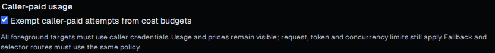

# M1–M4 implementation review

M1–M4 are implemented. This record separates implementation evidence from the
long-running qualification assigned to the human reviewer. It does not replace
or weaken the original milestone acceptance criteria. M5 and later milestones
remain outside this change.

## Scope and evidence

| Requirement | Implementation and review evidence |
| --- | --- |
| M1.1 benchmark scenarios, direct baseline, comparison and regression gates | [Benchmark harness](../../tests/bench/README.md), [performance results and limitations](../performance.md), and the unchanged targets and qualification handoff in [M1](m01-measured-advantage.md). |
| M1.2 admission estimates and cost reservations | Tokenizer/oracle fixtures under `tests/fixtures/tokens`, `internal/operations/tokenization/estimate`, and `internal/gateway/cost_reservation.go`. Unconfigured behavior remains covered by `TestUnconfiguredFeaturesAddNoAllocations`. |
| M1.3 client support and M1.4 response metadata | [Pinned clients](../clients.md), SDK/client suites and metadata tests; release/client qualification remains part of the reviewer handoff. |
| M2.1–M2.3 provider/preset/media breadth | Reviewed vendor evidence, connector/media fixtures and explicit declined combinations in [M2](m02-provider-catalog.md). No wildcard certification or caller-chosen endpoint was added. |
| M2.4–M2.5 signed catalog and plugin distribution | Catalog/signing/plugin-index verification, deterministic artifacts and workflow implementation; signing/release and live-provider evidence limitations remain recorded in M2. |
| M3.1–M3.9 routing, resilience and templates | `internal/gateway/adaptive_test.go`, `internal/runtime/adaptive_test.go`, fleet/supply integration suites and `tests/integration/route_resilience_test.go`; source and acceptance mapping remain in [M3](m03-routing-resilience.md). |
| M4.1 end users | `end_user_policies_test.go`, `end_user_privacy_test.go`, realtime/retained/media/Bedrock/subscription tests: project-scoped HMACs, independent fleet limits, complete overrides, blocks and content-free accounting. |
| M4.2 full hierarchy and refusal reporting | Aggregate, organization, key/group, end-user, key-route and attribution tests in `tests/integration`; `budget_boundary` survives event persistence and request-detail reporting without retaining identifiers. |
| M4.2 calendars, templates and increases | `weekly_budgets_test.go`, `budget_calendar_test.go`, `limit_templates_test.go`, `budget_increases_test.go` and usage retention tests: exact decimals, day/ISO-week/month, independent zone transitions, DST/subhour retention, template ceilings, expiry, replay, revocation and protected promotion. |
| M4.3 access ergonomics | Route-group, key-network, management-network, route-body and key-rotation integration suites; required/pinned attribution, explicit overlapping rotation, stable counters, metadata-only reminders, trusted-proxy controls and published body bounds. |
| M4.4 workload JWTs | `workload_identity_test.go` and `internal/workload`: signature/claim/time checks, bounded identity-egress JWKS cache, rotation/disablement, digest-only principals, portable trust, retained-resource renewal and current subscription/session authority. |
| M4.5 organizations | `organizations_test.go`, aggregate history and both management sweeps: inherited grants, independent direct memberships, token-scope intersection, unchanged installation roles, last-manager protection and immutable assigned project ownership. |
| M4.5 SCIM | `scim_test.go`, protocol tests and console journey: Users/Groups/discovery, bounded filters/PATCH/projection/sorting, ETags, mapping promotion, local takeover, session revocation and usable-owner protection. External conformance qualification remains assigned to the reviewer. |
| M4.5 local MFA | `mfa_test.go`, `mfa_webauthn_test.go`, federation boundary tests and virtual-authenticator Chromium journey: one-use TOTP/recovery, WebAuthn origin/UV/counters, replica safety, required enrollment, session rotation and explicit offline recovery. |
| M4.5 SAML | `saml_test.go`, XML protocol tests and real cross-site Chromium journey: imported trust, independently signed assertions, exact binding/time/subject checks, browser-bound completion, replay, linking, owner/MFA protection and public-only promotion. Production IdP qualification remains assigned to the reviewer. |
| M4.6 caller credentials | `caller_credentials_test.go`, caller video/privacy tests and ephemeral-transport tests: operator-only addresses/certification, stateless request auth, no shared secret/pool, no cross-target reuse, redaction and explicit caller-driven durable lifecycle. |
| M4.6 caller-paid budgets | `caller_budgets_test.go`, usage retention tests and caller-paid Chromium journey: immutable attempt treatment, preserved prices/usage, all applicable USD exemptions, retained rates/concurrency, graph validation, promotion and operator system-work accounting. |

Integration filenames above are relative to `tests/integration` unless their
package is stated explicitly. Unit and service assertions exercise production
admission, storage and transport boundaries; they are not claims that every
external vendor or identity implementation has been certified.

## Cross-cutting review

- **Contracts and authority:** `openapi/management.json` is the source of truth;
  generated Go/TypeScript and authorization goldens were regenerated. The final
  organization-aware authorization and project-isolation sweeps passed.
- **Storage and privacy:** migrations 0023–0042 are forward-only. Each feature's
  durable state, retention and cryptographic purposes are documented in
  [access](../access.md), [security](../security.md), [gateway](../gateway.md) and
  [operations](../operations.md). Caller secrets and raw end-user identifiers
  remain outside durable accounting and telemetry.
- **Promotion:** portable project/organization/identity policy is exported,
  planned and applied with conditional authority. API keys, principal digests,
  live directory memberships, MFA credentials, temporary increases, sessions
  and private SAML signing material remain destination-local as documented.
- **Serving compatibility:** strict native bytes and pinned revisions remain
  enforced. Caller authentication cannot broaden endpoints or certification.
  Retained strict Responses now use `native-responses-v2`; short-lived v1 handles
  must be recreated after upgrade, as documented under the project's 0.x policy.
- **Operations:** management network restrictions are aligned across process
  configuration, Helm values/schema/templates and Settings. Existing defaults
  preserve unrestricted networking and unconfigured admission fast paths.
- **Console:** controls, permission-aware read-only views, exact decimal forms,
  recovery flows, source/budget metadata and request refusal levels accompany
  the APIs. Focused Chromium/axe journeys cover the new security-sensitive flows.

Final audit also verified that disabled workload trust can retain unavailable
serving references without blocking unrelated static-key authority or configuration
round trips. Re-enabling trust still validates its templates and route groups.

## Validation and handoff

The final repository check is `make check`: generation, formatting, vet, console
checks, Go/benchmark-harness unit tests, 127 console files (1,031 tests), and 81
script tests. Focused service tests use disposable PostgreSQL/Valkey; selected
identity tests additionally use the `oidctest` build tag. Focused race tests and
Chromium/axe smoke journeys were run during implementation. Helm lint/render and
configuration validation were checked for the deployment changes.

Per the owner's instruction, the agent did **not** run a final long release
qualification campaign. The human reviewer owns the full `make integration`,
SDK/client/platform matrix, named-reference-hardware S1–S6/LiteLLM comparisons,
full-scale shadow/performance gates, credentialed live-provider checks, external
SCIM conformance and production identity-provider qualification before merge.
The original numerical thresholds, pins, declined combinations and missing
external evidence remain in M1–M3 and the corresponding operational guides.
Neither a checked handoff item nor an “Implemented” milestone asserts those
unrun checks passed.

Representative published-route control from the passing caller-paid Chromium
journey (the fixture contains no request secret in this view):

